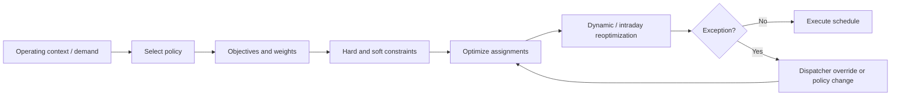

# OPP-006 — Operational workflow representation

## Representation metadata

| Field | Value |
|---|---|
| Object ID | `AOI-SNOW-OPP-006` |
| Source research files | [`OPP-006-01.md`](./OPP-006-01.md) through [`OPP-006-06.md`](./OPP-006-06.md) |
| Company | ServiceNow |
| Opportunity | Field-Service Policy-Arbitration Decision |
| Checkpoint | Consolidated across six checkpoints; final native test from OPP-006-06 |
| Investigation type | Field-service scheduling, optimization, and exception workflow |
| Research status | Workflow complexity VERIFIED; residual gap NOT ESTABLISHED; KILLED |
| AOI decision | KILL |
| Evidence classification | External complexity VERIFIED; native mechanisms DIRECT EVIDENCE; policy explosion UNKNOWN |
| Generation metadata | AOI Representation Compiler v0.2; generated 2026-08-20 |

## Workflow A — Policy-driven field-service scheduling



| Node | Trigger / inputs | Decision / action | Automation | Human judgment | Output / state | Evidence |
|---|---|---|---|---|---|---|
| 1. Operating context | Tasks, demand, skills, travel, time, territory | Select applicable policy. | Policy configuration | Dispatcher can choose policy. | Policy state | DIRECT; [`OPP-006-06`, §§11–13](./OPP-006-06.md) |
| 2. Objectives and constraints | Priorities, SLA, overtime, travel, assignment rules | Separate feasibility from preference; apply weights. | Optimization engine | Policy owner configures. | Feasible preference model | DIRECT; [`OPP-006-06`, §§6–8](./OPP-006-06.md) |
| 3. Schedule optimization | Policy model and work orders | Assign technicians and appointments. | Batch, dynamic, or intraday optimization | Review exceptions. | Schedule | DIRECT; [`OPP-006-06`, §§9–10](./OPP-006-06.md) |
| 4. State change | New task, absence, urgency, capacity change | Reoptimize or change policy. | Dynamic/intraday automation | Dispatcher may override. | Updated schedule | DIRECT; [`OPP-006-06`, §§9–13](./OPP-006-06.md) |
| 5. Exception | Excluded technician, preferred technician, appointment exception | Apply warning, override, preference, or schedule override. | Configured exception mechanisms | Dispatcher decides and accepts warning. | Exception resolved / traced | DIRECT; [`OPP-006-06`, §§14–16](./OPP-006-06.md) |

## Workflow B — Proposed policy-arbitration boundary

```text
COMPLEX CONTEXT → MULTIPLE POLICY OPTIONS → NO STABLE POLICY
→ HUMAN ARBITRATION → RECURRING MATERIAL CONSEQUENCE
```

This remains **HYPOTHESIS / NOT ESTABLISHED**. No source documents the required recurring policy explosion, decision burden, error, or material loss in a ServiceNow customer environment.

## State transitions and uncertainty

Verified state pattern: `NORMAL CONDITIONS → POLICY → OBJECTIVES/CONSTRAINTS → OPTIMIZATION → STATE CHANGE → REOPTIMIZATION / OVERRIDE`. Unverified pattern: `POLICY CONFLICT → RECURRING HUMAN ARBITRATION → MATERIAL LOSS`.

## Traceability and reusable patterns

- Native policy stack: [`OPP-006-06`, §§6–13](./OPP-006-06.md), [policies](https://www.servicenow.com/docs/r/field-service-management/field-service-scheduling/create-policies-schedule-optimization.html), [hard/soft constraints](https://www.servicenow.com/docs/r/field-service-management/hard-soft-constraints.html).
- Exception flow: [`OPP-006-06`, §§14–16](./OPP-006-06.md), [prevent excluded agents](https://www.servicenow.com/docs/r/field-service-management/field-service-scheduling/prevent-excluded-agents.html).
- Reusable lesson: configuration-first falsification before an intelligence-layer claim.
