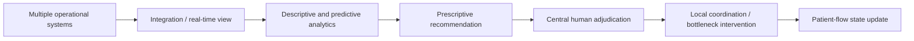

# OPP-008 — Operational workflow representation

## Representation metadata

| Field | Value |
|---|---|
| Object ID | `AOI-SNOW-OPP-008` |
| Source research files | [`OPP-008-01.md`](./OPP-008-01.md) through [`OPP-008-07.md`](./OPP-008-07.md) |
| Company | ServiceNow |
| Opportunity | Hospital Patient-Flow Cross-System Decision Synthesis |
| Checkpoint | Consolidated across seven checkpoints; final event test from OPP-008-07 |
| Investigation type | Patient-flow command-centre, data integration, prescriptive support, and bottleneck intervention |
| Research status | General workflows VERIFIED; specific reconciliation event NOT DEMONSTRATED; KILLED |
| AOI decision | KILL |
| Evidence classification | General workflow DIRECT VERIFIED EXTERNAL EVIDENCE; exact event chain UNKNOWN |
| Generation metadata | AOI Representation Compiler v0.2; generated 2026-08-20 |

## Workflow A — Command-centre patient-flow coordination



| Node | Trigger / inputs | Decision / action | Automation | Human involvement | Output / state | Evidence |
|---|---|---|---|---|---|---|
| 1. Operational data | Beds, admissions, discharges, staffing, systems | Gather and integrate operational state. | Data feeds and command-centre display | Staff verify data. | Integrated state | DIRECT VERIFIED; [`OPP-008-07`, §§3, 6](./OPP-008-07.md) |
| 2. Analyze | Current and predicted flow, occupancy, waits | Produce predictive or prescriptive insight. | Analytics | Human interprets context. | Recommendation / alert | DIRECT VERIFIED; [`OPP-008-07`, §12](./OPP-008-07.md) |
| 3. Adjudicate | Recommended placement, disputed case, transfer context | Decide or negotiate placement/action. | Decision support | Medical director / central manager adjudicates. | Accepted or contested plan | DIRECT VERIFIED generally; specific event details may be absent |
| 4. Intervene | Expected discharge, lab barrier, capacity mismatch | Prioritize task, coordinate transfer, or address bottleneck. | Workflow coordination | Local teams execute. | Updated flow state | DIRECT VERIFIED; [`OPP-008-07`, §§8, 10–11](./OPP-008-07.md) |
| 5. Measure | Actual state after intervention | Compare outcome with target. | Reporting | Human review. | Outcome / learning | Event-level measured outcome UNKNOWN in Hospital U example |

## Workflow B — Hospital U bottleneck intervention

```text
ANTICIPATED DISCHARGE TODAY
        ↓
WAITING FOR LAB TASK
        ↓
COMMAND CENTRE IDENTIFIES BARRIER
        ↓
LAB PRIORITIZES PATIENT
        ↓
PHLEBOTOMY EXPEDITED
        ↓
TARGET: MEET DISCHARGE DATE
```

| Field | Representation |
|---|---|
| Trigger | Anticipated discharge date and pending laboratory task. VERIFIED. |
| Actors | Command-centre manager, laboratory, phlebotomists, patient-flow operation. |
| Inputs | Discharge expectation and identified barrier. Separate source systems in this event NOT EXPLICITLY ESTABLISHED. |
| Decision criteria | Meet anticipated discharge date by addressing the laboratory barrier. PARTIAL. |
| Action | Prioritize patient and expedite task. VERIFIED. |
| Human judgment | Identification and coordination are described; reconciliation of conflicting data NOT ESTABLISHED. |
| Outcome | Target stated; measured event-level outcome not provided. UNKNOWN. |

## Workflow C — Required but unverified reconciliation event

```text
MULTIPLE SYSTEMS → CONFLICT / STALE DATA → HUMAN RECONCILIATION
→ EXPLICIT TRADE-OFF → ACTION → MEASURED OUTCOME
```

This is the final **HYPOTHESIS test condition**, not a verified workflow. The evidence matrix explicitly leaves multiple systems in the same decision, conflict in the same decision, reconciliation in a specific decision, trade-off, and measured outcome unknown.

## State transitions and uncertainty

Verified general state: `DATA → INTEGRATION → ANALYSIS → RECOMMENDATION → HUMAN ADJUDICATION → INTERVENTION → STATE UPDATE`. Unverified residual state: `CONFLICT → RECONCILIATION → TRADE-OFF → MEASURED OUTCOME` in one documented event.

## Traceability and reusable patterns

- Integration and analytics: [`OPP-008-07`, §§3–4, 12](./OPP-008-07.md), [Hopkins paper](https://doi.org/10.1016/j.jcjq.2018.11.006).
- Data trust: [`OPP-008-07`, §§6–7](./OPP-008-07.md), [NHS scientific summary](https://www.ncbi.nlm.nih.gov/books/NBK608696/).
- Bottleneck intervention: [`OPP-008-07`, §§8–10](./OPP-008-07.md), [patient-flow study](https://doi.org/10.1080/09537287.2026.2655748).
- Reusable lessons: integration is not decision synthesis; human involvement is not automatically an automation gap; recommendation is not command.
