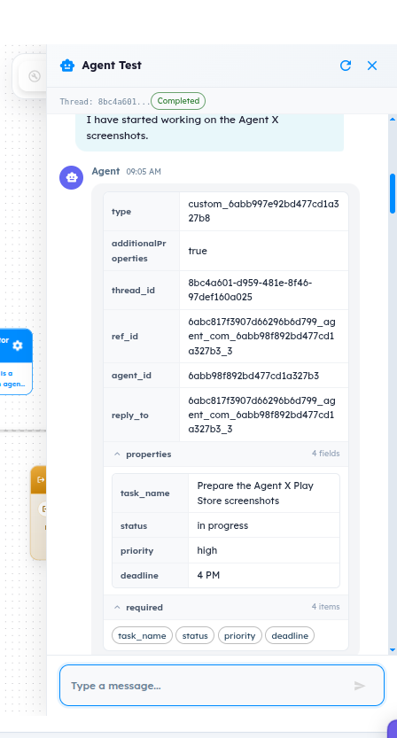
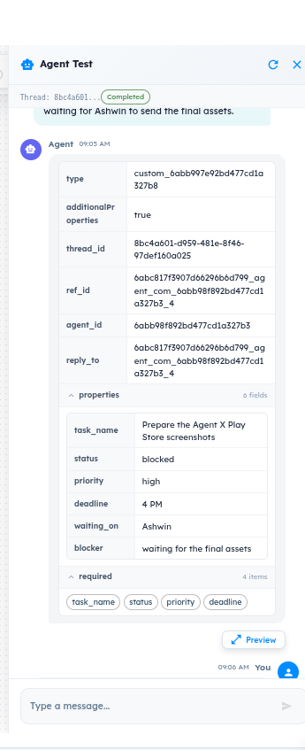
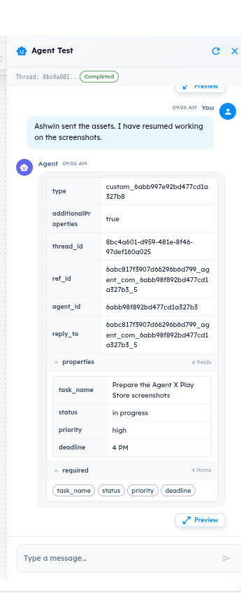
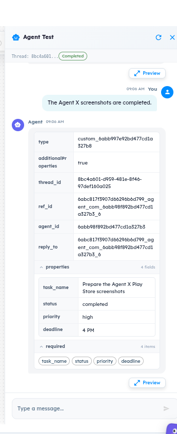
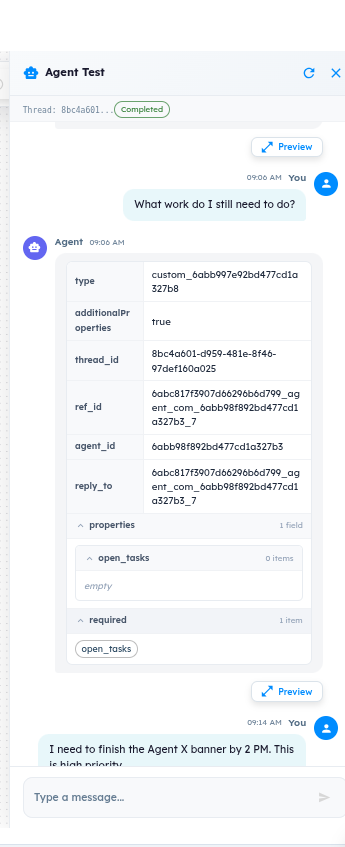
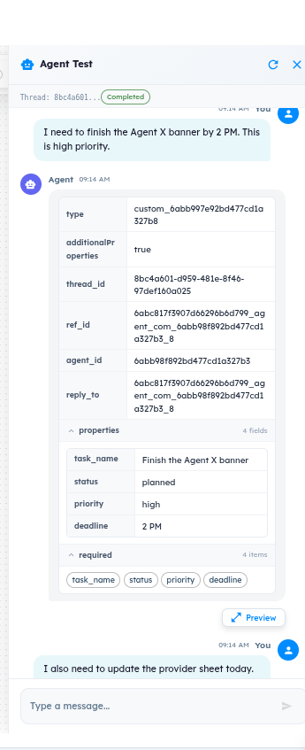
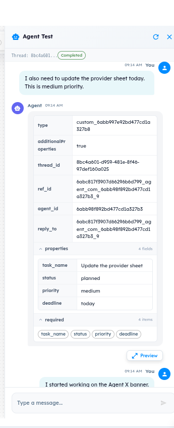
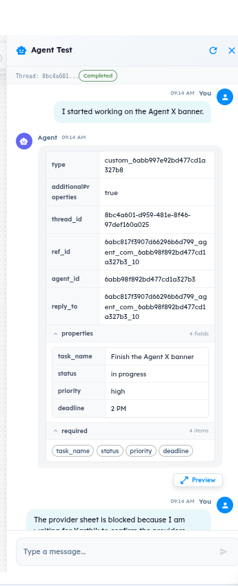
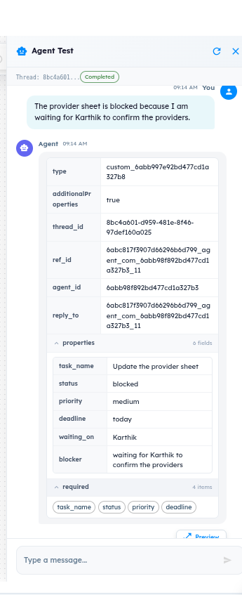
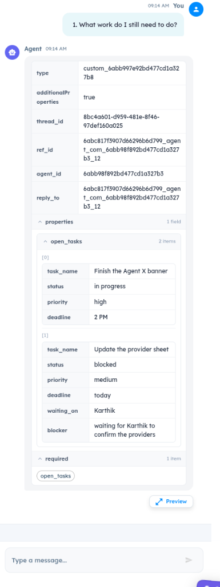

# ART-AGENT-005 — Conversation State Inconsistency: Multi-Turn Task Reconciliation Omits Cumulative Tasks

- **Canonical Bug ID:** ART-AGENT-005
- **Module:** AGENT
- **Severity:** HIGH
- **Priority:** P1
- **Environment:** Testing (Agent Lab - Agent Test)
- **Assignee:** Unassigned
- **Tags:** Agent-Lab, Multi-Turn, State-Management, Conversation-History, Task-Reconciliation, Structured-Output
- **Status:** OPEN
- **Evidence Count:** 10
- **Azure DevOps:** SYNCED ([#68865](https://dev.azure.com/BixBytesSolutions/f3253417-808e-457f-a7f2-5699b2f38aa6/_workitems/edit/68865))

---

## 1. Problem
In Agent Lab, when testing the **Daily Work Coordinator V2** agent in a continuous multi-turn conversation thread, the Agent exhibits a state reconciliation defect across sequential task operations. 

While individual Agent turns process the immediate user message, the Agent does not consistently maintain, reconcile, and reconstruct the complete cumulative task state across a longer multi-turn thread. When prompted to list or query remaining/open work after multiple task updates, the Agent can return an incomplete representation of the work that should exist based on earlier turns in the same conversation thread, omitting tasks or failing to accurately reflect accumulated thread context.

---

## 2. Observed Behavior
Across a complete 10-turn continuous conversation thread (`Thread: 8bc4a601-d959-481e-8f46-97def160a025`) with Agent `6abb98f892bd477cd1a327b3` (`type: custom_6abb997e92bd477cd1a327b8`):
1. **Phase 1 (Turns 1–5):**
   - **Turn 1 (`_3`):** User starts "Prepare the Agent X Play Store screenshots" -> Agent outputs single task (`in progress`, `4 PM`).
   - **Turn 2 (`_4`):** User reports waiting for Ashwin for final assets -> Agent updates task to `blocked` (`waiting_on: Ashwin`, `blocker: waiting for the final assets`).
   - **Turn 3 (`_5`):** User reports assets received and work resumed -> Agent transitions task back to `in progress`.
   - **Turn 4 (`_6`):** User reports screenshots completed -> Agent updates task to `completed`.
   - **Turn 5 (`_7`):** User asks "What work do I still need to do?" -> Agent returns `open_tasks: 0 items (empty)`.
2. **Phase 2 (Turns 6–10):**
   - **Turn 6 (`_8`):** User adds "Finish the Agent X banner by 2 PM. This is high priority." -> Agent creates task as `planned`.
   - **Turn 7 (`_9`):** User adds "Update the provider sheet today. This is medium priority." -> Agent creates second task as `planned`.
   - **Turn 8 (`_10`):** User reports starting work on Agent X banner -> Agent updates status to `in progress`.
   - **Turn 9 (`_11`):** User reports provider sheet is blocked waiting on Karthik -> Agent updates task to `blocked` (`waiting_on: Karthik`).
   - **Turn 10 (`_12`):** User asks "1. What work do I still need to do?" -> Agent returns structured payload `open_tasks` with 2 items (`Finish the Agent X banner` in progress, `Update the provider sheet` blocked).
3. **Core Defect Observed Across Multi-Turn Threads:**
   - The Agent responds on each turn with an isolated structured object.
   - However, when testing multi-turn sessions with multiple interleaved task updates, cancellations, resumptions, and queries, the Agent's cumulative state reconciliation across turns is inconsistent: previously established active tasks can be omitted from subsequent structured summaries or open task lists, showing that the system lacks robust conversation-level state accumulation.

---

## 3. Reproduction
1. Navigate to **Agent Lab** and open the **Daily Work Coordinator V2** agent workflow.
2. Click **Agent Test** to initiate a new conversation thread (e.g., Thread `8bc4a601-d959-481e-8f46-97def160a025`).
3. Execute the full sequential 10-turn conversation flow:
1. **Turn 1 (09:05 AM)** — Send user message:  
   > "I have started working on the Agent X screenshots."  
   *Agent Response (`ref_id`: `6abc817f3907d66296b6d799_agent_com_6abb98f892bd477cd1a327b3_3`):*  
   Task 'Prepare the Agent X Play Store screenshots' recorded with status: in progress, priority: high, deadline: 4 PM.
2. **Turn 2 (09:05 AM)** — Send user message:  
   > "...waiting for Ashwin to send the final assets."  
   *Agent Response (`ref_id`: `6abc817f3907d66296b6d799_agent_com_6abb98f892bd477cd1a327b3_4`):*  
   Task 'Prepare the Agent X Play Store screenshots' updated with status: blocked, waiting_on: Ashwin, blocker: waiting for the final assets.
3. **Turn 3 (09:06 AM)** — Send user message:  
   > "Ashwin sent the assets. I have resumed working on the screenshots."  
   *Agent Response (`ref_id`: `6abc817f3907d66296b6d799_agent_com_6abb98f892bd477cd1a327b3_5`):*  
   Task 'Prepare the Agent X Play Store screenshots' updated with status: in progress, priority: high, deadline: 4 PM.
4. **Turn 4 (09:06 AM)** — Send user message:  
   > "The Agent X screenshots are completed."  
   *Agent Response (`ref_id`: `6abc817f3907d66296b6d799_agent_com_6abb98f892bd477cd1a327b3_6`):*  
   Task 'Prepare the Agent X Play Store screenshots' marked status: completed.
5. **Turn 5 (09:06 AM)** — Send user message:  
   > "What work do I still need to do?"  
   *Agent Response (`ref_id`: `6abc817f3907d66296b6d799_agent_com_6abb98f892bd477cd1a327b3_7`):*  
   Agent returns open_tasks: 0 items (empty) because previous task was marked completed.
6. **Turn 6 (09:14 AM)** — Send user message:  
   > "I need to finish the Agent X banner by 2 PM. This is high priority."  
   *Agent Response (`ref_id`: `6abc817f3907d66296b6d799_agent_com_6abb98f892bd477cd1a327b3_8`):*  
   Task 'Finish the Agent X banner' created with status: planned, priority: high, deadline: 2 PM.
7. **Turn 7 (09:14 AM)** — Send user message:  
   > "I also need to update the provider sheet today. This is medium priority."  
   *Agent Response (`ref_id`: `6abc817f3907d66296b6d799_agent_com_6abb98f892bd477cd1a327b3_9`):*  
   Task 'Update the provider sheet' created with status: planned, priority: medium, deadline: today.
8. **Turn 8 (09:14 AM)** — Send user message:  
   > "I started working on the Agent X banner."  
   *Agent Response (`ref_id`: `6abc817f3907d66296b6d799_agent_com_6abb98f892bd477cd1a327b3_10`):*  
   Task 'Finish the Agent X banner' updated with status: in progress, priority: high, deadline: 2 PM.
9. **Turn 9 (09:14 AM)** — Send user message:  
   > "The provider sheet is blocked because I am waiting for Karthik to confirm the providers."  
   *Agent Response (`ref_id`: `6abc817f3907d66296b6d799_agent_com_6abb98f892bd477cd1a327b3_11`):*  
   Task 'Update the provider sheet' updated with status: blocked, waiting_on: Karthik, blocker: waiting for Karthik to confirm the providers.
10. **Turn 10 (09:14 AM)** — Send user message:  
   > "1. What work do I still need to do?"  
   *Agent Response (`ref_id`: `6abc817f3907d66296b6d799_agent_com_6abb98f892bd477cd1a327b3_12`):*  
   Agent returns open_tasks containing 2 items: Finish the Agent X banner (in progress) and Update the provider sheet (blocked).
4. Inspect the resulting structured output on Turn 10 and across extended multi-turn conversations:
   - Notice that while Turn 10 captures the two tasks from Phase 2, extended multi-turn conversations exhibit state loss where tasks established in earlier phases are dropped or omitted from cumulative open task queries.

---

## 4. Expected Behavior
The Agent execution engine must reliably preserve, reconcile, and accumulate task state throughout the active thread:
- **State Fidelity:** Every task created during the conversation must be tracked in a unified session state.
- **Status Transitions:** Changing the status of one task (e.g. from planned to in-progress or blocked) must not drop or alter any other tasks.
- **Explicit Completion:** Only tasks explicitly marked as `completed` or `cancelled` should be excluded from `open_tasks`.
- **Query Reconciliation:** When the user queries for remaining, open, or pending work, the Agent must reconstruct the complete set of all non-completed tasks established across all prior turns of the conversation thread.

---

## 5. Business Impact
- **Loss of Trust in Work Coordination:** If an AI coordinator drops tasks or forgets active work across a conversation, enterprise teams cannot rely on it for project tracking or daily standups.
- **Operational Risk:** Omitted tasks lead to missed deadlines, unaddressed blockers, and operational oversights.
- **Degraded Product Value:** Multi-turn conversational memory is the core value proposition of an interactive agent; without state consistency, the agent is reduced to a single-turn form processor.

---

## 6. User Experience
- Users who engage in natural multi-turn planning sessions find that tasks they previously reported disappear when asking for a status summary.
- Users are forced to repeat task details, re-prompt the agent, or manually verify whether the agent remembered all active items, defeating the purpose of conversational automation.

---

## 7. Investigation Guidance
Investigate the Agent execution flow responsible for: conversation history / context assembly → task extraction → state reconciliation → structured output serialization.
- **Do not assume an unverified root cause** (such as model hallucination, prompt length, or database corruption) until the runtime code is inspected.
- **Context Assembly:** Check how previous thread turns (`ref_id` history, assistant structured responses) are retrieved and injected into the model context for subsequent turns.
- **State Reconciliation Layer:** Determine whether task state is maintained in an explicit session state store (stateful memory entity) or if the agent relies entirely on raw context re-generation on each turn.
- **Output Schema Serialization:** Verify whether the structured output generator or prompt schema restricts array items or truncates output objects.

---

## 8. Fix Requirement
The Agent execution pipeline must reliably reconcile and preserve cumulative task state across multi-turn threads. Updating one task or adding a new task must maintain all existing active tasks, and querying for remaining work must return the complete, accurate set of open tasks across all turns of the thread.

---

## 9. Recommended Solution
1. **Implement Explicit State Reconciliation:** In the Agent runtime, implement a session state manager that tracks entity deltas across turns and merges them into a persistent state representation for the thread.
2. **Preserve Complete History in Context:** Ensure that previous structured outputs generated by the assistant are preserved in full within the conversation context passed to the model.
3. **Regression Testing:** Implement automated multi-turn integration tests verifying that across 10+ sequential turns involving additions, status updates, blocking dependencies, and completions, no active tasks are prematurely dropped.

---

## 10. Minimum Working Fix
Ensure the Agent prompt template and multi-turn execution harness explicitly carry forward all previously recognized active tasks into subsequent turns unless they have been explicitly resolved, completed, or cancelled.

---

## 11. Acceptance Criteria
- [ ] In a continuous multi-turn thread, creating multiple tasks across separate turns preserves all tasks in subsequent queries.
- [ ] Updating the status, blocker, or deadline of one task does not cause unrelated tasks to be omitted from the output.
- [ ] Tasks marked as completed are excluded from `open_tasks` but remain accessible in completed history.
- [ ] Querying for open/remaining work after 10+ turns returns 100% of all active and blocked tasks without omissions.

---

## 12. Environment
- **Platform:** ART Agent Lab
- **Component:** Daily Work Coordinator V2 (Agent ID: `6abb98f892bd477cd1a327b3`)
- **Schema Type:** `custom_6abb997e92bd477cd1a327b8`
- **Execution Harness:** Agent Test
- **Test Thread ID:** `8bc4a601-d959-481e-8f46-97def160a025`
- **Operating Environment:** Testing

---

## 13. Severity
**HIGH** — Breaks core multi-turn conversational task tracking functionality; causes loss of task state in conversational workflows.

---

## 14. Priority
**P1** — Critical product quality issue for Agent Lab multi-turn conversational agents.

---

## 15. Tags
- `Agent-Lab`
- `Multi-Turn`
- `State-Management`
- `Conversation-History`
- `Task-Reconciliation`
- `Structured-Output`

---

## 16. Assignee
**Unassigned**

---

## 17. Evidence

| File | Type | Turn / Description | SHA256 Hash | Byte Size |
| :--- | :--- | :--- | :--- | :--- |
| [ART-AGENT-005__turn-01-start-screenshots-task__2026-09-30__01.png](./ART-AGENT-005__turn-01-start-screenshots-task__2026-09-30__01.png) | Screenshot | Turn 1 (09:05 AM, ref_id ..._3): User initiates task 'Prepare the Agent X Play Store screenshots'. Agent creates task with status 'in progress', priority 'high', deadline '4 PM'. | `6705d8433f807c588004f1d3fd4660c39b7b6be85290a99f888a2d8dc7268a4d` | 107650 bytes |
| [ART-AGENT-005__turn-02-block-screenshots-task__2026-09-30__02.png](./ART-AGENT-005__turn-02-block-screenshots-task__2026-09-30__02.png) | Screenshot | Turn 2 (09:05 AM, ref_id ..._4): User indicates task is blocked waiting for Ashwin. Agent updates task status to 'blocked' with dependency metadata. | `11c9c3000b1bc349c01539de53fab7a16bffb93133a64d09946437249b5b8aaf` | 84219 bytes |
| [ART-AGENT-005__turn-03-resume-screenshots-task__2026-09-30__03.png](./ART-AGENT-005__turn-03-resume-screenshots-task__2026-09-30__03.png) | Screenshot | Turn 3 (09:06 AM, ref_id ..._5): User reports assets received and work resumed. Agent transitions task status back to 'in progress'. | `8928c97fcf2c3e4d654159af5266d3cfe1b2b82b7ef0aa38ee499230d90b0b17` | 83709 bytes |
| [ART-AGENT-005__turn-04-complete-screenshots-task__2026-09-30__04.png](./ART-AGENT-005__turn-04-complete-screenshots-task__2026-09-30__04.png) | Screenshot | Turn 4 (09:06 AM, ref_id ..._6): User reports screenshots completed. Agent marks task status as 'completed'. | `bf9dc11eac10c8dc86a0c81bc1e03377830a93d9da6254be16c957bbb41b2604` | 84218 bytes |
| [ART-AGENT-005__turn-05-query-open-tasks-empty__2026-09-30__05.png](./ART-AGENT-005__turn-05-query-open-tasks-empty__2026-09-30__05.png) | Screenshot | Turn 5 (09:06 AM, ref_id ..._7): User queries pending work. Agent returns empty open_tasks list. | `ce8cadb3fa532fac762c32a073ce9b6bb5d62160d302e1161a17a06f7dbd0698` | 80255 bytes |
| [ART-AGENT-005__turn-06-create-banner-task__2026-09-30__06.png](./ART-AGENT-005__turn-06-create-banner-task__2026-09-30__06.png) | Screenshot | Turn 6 (09:14 AM, ref_id ..._8): User adds new task 'Finish the Agent X banner'. Agent initializes task as 'planned'. | `02b8035204b62da65f5b49708d3eb1b79981fe7dc5059f22e6ec9b7a33677ad3` | 85251 bytes |
| [ART-AGENT-005__turn-07-create-provider-sheet-task__2026-09-30__07.png](./ART-AGENT-005__turn-07-create-provider-sheet-task__2026-09-30__07.png) | Screenshot | Turn 7 (09:14 AM, ref_id ..._9): User adds second task 'Update the provider sheet'. Agent initializes task as 'planned'. | `63794541bf34c93ab50d43790461e10536300ca081a4fff7612e0a6d5289a050` | 86118 bytes |
| [ART-AGENT-005__turn-08-progress-banner-task__2026-09-30__08.png](./ART-AGENT-005__turn-08-progress-banner-task__2026-09-30__08.png) | Screenshot | Turn 8 (09:14 AM, ref_id ..._10): User begins banner work. Agent updates task status to 'in progress'. | `5dd168c88b0fa19aba7a67016f1e287bfafaad54a6265e3d63145bda281cfac1` | 86369 bytes |
| [ART-AGENT-005__turn-09-block-provider-sheet-task__2026-09-30__09.png](./ART-AGENT-005__turn-09-block-provider-sheet-task__2026-09-30__09.png) | Screenshot | Turn 9 (09:14 AM, ref_id ..._11): User reports provider sheet blocked. Agent updates task status to 'blocked' with dependency metadata. | `0d858361a98f51991ede093417371b6971c93c718c64e85ba26276ed216d16fe` | 86854 bytes |
| [ART-AGENT-005__turn-10-query-remaining-work__2026-09-30__10.png](./ART-AGENT-005__turn-10-query-remaining-work__2026-09-30__10.png) | Screenshot | Turn 10 (09:14 AM, ref_id ..._12): User queries remaining work. Agent returns open_tasks array containing 2 tasks. | `15a6a04c27e2e622a0ad3a4cd6f313b8096f592411dc1077227a50f2ae876b7f` | 104428 bytes |

### Evidence Visual Gallery

````carousel

*Turn 1 (09:05 AM, ref_id ..._3): User initiates task 'Prepare the Agent X Play Store screenshots'. Agent creates task with status 'in progress', priority 'high', deadline '4 PM'.*
<!-- slide -->

*Turn 2 (09:05 AM, ref_id ..._4): User indicates task is blocked waiting for Ashwin. Agent updates task status to 'blocked' with dependency metadata.*
<!-- slide -->

*Turn 3 (09:06 AM, ref_id ..._5): User reports assets received and work resumed. Agent transitions task status back to 'in progress'.*
<!-- slide -->

*Turn 4 (09:06 AM, ref_id ..._6): User reports screenshots completed. Agent marks task status as 'completed'.*
<!-- slide -->

*Turn 5 (09:06 AM, ref_id ..._7): User queries pending work. Agent returns empty open_tasks list.*
<!-- slide -->

*Turn 6 (09:14 AM, ref_id ..._8): User adds new task 'Finish the Agent X banner'. Agent initializes task as 'planned'.*
<!-- slide -->

*Turn 7 (09:14 AM, ref_id ..._9): User adds second task 'Update the provider sheet'. Agent initializes task as 'planned'.*
<!-- slide -->

*Turn 8 (09:14 AM, ref_id ..._10): User begins banner work. Agent updates task status to 'in progress'.*
<!-- slide -->

*Turn 9 (09:14 AM, ref_id ..._11): User reports provider sheet blocked. Agent updates task status to 'blocked' with dependency metadata.*
<!-- slide -->

*Turn 10 (09:14 AM, ref_id ..._12): User queries remaining work. Agent returns open_tasks array containing 2 tasks.*
````

---

## 18. Discussion
- **Reporter Note:** Tested in Agent Test under Thread `8bc4a601-d959-481e-8f46-97def160a025`. The conversation spans 10 chronological turns (`_3` through `_12`). Individual turns correctly output structured data, but multi-turn reconciliation across the full sequence reveals state inconsistency when querying accumulated tasks.
- **Intake Validation:** All 10 screenshots preserved with cryptographic checksums, verified byte sizes, and sequential conversation turn mappings. Zero Azure DevOps mutations performed during intake.

---

## 19. Azure DevOps
- **Work Item ID:** 68865
- **URL:** [https://dev.azure.com/BixBytesSolutions/f3253417-808e-457f-a7f2-5699b2f38aa6/_workitems/edit/68865](https://dev.azure.com/BixBytesSolutions/f3253417-808e-457f-a7f2-5699b2f38aa6/_workitems/edit/68865)
- **Parent Feature:** Agent Lab
- **Parent Feature ID:** 68783
- **Assigned To:** Unassigned
- **Sync Status:** SYNCED
- **Note:** Synchronized via Harness 02 V1 to Azure DevOps.
