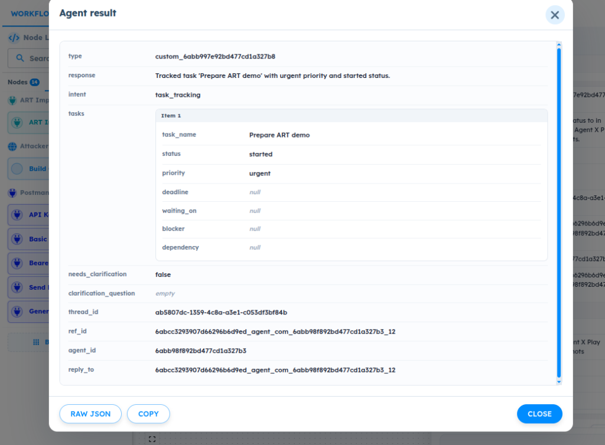
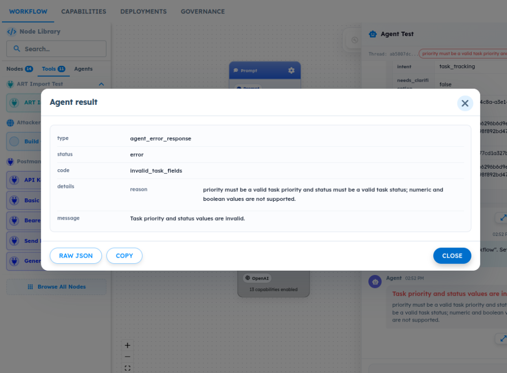

# ART-AGENT-006 — Agent Output Schema Allowed Values Are Not Strictly Enforced for Text Fields

- **Canonical Bug ID:** ART-AGENT-006
- **Module:** AGENT
- **Severity:** HIGH
- **Priority:** P1
- **Environment:** Testing (Daily Work Coordinator V2)
- **Assignee:** Unassigned
- **Tags:** Agent-Lab, Output-Schema, Output-Validation, Enum-Validation, Allowed-Values, Structured-Output
- **Status:** OPEN
- **Evidence Count:** 2
- **Azure DevOps:** SYNCED ([#68876](https://dev.azure.com/BixBytesSolutions/f3253417-808e-457f-a7f2-5699b2f38aa6/_workitems/edit/68876))

---

## 1. Problem
In Daily Work Coordinator V2 (Agent Lab), the Agent Output Schema is configured with Text fields and restricted allowed values for structured properties such as `intent`, `status`, and `priority`. 

During testing, when the Agent is prompted to create or update structured items with values outside the configured allowed-value contract (e.g. setting `status` to `STARTED` and `priority` to `URGENT`), the validation layer does not enforce the restricted allowed-value contract for Text fields. The Agent execution completes successfully and outputs the invalid text values as a valid structured result (`custom_6abb997e92bd477cd1a327b8`).

In contrast, primitive type validation is actively enforced: when incompatible types (such as numeric priority or boolean status) are provided, ART detects the type mismatch and halts execution with an error (`code: invalid_task_fields`, `message: Task priority and status values are invalid.`). This demonstrates that while type checking operates, the configured allowed-value restrictions for Text fields are bypassed, allowing schema-violating strings to be treated as successful results and propagated downstream.

---

## 2. Observed Behavior
- **Allowed-Value Violation (Passed / Unenforced):**
  When prompted with:
  > "Add a task called Prepare ART demo. Set the status to STARTED and priority to URGENT."
  
  The configured schema does not allow `STARTED` for status or `URGENT` for priority. However, the Agent run completes successfully and emits the following structured payload:
  - `intent`: `task_tracking`
  - `tasks`:
    - `task_name`: `Prepare ART demo`
    - `status`: `started`
    - `priority`: `urgent`
    - `deadline`: `null`
    - `waiting_on`: `null`
    - `blocker`: `null`
    - `dependency`: `null`
  - `response`: `Tracked task 'Prepare ART demo' with urgent priority and started status.`
  - `type`: `custom_6abb997e92bd477cd1a327b8`
  - `thread_id`: `ab5807dc-1359-4c8a-a3e1-c053df3bf84b`
  - `ref_id`: `6abcc3293907d66296b6d9ed_agent_com_6abb98f892bd477cd1a327b3_12`

- **Type Incompatibility (Caught / Enforced):**
  When incompatible value types are provided for the same fields (such as numeric priority and boolean status), ART halts execution and returns an error response:
  - `type`: `agent_error_response`
  - `status`: `error`
  - `code`: `invalid_task_fields`
  - `details`:
    - `reason`: `priority must be a valid task priority and status must be a valid task status; numeric and boolean values are not supported.`
  - `message`: `Task priority and status values are invalid.`

- **Summary of Discrepancy:**
  The runtime validation checks whether values are strings, but fails to check whether string values belong to the configured allowed-value set defined in the schema contract.

---

## 3. Reproduction
1. Navigate to **Agent Lab** and open the **Daily Work Coordinator V2** agent workflow (`agent_id`: `6abb98f892bd477cd1a327b3`).
2. Verify that the Agent Output Schema configures Text fields with restricted allowed values for `status` (e.g. `planned`, `in progress`, `completed`, `blocked`) and `priority` (e.g. `high`, `medium`, `low`).
3. Open **Agent Test** to initiate a test conversation thread.
4. Submit a task creation message with values outside the allowed-value set:
   > "Add a task called Prepare ART demo. Set the status to STARTED and priority to URGENT."
5. Open the **Agent result** modal upon completion.
6. Observe that the Agent returns a successful result with `status: started` and `priority: urgent` instead of rejecting the output or repairing the values to schema-valid enums.
7. For comparison, submit a prompt supplying incompatible primitive types (e.g. numeric priority or boolean status).
8. Observe that ART rejects the incompatible types with `code: invalid_task_fields`.

---

## 4. Expected Behavior
ART should validate the final Agent output against the complete configured Output Schema before accepting the result:
- For Text fields with configured allowed values:
  - Values within the allowed set should be accepted.
  - Text values outside the allowed set must not be accepted as valid output.
  - Invalid values should either be safely repaired to a contract-valid value or execution should halt with a clear output-validation error.
  - The validation error should identify the affected field and invalid value.
  - Invalid structured output must not be exposed as a successful Agent result or propagated downstream.

---

## 5. Business Impact
- **Downstream Orchestration Failures:** Orchestrators, routers, and switch nodes expecting standardized enum values (e.g. branching on `high`, `medium`, `low`) fail to match conditions when encountering unstandardized strings like `urgent`, causing workflows to drop execution branches or fail silently.
- **Data Integrity Degradation:** Task ledgers, analytics dashboards, and external issue trackers receive corrupted, unstandardized status values (e.g. `started` instead of `in progress`), undermining automated reporting.
- **Contract Reliability:** The platform's guarantee of schema-driven agent execution is weakened when configured schema constraints are not enforced at runtime.

---

## 6. User Experience
- Builders define explicit allowed values in the Schema Builder expecting the platform to enforce them, but find that end-user inputs can inject arbitrary values directly into the final agent output.
- Debugging downstream workflow issues is frustrating because the upstream Agent reports successful execution despite producing contract-violating outputs.

---

## 7. Investigation Guidance
Investigate the post-execution Agent output validation pipeline:
- **Validation Execution Point:** Identify where post-model execution output validation takes place (between LLM response parsing and the creation of `custom_...` structured result).
- **JSON Schema Compilation:** Check how the Agent Output Schema is compiled into a JSON Schema validator. Determine whether `enum` or `oneOf` constraints configured for Text fields in the UI builder are included in the compiled schema or dropped during compilation.
- **Type Checking vs. Schema Validation:** Contrast the implementation of `invalid_task_fields` (which detects non-string primitive types) with the general schema validation routine. Determine whether allowed-value checks were omitted from the custom field validation logic or if schema validation only checks primitive types (`type: "string"`).
- **Repair / Coercion Logic:** Check whether an auto-repair or normalization step exists and why unallowed values bypass it without triggering a fallback error.

---

## 8. Fix Requirement
The Agent output validation engine must enforce configured allowed-value (enum) constraints on all Text fields. Any output value not belonging to the allowed-value set must not be accepted as a successful result; it must either be coerced/repaired to a valid allowed value or rejected with an informative output-validation error.

---

## 9. Recommended Solution
1. **Include Enum Constraints in Schema Definition:** Ensure the schema generator always populates the `enum` array for Text fields with configured allowed values.
2. **Strict Server-Side Validation:** Enforce strict JSON Schema validation against the complete compiled schema after agent execution.
3. **Structured Validation Error Response:** If an output field contains an unallowed string value, return an error payload (e.g., `code: invalid_field_allowed_value` with details specifying the field, received value, and allowed choices) rather than emitting a successful `custom_...` response.
4. **Automated Regression Testing:** Add unit and integration tests verifying that outputs with unallowed text values are rejected or repaired.

---

## 10. Minimum Working Fix
In the agent output validation routine, add an explicit check for all Text fields with defined allowed values verifying `value in field_spec["allowed_values"]`. If the value is outside the allowed list, emit an `invalid_task_fields` error response instead of proceeding to emit the successful result payload.

---

## 11. Acceptance Criteria
- [ ] Text fields configured with allowed values reject any output value outside the allowed set with a clear validation error.
- [ ] The validation error identifies the invalid field name and the offending value.
- [ ] Valid enum values within the allowed set continue to be accepted and processed normally.
- [ ] Incompatible primitive types (e.g. numeric, boolean) continue to be rejected.
- [ ] Invalid structured outputs are never emitted as successful `custom_...` results or passed to downstream nodes.

---

## 12. Environment
- **Component:** Daily Work Coordinator V2 (Agent ID: `6abb98f892bd477cd1a327b3`)
- **Schema:** `custom_6abb997e92bd477cd1a327b8`
- **Module:** Agent Lab — Output Schema / Output Validation
- **Test Thread ID:** `ab5807dc-1359-4c8a-a3e1-c053df3bf84b`
- **Environment:** Testing

---

## 13. Severity
**HIGH** — Breaks schema contract enforcement; allows unvalidated and contract-violating data to pass as successful outputs.

---

## 14. Priority
**P1** — Core integrity defect in Agent Lab's structured output schema and validation system.

---

## 15. Tags
- `Agent-Lab`
- `Output-Schema`
- `Output-Validation`
- `Enum-Validation`
- `Allowed-Values`
- `Structured-Output`

---

## 16. Assignee
**Unassigned**

---

## 17. Evidence

| File | Type | Description | SHA256 Hash | Byte Size |
| :--- | :--- | :--- | :--- | :--- |
| [ART-AGENT-006__agent-result-accepts-unallowed-text-values__2026-09-30__01.png](./ART-AGENT-006__agent-result-accepts-unallowed-text-values__2026-09-30__01.png) | Screenshot | Agent result modal displaying accepted unallowed text values 'started' for status and 'urgent' for priority within custom schema custom_6abb997e92bd477cd1a327b8. | `d5df3bd41e22398151b33733e84eb909637f89a61dc9c431f5bd70b0bd6263df` | 189743 bytes |
| [ART-AGENT-006__type-validation-error-on-incompatible-types__2026-09-30__02.png](./ART-AGENT-006__type-validation-error-on-incompatible-types__2026-09-30__02.png) | Screenshot | Agent error response displaying code 'invalid_task_fields' when numeric/boolean values are provided, demonstrating that type checking occurs while string allowed-value validation is not enforced. | `3f7e42be16934854b7b48266f700d65d77b6e1986e20c601e39b2f9a529721a5` | 236648 bytes |

### Evidence Visual Gallery

````carousel

*Agent result modal displaying accepted unallowed text values 'started' for status and 'urgent' for priority within custom schema custom_6abb997e92bd477cd1a327b8.*
<!-- slide -->

*Agent error response displaying code 'invalid_task_fields' when numeric/boolean values are provided, demonstrating that type checking occurs while string allowed-value validation is not enforced.*
````

---

## 18. Discussion
- **Reporter Note:** In Daily Work Coordinator V2, testing out-of-contract values revealed that string values outside the configured allowed set (`started`, `urgent`) pass validation and produce a successful agent result. Incompatible primitive types (numeric/boolean) are correctly rejected with `invalid_task_fields`. This proves that primitive type checking is functional, but allowed-value / enum restrictions on Text fields are completely unenforced.

---

## 19. Azure DevOps
- **Work Item ID:** 68876
- **URL:** [https://dev.azure.com/BixBytesSolutions/f3253417-808e-457f-a7f2-5699b2f38aa6/_workitems/edit/68876](https://dev.azure.com/BixBytesSolutions/f3253417-808e-457f-a7f2-5699b2f38aa6/_workitems/edit/68876)
- **Parent Feature:** Agent Lab
- **Parent Feature ID:** 68783
- **Assigned To:** Unassigned
- **Sync Status:** SYNCED
- **Note:** Synchronized via Harness 02 V1 to Azure DevOps.
