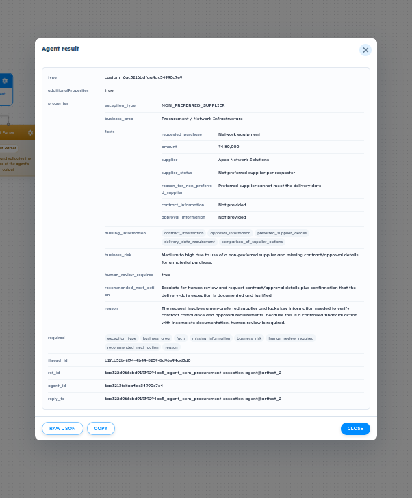
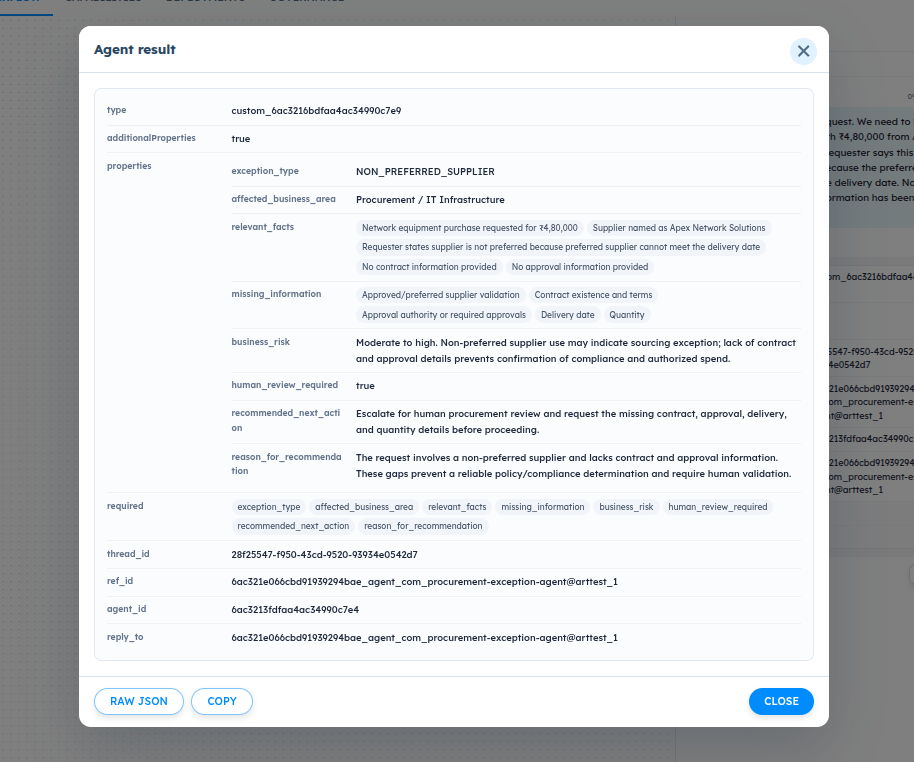

# ART-AGENT-007 — Output Schema Fields Should Be Required by Default

- **Canonical Bug ID:** ART-AGENT-007
- **Module:** AGENT
- **Severity:** MEDIUM
- **Priority:** P2
- **Environment:** Testing (Procurement Exception Agent / Agent Lab / Professional Plan / InvestigationLab)
- **Assignee:** Unassigned
- **Tags:** Agent-Lab, Output-Schema, Schema-Builder, Required-By-Default, Structured-Output, Contract-Enforcement, UX-Improvement, Governance-Reliability
- **Status:** OPEN
- **Evidence Count:** 2
- **Azure DevOps:** SYNCED ([#68933](https://dev.azure.com/BixBytesSolutions/f3253417-808e-457f-a7f2-5699b2f38aa6/_workitems/edit/68933))

---

## 1. Problem
When creating an Agent output schema in **Agent Lab / Schema Builder**, fields and nested subfields are currently **not marked as Required by default**. Users must manually enable the `Required` toggle for every single field and nested subfield (e.g. inside objects and arrays of structured objects).

During testing, Agent outputs were noticeably more complete, robust, and structurally consistent after `Required` was explicitly enabled across the schema. Under the default optional configuration, the underlying model frequently omits fields from the structured response. Because downstream workflow components—such as Orchestrator value mappings, Condition Builder logic, Governance rules, and external integrations—depend on predictable field availability, omitted fields lead to ambiguous states and workflow execution failures.

For structured Agent outputs, enterprise orchestration requires schema-first workflows to default toward **strict contracts** rather than loose, optional contracts. Newly created fields and nested fields should be marked `Required` by default, with users explicitly opting out when a field is intended to be optional. Additionally, when importing an external schema where `required` is not specified, ART should clearly indicate which fields are optional instead of silently allowing a loose contract.

---

## 2. Observed Behavior
- **Default Optional State:** When a new field is added in the Output Schema builder, the `Required` toggle defaults to OFF (`required: false`).
- **Subfield Configuration Overhead:** When structured objects or arrays of objects are added, all nested properties also default to `Required: false`, requiring repetitive manual toggling for every subfield.
- **Model Field Omission:** In executions where fields are left optional, the model omits properties from structured output payloads, causing missing keys in downstream nodes.
- **Evidence from Enforced Schemas:**
  - **Thread `b2fcb32b-ff74-4b49-8259-8d96e94ad5d0` (`@arttest_2`):** When all 8 top-level properties (`exception_type`, `business_area`, `facts`, `missing_information`, `business_risk`, `human_review_required`, `recommended_next_action`, `reason`) and nested object properties under `facts` (`requested_purchase`, `amount: ₹4,80,000`, `supplier: Apex Network Solutions`, `supplier_status`, `reason_for_non_preferred_supplier`, `contract_information`, `approval_information`) are explicitly configured as required, the Agent generates a 100% complete and structurally consistent result.
  - **Thread `28f25547-f950-43cd-9520-93934e0542d7` (`@arttest_1`):** When all required fields (`exception_type`, `affected_business_area`, `relevant_facts`, `missing_information`, `business_risk`, `human_review_required`, `recommended_next_action`, `reason_for_recommendation`) are configured, the Agent produces complete array and string outputs without field dropping.
- **Silent Loose Contract on Import:** Importing a schema without an explicit `required` array silently leaves all imported fields optional without visual indication or confirmation.

---

## 3. Reproduction
1. Navigate to **Agent Lab** and open or create an Agent workflow (e.g. Procurement Exception Agent).
2. Navigate to the **Output Schema** / **Schema Builder** section.
3. Click **Add Field** to create a new output schema field (e.g. `exception_type`, `human_review_required`, or `facts`).
4. Observe that the newly created field has `Required` disabled by default.
5. Add nested fields inside an object or an array of structured objects (e.g. `facts.amount`, `facts.supplier`).
6. Observe that all nested subfields also default to `Required = OFF`, requiring manual activation for every property.
7. Import an external JSON schema where the `required` array is not specified.
8. Observe that ART accepts the schema without highlighting or confirming optional fields.

---

## 4. Expected Behavior
- When a user adds a new output-schema field, `Required` should be enabled by default (`required: true`).
- The same `Required = true` default must apply recursively to fields created inside nested objects and arrays of structured objects.
- Users must retain the ability to manually toggle `Required` OFF for genuinely optional fields.
- When importing a schema where `required` is not specified, ART should clearly indicate which fields are optional instead of silently allowing a loose contract.
- Downstream Orchestrators, Condition Builders, and Governance rules receive predictable, complete payloads conforming to strict contracts.

---

## 5. Business Impact
- **Governance and Policy Ambiguity:** Governance rules often evaluate conditions such as `human_review_required == true` or inspect `facts.amount`. If `human_review_required` is optional and omitted by the model, downstream behavior becomes ambiguous:
  - `true` → escalate for human review
  - `false` → continue automated flow
  - `missing` → unhandled evaluation / potential governance bypass or workflow stall
- **Downstream Orchestration Failures:** Orchestrator node mappings and Condition Builder branches fail or evaluate unexpectedly when upstream Agent outputs drop optional fields.
- **High Authoring Friction and Error Rate:** Enterprise builders constructing schemas with dozens of nested properties face repetitive manual clicking, increasing the risk of configuration errors that surface later as workflow failures.

---

## 6. User Experience
- Schema authoring is cumbersome and error-prone because users must remember to toggle `Required` for every field and nested property.
- When importing schemas, authors receive no visual feedback regarding contract strictness, leading to unexpected runtime omissions.
- Defaulting to `Required = ON` establishes a strict contract by default, aligning with enterprise developer expectations while allowing deliberate opt-out when needed.

---

## 7. Investigation Guidance
Investigate the Agent Output Schema Builder UI and schema compilation components:
- **Schema Builder Field Factory:** Inspect the component or state handler that initializes new fields in the Schema Builder (e.g. `addField`, `addNestedProperty`, or equivalent field definition factory). Check where default property attributes (`type`, `name`, `required`, `description`) are initialized.
- **Nested Schema Handlers:** Ensure default `required: true` is applied consistently across all container types: top-level object properties, nested object properties, and array items of type `object`.
- **JSON Schema Compilation:** Verify how the Schema Builder state compiles into the final JSON Schema `required` array (`properties` vs `required: [...]`). Ensure setting `required: true` properly adds the field name into the parent object's `required` list.
- **Schema Import Parser:** Inspect the schema import handler. Identify where imported JSON Schemas are converted into builder state, and verify how missing `required` arrays are surfaced to the user.
- **Regression Protection:** Ensure existing schemas with explicitly optional fields (`required: false`) are preserved and not mutated upon loading or editing.

---

## 8. Fix Requirement
The Agent Output Schema Builder must initialize all newly created fields and nested subfields with `Required` enabled by default. Users must remain able to toggle `Required` off. The schema import mechanism must clearly surface optional fields when `required` is not specified. Existing saved schemas must retain their configured required/optional settings without modification.

---

## 9. Recommended Solution
1. **Default Required = True for New Fields:** In the Schema Builder field factory, set the default `required` flag to `true` for all newly created fields.
2. **Recursive Application:** Ensure that adding subfields to nested objects or structured array items also defaults `required` to `true`.
3. **Opt-Out Control:** Maintain the existing UI toggle allowing authors to switch `Required` from ON to OFF for fields intended to be optional.
4. **Schema Import Inspection:** In the schema importer, detect when an object schema does not define a `required` list or defines optional fields. Display an informational notice/badge indicating optional fields, with a quick action to "Mark All as Required" or "Keep As Optional".
5. **Preserve Existing Saved Schemas:** Ensure schema serialization and deserialization does not alter existing agent schemas that have optional fields already configured.

---

## 10. Minimum Working Fix
In the Schema Builder's field creation action handler, change the default state of `required` from `false` to `true` for newly instantiated fields and nested object properties. Ensure the UI toggle reflects this checked state and includes the field in the parent object's `required` array upon generation.

---

## 11. Acceptance Criteria
- [ ] Newly added top-level output schema fields have `Required` enabled by default.
- [ ] Newly added fields inside nested objects and structured array items have `Required` enabled by default.
- [ ] Users can manually toggle `Required` OFF for any field or subfield without restriction.
- [ ] Saving an Agent output schema with default settings generates a JSON Schema containing all created properties in the `required` array.
- [ ] Importing a schema without specified `required` properties clearly identifies optional fields in the UI.
- [ ] Existing Agent output schemas with optional fields remain unchanged upon loading and editing.

---

## 12. Environment
- **Platform:** ART Agent Builder / Agent Lab
- **Module:** Agent — Output Schema / Schema Builder
- **Agent Workflow:** Procurement Exception Agent (`6ac3213fdfaa4ac34990c7e4`)
- **Schema Reference:** `custom_6ac3216bdfaa4ac34990c7e9`
- **Environment:** Testing (InvestigationLab, Professional Plan)

---

## 13. Severity
**MEDIUM** — Defaulting to optional fields directly causes model omission defects and downstream workflow/governance failures, but can currently be worked around through manual per-field configuration.

---

## 14. Priority
**P2** — High-value product improvement / UX reliability enhancement that directly prevents configuration mistakes and ensures contract predictability across enterprise workflows.

---

## 15. Tags
- `Agent-Lab`
- `Output-Schema`
- `Schema-Builder`
- `Required-By-Default`
- `Structured-Output`
- `Contract-Enforcement`
- `UX-Improvement`
- `Governance-Reliability`

---

## 16. Assignee
**Unassigned**

---

## 17. Evidence

| File | Type | Description | SHA256 Hash | Byte Size |
| :--- | :--- | :--- | :--- | :--- |
| [ART-AGENT-007__agent-result-procurement-exception-nested-facts-required__2026-10-05__01.png](./ART-AGENT-007__agent-result-procurement-exception-nested-facts-required__2026-10-05__01.png) | Screenshot | Agent result modal for procurement-exception-agent (thread b2fcb32b, @arttest_2) demonstrating complete structured output when required is fully configured across the schema. Output includes nested object 'facts' with all required properties (requested_purchase, amount '₹4,80,000', supplier 'Apex Network Solutions', supplier_status, reason_for_non_preferred_supplier, contract_information, approval_information), required array 'missing_information', exception_type, business_area, business_risk, human_review_required (true), recommended_next_action, and reason. The required pill list shows all 8 top-level properties explicitly marked required. | `aa6444e03af9c178656da61a83b048d0ea91ab6d53ccc5fbf6ea04437bd11249` | 143690 bytes |
| [ART-AGENT-007__agent-result-procurement-exception-relevant-facts-required__2026-10-05__02.png](./ART-AGENT-007__agent-result-procurement-exception-relevant-facts-required__2026-10-05__02.png) | Screenshot | Agent result modal for procurement-exception-agent (thread 28f25547, @arttest_1) showing complete structured output with required enabled across top-level fields and arrays: exception_type, affected_business_area, relevant_facts array, missing_information array, business_risk, human_review_required (true), recommended_next_action, and reason_for_recommendation. The required pill list confirms all 8 properties were explicitly configured as required. | `716a74a12cac8c4c37ecc7f0b68d4eacf802194b5259f72308f7a4130978f213` | 183561 bytes |

### Evidence Visual Gallery

````carousel

*Agent result modal for procurement-exception-agent (thread b2fcb32b, @arttest_2) demonstrating complete structured output when required is fully configured across the schema. Output includes nested object 'facts' with all required properties (requested_purchase, amount '₹4,80,000', supplier 'Apex Network Solutions', supplier_status, reason_for_non_preferred_supplier, contract_information, approval_information), required array 'missing_information', exception_type, business_area, business_risk, human_review_required (true), recommended_next_action, and reason. The required pill list shows all 8 top-level properties explicitly marked required.*
<!-- slide -->

*Agent result modal for procurement-exception-agent (thread 28f25547, @arttest_1) showing complete structured output with required enabled across top-level fields and arrays: exception_type, affected_business_area, relevant_facts array, missing_information array, business_risk, human_review_required (true), recommended_next_action, and reason_for_recommendation. The required pill list confirms all 8 properties were explicitly configured as required.*
````

---

## 18. Discussion
- **Reporter Analysis:** In enterprise orchestration layers, schema-first workflows must default toward strict contracts rather than loose contracts. Optional contracts allow models to omit fields non-deterministically, breaking downstream Governance condition evaluation (e.g. `human_review_required == true`) and Orchestrator key mappings. Defaulting `Required` to ON while allowing deliberate opt-out significantly reduces configuration errors and improves runtime reliability.
- **Product Classification:** Logged as a Product Improvement / UX + Reliability with Medium priority (P2), reflecting that the defect is not an immediate system crash but a systemic architectural default that drives configuration mistakes and downstream execution failures.
- **Intake Validation:** Evidence screenshots preserved with cryptographic SHA256 checksums and verified byte sizes. Zero Azure DevOps mutations performed during intake.

---

## 19. Azure DevOps
- **Work Item ID:** 68933
- **URL:** [https://dev.azure.com/BixBytesSolutions/f3253417-808e-457f-a7f2-5699b2f38aa6/_workitems/edit/68933](https://dev.azure.com/BixBytesSolutions/f3253417-808e-457f-a7f2-5699b2f38aa6/_workitems/edit/68933)
- **Parent Feature:** Agent Lab
- **Parent Feature ID:** 68783
- **Assigned To:** Unassigned
- **Sync Status:** SYNCED
- **Note:** Synchronized via Harness 02 V1 to Azure DevOps.
