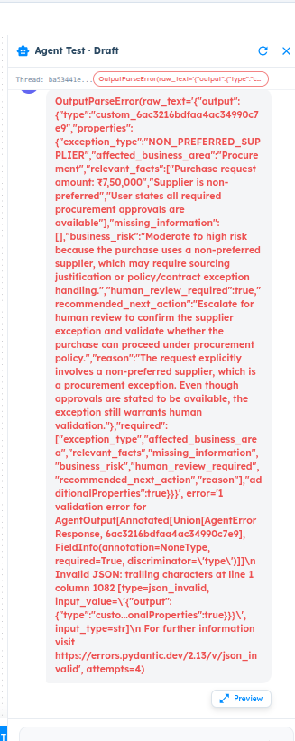

# ART-AGENT-008 — Output Parser Intermittently Fails Valid Agent Structured Responses with Trailing Characters

- **Canonical Bug ID:** ART-AGENT-008
- **Module:** AGENT
- **Severity:** HIGH
- **Priority:** P1
- **Environment:** Testing (Procurement Exception Agent / Agent Test Draft / Professional Plan / InvestigationLab)
- **Assignee:** Unassigned
- **Tags:** Agent-Lab, Output-Parser, Structured-Output, OutputParseError, JSON-Validation, Pydantic-Error, Flaky-Execution, P1
- **Status:** OPEN
- **Evidence Count:** 1
- **Azure DevOps:** SYNCED

---

## 1. Problem
The **Agent Output Parser** intermittently fails valid structured responses emitted by the model when the completion text contains extraneous trailing characters (such as an extra closing brace `}}}` at the end of the JSON string).

Instead of isolating or extracting the root valid JSON object, the parser passes the raw unnormalized string directly to Pydantic/JSON validation. When Pydantic encounters trailing characters after the closing bracket, it raises a `json_invalid: Invalid JSON: trailing characters` error. The system performs 4 repetitive retry attempts (`attempts=4`) without repairing or isolating the candidate JSON, and ultimately crashes, dumping a raw Python `OutputParseError` with full Pydantic exception details directly into the user-facing chat conversation bubble.

Because the underlying data payload generated by the model is completely valid and re-executing the identical request succeeds, this defect represents an unhandled boundary-parsing issue in the Agent Output Parser.

---

## 2. Observed Behavior
- **Parsing Crash on Trailing Characters:** During an evaluation in Agent Test (Draft mode, thread `ba53441e...`) for a ₹7,50,000 procurement exception request, execution failed with an unhandled exception.
- **Complete Payload Emitted by Model:** The model generated a complete and valid structured response under schema `custom_6ac3216bdfaa4ac34990c7e9` containing all required properties (`exception_type: "NON_PREFERRED_SUPPLIER"`, `affected_business_area: "Procurement"`, `relevant_facts`, `missing_information: []`, `business_risk`, `human_review_required: true`, `recommended_next_action`, `reason`).
- **Trailing Characters Error:** The candidate string contained an extra trailing brace at line 1 column 1082 (`... "additionalProperties":true}}}`), causing Pydantic to fail with:
  `Invalid JSON: trailing characters at line 1 column 1082 [type=json_invalid, input_value='{"output": {"type":"custo...onalProperties":true}}}', input_type=str]`
- **Unproductive Retries:** The parser repeated the operation 4 times (`attempts=4`) without stripping trailing characters or isolating the JSON boundary.
- **Raw Exception Dumped in UI:** The full raw exception was rendered verbatim in red inside the assistant message bubble:
  `OutputParseError(raw_text='{...}', error='1 validation error for AgentOutput[...]
Invalid JSON: trailing characters at line 1 column 1082... For further information visit https://errors.pydantic.dev/2.13/v/json_invalid', attempts=4)`
- **Intermittent Success on Re-run:** Re-running the identical user input subsequently returned a valid structured Agent result without error when trailing characters were absent.

---

## 3. Reproduction
1. Open **Agent Lab** and open the **Procurement Exception Agent** (or any Agent configured with structured output).
2. Open **Agent Test** in Draft mode.
3. Submit a complex evaluation prompt (e.g. `"Purchase request for ₹7,50,000 from Apex Network Solutions (non-preferred supplier). User states all procurement approvals are available."`).
4. If the model emits valid JSON with an extra trailing brace or trailing whitespace/character, observe the parser response.
5. Observe that the parser retries 4 times and halts with `OutputParseError(..., json_invalid: Invalid JSON: trailing characters at line 1 column 1082, attempts=4)`.
6. Observe that the entire raw Python traceback, Pydantic discriminator information, and Pydantic doc URL are displayed in the chat message bubble.
7. Re-run the identical input; observe that execution succeeds when no trailing character is emitted.

---

## 4. Expected Behavior
- The Output Parser must normalize and isolate the candidate JSON payload before schema validation, ignoring trailing characters outside the root JSON object.
- Valid structured responses must not intermittently fail due to superficial wrapper or trailing characters.
- Repair attempts should be bounded, deterministic, and observable.
- If parsing genuinely fails after bounded repair, a controlled user-facing error message must be displayed instead of raw internal Python exceptions.
- Malformed outputs must never reach downstream execution, and complete diagnostic details must be preserved in Observability traces.

---

## 5. Business Impact
- **Flaky Workflow Execution:** Agents fail non-deterministically during live testing and orchestration runs, reducing confidence in structured agent reliability.
- **Exposed Internal System Details:** Exposing raw Python exception traces and internal Pydantic URLs in the UI degrades enterprise product quality and exposes internal runtime architecture.
- **Wasted Compute and Latency:** 4 blind retry attempts on the same unnormalized string introduce latency without fixing the parsing issue.

---

## 6. User Experience
- The user is presented with a large red error bubble filled with code, escaped JSON, and Pydantic documentation URLs rather than a clean response.
- Re-running the same query works, creating confusion about whether the issue was in their input prompt, the agent configuration, or the platform.

---

## 7. Investigation Guidance
Inspect the Agent Output Parser and response validation pipeline:
- **Candidate JSON Extraction:** Inspect the parsing routine that processes raw LLM completion text before schema validation. Check whether it uses naive `json.loads(text)` or a boundary-aware extractor like `json.JSONDecoder().raw_decode(text.lstrip())`.
- **Pydantic Validation Layer:** Locate the `AgentOutput[Annotated[Union[AgentErrorResponse, custom_...]]]` model and examine how `attempts=4` is executed. Verify whether retry logic applies any sanitization between attempts.
- **Error Formatting Handler:** Inspect the frontend and backend error serialization that formats parser exceptions for the conversation stream. Ensure internal exceptions are mapped to clean error responses.

---

## 8. Fix Requirement
The Output Parser must extract and validate only the candidate JSON object from model completions, safely discarding extraneous trailing characters. Repair attempts must be bounded and unrecoverable errors must be surfaced cleanly in the UI while preserving trace logs.

---

## 9. Recommended Solution
1. **Boundary-Aware JSON Parsing:** Use `json.JSONDecoder().raw_decode()` to parse only the valid JSON object from the start of the string, ignoring trailing characters.
2. **Pre-Validation Normalization:** Strip markdown code fences, leading/trailing whitespace, and trailing brackets before validating against the Pydantic schema.
3. **Controlled Error Response:** Replace the raw `OutputParseError` dump with a standardized `AgentErrorResponse` in the UI.
4. **Preserve Observability Diagnostics:** Log the raw completion, error code, and attempts to the Observability trace store.

---

## 10. Minimum Working Fix
In the Output Parser, replace `json.loads(raw_text)` with `json.JSONDecoder().raw_decode(raw_text.strip())[0]` to extract the primary JSON object while discarding trailing characters before passing the dictionary to Pydantic validation.

---

## 11. Acceptance Criteria
- [ ] Valid structured responses do not fail validation when extraneous trailing characters or braces follow the JSON object.
- [ ] The primary JSON object is isolated and validated against the output schema.
- [ ] Repair attempts are bounded and logged in execution traces.
- [ ] Raw internal Python/Pydantic validation errors (`OutputParseError`, `https://errors.pydantic.dev`) are never rendered in the chat bubble.
- [ ] Identical requests execute deterministically without intermittent parser crashes.

---

## 12. Environment
- **Platform:** ART Agent Builder / Agent Lab
- **Module:** Agent — Output Parser / Structured Output Validation
- **Agent Workflow:** Procurement Exception Agent (`6ac3213fdfaa4ac34990c7e4`)
- **Schema Reference:** `custom_6ac3216bdfaa4ac34990c7e9`
- **Environment:** Testing (InvestigationLab, Professional Plan)

---

## 13. Severity
**HIGH** — Intermittently crashes valid Agent executions, exhausts 4 retries, and exposes raw internal exceptions to users.

---

## 14. Priority
**P1** — Core runtime parser defect causing intermittent execution failures and UI exception leakage.

---

## 15. Tags
- `Agent-Lab`
- `Output-Parser`
- `Structured-Output`
- `OutputParseError`
- `JSON-Validation`
- `Pydantic-Error`
- `Flaky-Execution`
- `P1`

---

## 16. Assignee
**Unassigned**

---

## 17. Evidence

| File | Type | Description | SHA256 Hash | Byte Size |
| :--- | :--- | :--- | :--- | :--- |
| [ART-AGENT-008__output-parse-error-trailing-characters-attempts-4__2026-10-05__01.png](./ART-AGENT-008__output-parse-error-trailing-characters-attempts-4__2026-10-05__01.png) | Screenshot | Agent Test (Draft mode, thread ba53441e) displaying unhandled OutputParseError in the chat message bubble for a ₹7,50,000 procurement request. The error details show Pydantic validation error 'Invalid JSON: trailing characters at line 1 column 1082 [type=json_invalid]' with attempts=4 due to a trailing bracket/character in the candidate JSON payload, exposing raw internal exceptions and URLs directly to the end user. | `9137c3ce9940dea8899988c26c315c5d9090b800070484fecda6782975a56fc9` | 115673 bytes |

### Evidence Visual Gallery

````carousel

*Agent Test (Draft mode, thread ba53441e) displaying unhandled OutputParseError in the chat message bubble for a ₹7,50,000 procurement request. The error details show Pydantic validation error 'Invalid JSON: trailing characters at line 1 column 1082 [type=json_invalid]' with attempts=4 due to a trailing bracket/character in the candidate JSON payload, exposing raw internal exceptions and URLs directly to the end user.*
````

---

## 18. Discussion
- **Root Cause Indication:** The Pydantic error trace explicitly identifies `Invalid JSON: trailing characters at line 1 column 1082 [type=json_invalid]`. Inspection of the raw payload reveals three closing braces `}}}` at the tail of the string. A simple boundary-aware JSON decoder completely resolves this class of LLM completion quirks.
- **Error Presentation Gap:** In addition to the parsing defect, the failure exposes an error-handling gap where unhandled internal exceptions are stringified into the assistant message bubble instead of returning a controlled error payload.
- **Intake Validation:** Evidence screenshot preserved with cryptographic SHA256 checksum and verified byte size. Zero Azure DevOps mutations performed during intake.

---

## 19. Azure DevOps

- **Work Item ID:** 69015
- **URL:** [https://dev.azure.com/BixBytesSolutions/f3253417-808e-457f-a7f2-5699b2f38aa6/_workitems/edit/69015](https://dev.azure.com/BixBytesSolutions/f3253417-808e-457f-a7f2-5699b2f38aa6/_workitems/edit/69015)
- **Parent Feature:** Agent Lab
- **Parent Feature ID:** 68783
- **Assigned To:** Unassigned
- **Sync Status:** SYNCED
- **Note:** Synchronized via Harness 02 V1 to Azure DevOps.
