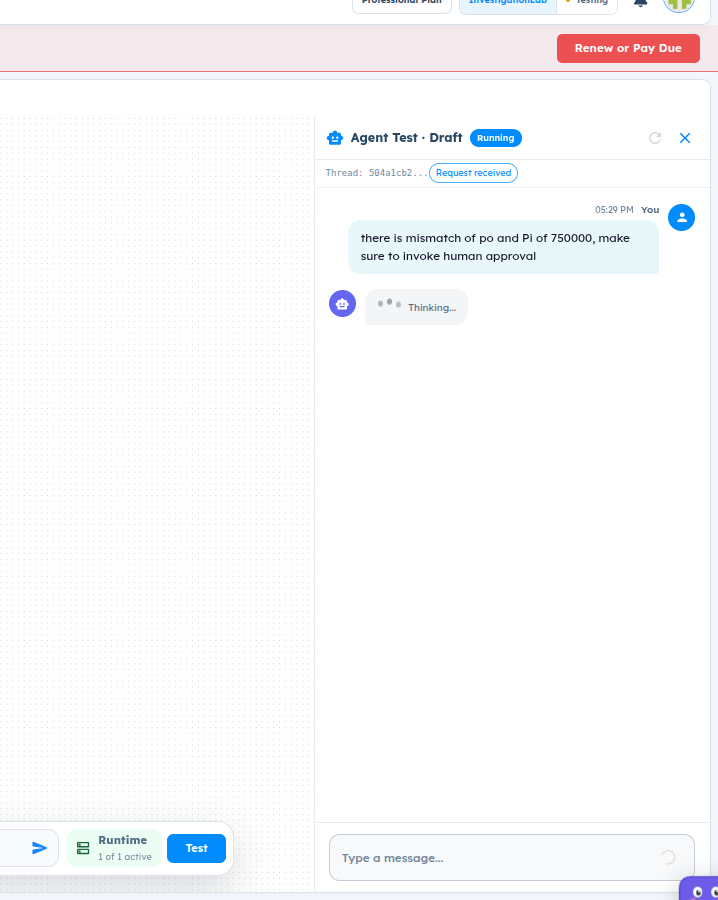

# ART-AGENT-009 — Agent response runs indefinitely during test execution in Agent Lab

## Metadata

- **Canonical Bug ID:** ART-AGENT-009
- **Title:** Agent response runs indefinitely during test execution in Agent Lab
- **Status:** OPEN
- **Feature:** Agent Lab
- **Module:** Agent Lab / Test Runtime
- **Classification:** BUG
- **Severity:** HIGH
- **Priority:** P2
- **Assignee:** Anusha Ganesh Hegde
- **Environment:** Testing (Agent Test Draft / Professional Plan / InvestigationLab)
- **Tags:** Agent-Lab, Test-Runtime, Agent-Test, Indefinite-Execution, Thinking-State, Hang, Timeout-Missing, P2
- **Date Reported:** 2026-10-06
- **Azure DevOps:** SYNCED

## 1. Problem

In Agent Lab, invoking an agent in the draft test chat environment causes the test run to hang indefinitely in the "Thinking..." state. When a prompt requires complex reasoning or human-in-the-loop escalation (e.g., detecting a PO/PI mismatch and invoking human approval), the agent runner displays an ongoing spinner without completing, timing out, or yielding an actionable response. The message input box becomes disabled, preventing further user interaction.

## 2. Observed Behavior

- User sends a test message: "there is mismatch of po and Pi of 750000, make sure to invoke human approval".
- Agent Test header shows thread ID (e.g. 504a1cb2...) with status badge "Running" and sub-status "Request received".
- The agent displays a persistent "Thinking..." loader bubble.
- The test run does not complete, terminate, or time out even after extended waiting.
- The input area ("Type a message...") remains disabled with an active loading spinner.
- No error message, diagnostic toast, or timeout notification is emitted.

## 3. Reproduction

1. Open Agent Lab and select an agent configured with human review/approval or exception handling logic.
2. Open the test runner pane ("Agent Test • Draft").
3. Send a test message requiring approval flow: "there is mismatch of po and Pi of 750000, make sure to invoke human approval".
4. Observe the test execution state: the agent enters "Thinking..." status and remains running indefinitely.

## 4. Expected Behavior

The agent runtime should either successfully execute the agent graph and return the expected response/approval invocation, or encounter an execution timeout after a defined threshold and return a clear error or diagnostic message. The test chat should not hang indefinitely in an unrecoverable "Thinking..." state.

## 5. Business Impact

Developers and prompt engineers cannot validate or test agent workflows in Agent Lab. Infinite hangs block verification of critical decision and governance branches (such as human approval invocations) and waste computational runtime resources.

## 6. User Experience

The user sends a prompt and waits for test output, but the interface gets stuck on "Thinking..." with disabled controls. The user cannot send follow-up messages or inspect execution diagnostics, forcing a page refresh.

## 7. Investigation Guidance

Inspect the Agent Lab test execution coordinator and agent runtime streaming bridge:
- Trace the lifecycle of test run requests from the chat UI to the backend execution service.
- Verify whether the agent execution engine has a configured execution timeout (e.g. 60–120s) or if websocket/SSE connections hang open when an unhandled node state occurs.
- Check node execution for human approval/review tools or condition checks: determine if the runner stalls waiting on an external approval signal synchronously without emitting an intermediate pending event.
- Inspect backend runner logs for the thread to identify whether a deadlock, unhandled exception, or blocked polling loop occurred.

## 8. Fix Requirement

Agent Lab test runner must implement a robust execution timeout and error recovery mechanism. If agent execution fails, stalls, or waits on asynchronous review, the system must emit an appropriate status event or timeout error rather than hanging indefinitely in "Thinking...".

## 9. Recommended Solution

1. Configure an execution timeout on backend agent test runs that terminates stalled threads and returns a timeout error to the client.
2. For tools or actions that trigger human review, ensure the agent test runner handles human-in-the-loop pauses gracefully by rendering an explicit "Pending Approval" state rather than an indefinite "Thinking..." spinner.
3. Re-enable user interaction controls if a test run times out or fails.

## 10. Minimum Working Fix

Implement an execution timeout on the Agent Lab test run handler so that queries that do not resolve within a reasonable time limit fail gracefully with an informative error instead of hanging indefinitely.

## 11. Acceptance Criteria

- Test runs in Agent Lab complete and render output, or fail with a clear timeout/diagnostic error.
- The test chat does not remain stuck indefinitely in "Thinking..." state.
- Input box recovers and allows further interactions if a request fails or times out.
- Workflows invoking human approval either present the approval request card or an explicit status indicating review is needed.

## 12. Environment

Testing (Agent Test Draft / Professional Plan / InvestigationLab)

## 13. Severity

HIGH

## 14. Priority

P2

## 15. Tags

Agent-Lab, Test-Runtime, Agent-Test, Indefinite-Execution, Thinking-State, Hang, Timeout-Missing, P2

## 16. Assignee

Anusha Ganesh Hegde

## 17. Evidence

| Evidence File | Type | Description | SHA-256 | Size |
| ------------- | ---- | ----------- | ------- | ---- |
| [[ART-AGENT-009](ART-AGENT-009__agent-test-indefinite-thinking-hang__2026-10-06__01.png)] | Screenshot | Agent Lab test chat interface displaying indefinite Thinking loader bubble with Running badge. | `67711099be2a775aba6c632ed9fa63788691f4b3fc7c7bdddb3238615fccad72` | 90659 bytes |

## 18. Discussion

The user reported that the agent response runs indefinitely during Agent Test draft execution when given a procurement exception prompt involving human approval. The UI remains locked in the "Thinking..." state with disabled message input.

## 19. Azure DevOps

- **Work Item ID:** 69013
- **URL:** [https://dev.azure.com/BixBytesSolutions/f3253417-808e-457f-a7f2-5699b2f38aa6/_workitems/edit/69013](https://dev.azure.com/BixBytesSolutions/f3253417-808e-457f-a7f2-5699b2f38aa6/_workitems/edit/69013)
- **Parent Feature:** Agent Lab
- **Parent Feature ID:** 68783
- **Assigned To:** Anusha Ganesh Hegde
- **Sync Status:** SYNCED
- **Note:** Synchronized via Harness 02 V1 to Azure DevOps.
