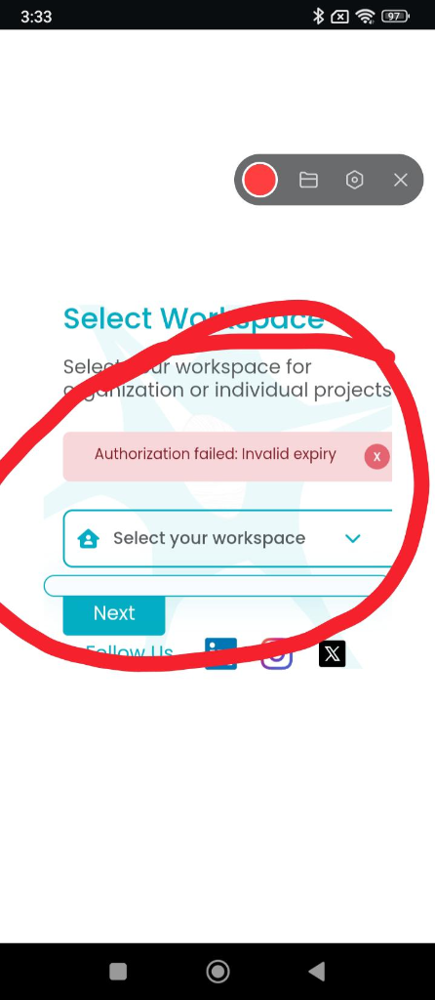

# ART-AGENTX-002 — Agent X mobile UI is trimmed at screen edges and corners

## Metadata

- **Canonical Bug ID:** ART-AGENTX-002
- **Title:** Agent X mobile UI is trimmed at screen edges and corners
- **Status:** OPEN
- **Feature:** Agent X
- **Module:** Agent X / Mobile UI / Select Workspace
- **Classification:** BUG
- **Severity:** LOW
- **Priority:** P3
- **Assignee:** Unassigned
- **Environment:** Mobile (Android, Agent X Mobile Web/App, Select Workspace screen)
- **Tags:** Agent-X, Mobile-UI, Select-Workspace, Responsive-Design, Viewport-Padding, Layout-Clipping, P3
- **Date Reported:** 2026-10-05
- **Azure DevOps:** SYNCED ([#68971](https://dev.azure.com/BixBytesSolutions/f3253417-808e-457f-a7f2-5699b2f38aa6/_workitems/edit/68971))

## 1. Problem

In Agent X, the Select Workspace screen suffers from inadequate horizontal viewport margins and responsive layout containment on mobile devices. The screen content container, including header text, authorization alert banner, dropdown picker, input field, and action buttons, is positioned too close to the mobile screen boundaries, causing components to appear visually clipped or trimmed at the left and right edges and corners.

## 2. Observed Behavior

- On the Agent X mobile Select Workspace screen, main content extends excessively close to the mobile screen boundaries.
- Left and right display areas appear visually trimmed and clipped.
- UI elements lack consistent responsive horizontal padding across the mobile viewport.
- The error alert banner and workspace selection container appear compressed within the available screen width.
- Spacing around corners and edges is inconsistent on the mobile layout.

## 3. Reproduction

1. Open the Agent X mobile application or web client on a mobile device or responsive viewport.
2. Navigate to the Select Workspace screen.
3. Observe the layout spacing, horizontal margins, and edge containment of the card container, alert banner, and workspace selection controls.

## 4. Expected Behavior

The Agent X mobile interface should maintain consistent responsive padding and safe margins from all screen edges. No content, borders, rounded corners, alert banners, form controls, or action buttons should appear clipped, trimmed, or compressed on supported mobile screen sizes.

## 5. Business Impact

Degrades visual polish and user confidence during initial workspace selection. Clipping and lack of safe horizontal margins make the mobile interface appear broken and risk obstructing touch targets located near viewport boundaries.

## 6. User Experience

Mobile users see a cramped screen layout where form elements, alert boxes, and headers push directly against the device display edges, making the UI appear cut off and poorly optimized for mobile screens.

## 7. Investigation Guidance

Inspect the responsive CSS stylesheet rules, layout grid/flexbox containers, and padding configurations for the Select Workspace screen in Agent X. Check the outermost content wrapper for missing or insufficient horizontal padding (e.g. padding: 0 16px or safe-area-inset) on mobile viewport breakpoints (< 640px). Verify that container max-width constraints and overflow properties do not truncate rounded corners or push elements flush against screen perimeters.

## 8. Fix Requirement

The Select Workspace view on mobile viewports must enforce uniform container padding and safe horizontal margins, ensuring all child cards, alert banners, form controls, and action buttons remain fully visible, properly padded, and unclipped.

## 9. Recommended Solution

Add or adjust responsive horizontal padding (e.g. `padding-left: 16px; padding-right: 16px;` or utility class `px-4`) on the top-level page or card wrapper for mobile viewports. Ensure `box-sizing: border-box` is set and integrate CSS safe-area insets (`env(safe-area-inset-left)`, `env(safe-area-inset-right)`) so that edge boundaries and border radii are preserved cleanly.

## 10. Minimum Working Fix

Apply adequate horizontal padding (e.g. minimum 16px safe margin) to the main container wrapper on mobile viewports so that elements are not positioned directly against or clipped by screen edges.

## 11. Acceptance Criteria

- The Select Workspace screen displays with consistent horizontal and vertical safe padding on mobile viewports.
- Form containers, alert banners, and action buttons remain fully visible with unclipped borders and rounded corners.
- No UI elements extend flush against or beyond display perimeters on supported mobile screen dimensions.
- Touch targets and dismiss buttons maintain adequate clearance from viewport edges.
- Desktop and tablet viewports remain unaffected and properly centered.

## 12. Environment

Mobile (Android, Agent X Mobile Web/App, Select Workspace screen)

## 13. Severity

LOW

## 14. Priority

P3

## 15. Tags

Agent-X, Mobile-UI, Select-Workspace, Responsive-Design, Viewport-Padding, Layout-Clipping, P3

## 16. Assignee

Unassigned

## 17. Evidence

| Evidence File                                                                                 | Type       | Description                                                                                                                                                                                                              | SHA-256                                                              | Size         |
| --------------------------------------------------------------------------------------------- | ---------- | ------------------------------------------------------------------------------------------------------------------------------------------------------------------------------------------------------------------------ | -------------------------------------------------------------------- | ------------ |
| [[ART-AGENTX-002](ART-AGENTX-002__mobile-ui-trimmed-screen-edges-corners__2026-10-05__01.png)] | Screenshot | Mobile screenshot of Agent X Select Workspace screen showing screen content, alert banner, and form elements extending too close to mobile viewport edges with visual trimming along left and right borders and corners. | `52196304849a21cbc5120f56eb416d20550e29c43465b7ae51e136bff3c5dabb` | 221573 bytes |

## 18. Discussion

Supplied mobile screenshot demonstrates Select Workspace screen content extending directly against screen boundaries, with noticeable clipping of corners and insufficient horizontal padding across the card container and interactive elements.

## 19. Azure DevOps

- **Work Item ID:** 68971
- **URL:** [https://dev.azure.com/BixBytesSolutions/f3253417-808e-457f-a7f2-5699b2f38aa6/_workitems/edit/68971](https://dev.azure.com/BixBytesSolutions/f3253417-808e-457f-a7f2-5699b2f38aa6/_workitems/edit/68971)
- **Parent Feature:** Agent X
- **Parent Feature ID:** 68960
- **Assigned To:** Unassigned
- **Sync Status:** SYNCED
- **Note:** Synchronized via Harness 02 V1 to Azure DevOps.
