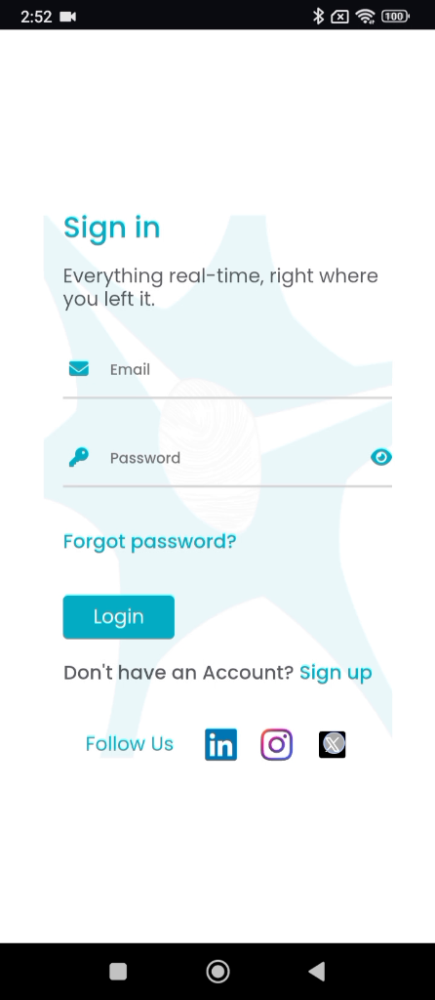
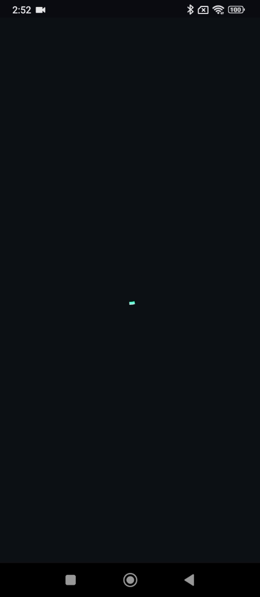
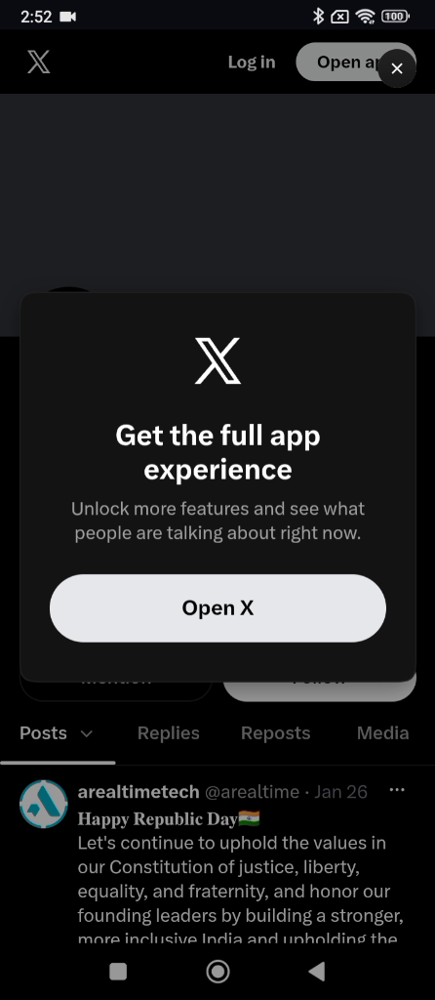
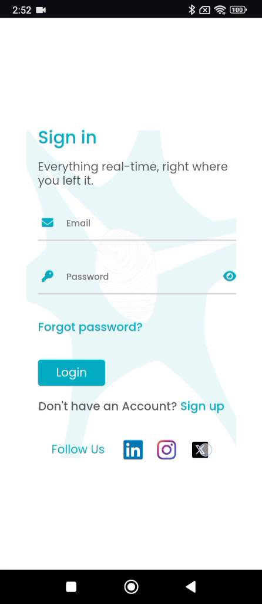
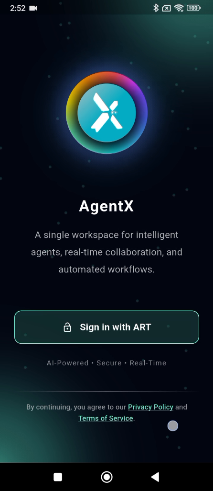

# ART-AGENTX-004 — Agent X social media navigation returns user to home screen instead of sign-up/sign-in page

## Metadata

- **Canonical Bug ID:** ART-AGENTX-004
- **Title:** Agent X social media navigation returns user to home screen instead of sign-up/sign-in page
- **Status:** OPEN
- **Feature:** Agent X
- **Module:** Agent X / Authentication / Social Media Navigation
- **Classification:** BUG
- **Severity:** MEDIUM
- **Priority:** P2
- **Assignee:** Unassigned
- **Environment:** Mobile (Android, Agent X Mobile Web/App, Authentication Screen)
- **Tags:** Agent-X, Authentication, Social-Media, Navigation, Route-Reset, Mobile, P2
- **Date Reported:** 2026-10-06
- **Azure DevOps:** SYNCED ([#68976](https://dev.azure.com/BixBytesSolutions/f3253417-808e-457f-a7f2-5699b2f38aa6/_workitems/edit/68976))

## 1. Problem

In Agent X, opening external social media links from the authentication screen causes loss of navigation continuity. When a user taps a social media link under "Follow Us" on the sign-in or sign-up view and subsequently navigates back to Agent X, the application resets the navigation state and redirects the user to the initial Agent X landing/home screen instead of maintaining or returning to the active authentication page.

## 2. Observed Behavior

- The Agent X authentication screen displays social media icons (LinkedIn, Instagram, X) under "Follow Us".
- Selecting a social media link initiates navigation to the external social destination.
- The external social media destination page is displayed.
- Upon returning from the social destination, the application does not preserve the sign-in/sign-up page context.
- Navigation sequence evidence demonstrates that the user is returned to the top-level Agent X landing screen ("Sign in with ART").
- Authentication workflow context is lost, forcing the user to restart the sign-in flow.

## 3. Reproduction

1. Open Agent X and navigate to the authentication screen (Sign In or Sign Up).
2. Scroll to the "Follow Us" section at the bottom of the form.
3. Tap on a social media icon (e.g. X / Twitter) to open the external link.
4. Return from the external social destination back to Agent X.
5. Observe that Agent X routes to the main landing screen instead of preserving the authentication view.

## 4. Expected Behavior

Opening a social media link from the Agent X authentication screen should not reset the navigation state or clear the authentication stack. When the user returns from an external social media destination, Agent X should restore or remain on the corresponding sign-in/sign-up screen.

## 5. Business Impact

Users who explore social media links during authentication lose their current progress and context. This creates frustration, adds unnecessary friction to user onboarding, and may lead to drop-offs during the sign-in/sign-up funnel.

## 6. User Experience

The user leaves the sign-in form to check a social channel, returns to the app expecting to continue signing in, but finds themselves unexpectedly kicked back to the beginning landing screen, requiring them to tap "Sign in with ART" again.

## 7. Investigation Guidance

Inspect the navigation routing and app lifecycle event handling for external links opened from the authentication screen. Trace how external URLs are launched (e.g. in-app browser/webview vs system browser) and whether the app unmounts or resets the navigation stack during lifecycle pauses or backgrounding. Determine why returning from the external intent routes to the root landing path instead of the prior authentication route.

## 8. Fix Requirement

The social media navigation flow must preserve the user's authentication-page navigation context. Returning from an external social link must return the user directly to the sign-in/sign-up page rather than resetting to the root Agent X landing screen.

## 9. Recommended Solution

Open external social media links in an external browser intent or non-destructive overlay that does not unmount the authentication router. Ensure that navigation stack state or deep-link restore handlers preserve the active route history when the app resumes focus.

## 10. Minimum Working Fix

Ensure external social links do not clear the router history stack or trigger a default redirect to the landing route upon app resumption.

## 11. Acceptance Criteria

- Social media links under "Follow Us" remain functional and open their intended destinations.
- Returning from an external social media destination returns the user directly to the active sign-in/sign-up screen.
- Navigation state and entered form context are preserved or cleanly restored upon return.
- The user is not redirected to the initial Agent X landing screen when returning from social links.
- Existing sign-in and sign-up flows continue to operate normally.

## 12. Environment

Mobile (Android, Agent X Mobile Web/App, Authentication Screen)

## 13. Severity

MEDIUM

## 14. Priority

P2

## 15. Tags

Agent-X, Authentication, Social-Media, Navigation, Route-Reset, Mobile, P2

## 16. Assignee

Unassigned

## 17. Evidence

| Evidence File | Type | Description | SHA-256 | Size |
| ------------- | ---- | ----------- | ------- | ---- |
| [[ART-AGENTX-004](ART-AGENTX-004__signin-page-follow-us-icons__2026-10-06__01.png)] | Screenshot | Agent X authentication sign-in screen showing Follow Us social icons (LinkedIn, Instagram, X). | `a426323b284abac71191bc5810e5df584e7fde5e067146b02c0f69422dfabbaa` | 134018 bytes |
| [[ART-AGENTX-004](ART-AGENTX-004__social-destination-transition__2026-10-06__02.png)] | Screenshot | Loading and transition screen displayed while opening the social destination. | `f974f9da44bcf6950b2549c30186fc1b6dd450b2467c8b0776830ae70bc7be82` | 22231 bytes |
| [[ART-AGENTX-004](ART-AGENTX-004__external-social-destination-page__2026-10-06__03.png)] | Screenshot | External social media destination page (X / Twitter profile for @arealtimetech) displayed. | `079419ad8888c94b51ae194470478028862c5158c02bf7afb29ac60ddb543faf` | 109380 bytes |
| [[ART-AGENTX-004](ART-AGENTX-004__signin-page-during-return__2026-10-06__04.png)] | Screenshot | Authentication sign-in screen visible during return sequence showing touch interaction on social icon. | `0ff073482c44d529637cb44556170bc19ebce3ba3cbe854fbb20d921f2c17e06` | 132755 bytes |
| [[ART-AGENTX-004](ART-AGENTX-004__home-landing-screen-reset__2026-10-06__05.png)] | Screenshot | Agent X landing/home screen displayed after returning from social destination, proving unexpected route reset. | `c7383b4a3d77a7999728500ed3eb749527849e8ece52cb1ccf20eb2d975bce25` | 287735 bytes |

## 18. Discussion

Supplied recording captures a user on the Agent X sign-in screen selecting an external social link under "Follow Us", viewing the external social profile, and upon return being routed to the top-level Agent X landing page rather than remaining on the sign-in form.

## 19. Azure DevOps

- **Work Item ID:** 68976
- **URL:** [https://dev.azure.com/BixBytesSolutions/f3253417-808e-457f-a7f2-5699b2f38aa6/_workitems/edit/68976](https://dev.azure.com/BixBytesSolutions/f3253417-808e-457f-a7f2-5699b2f38aa6/_workitems/edit/68976)
- **Parent Feature:** Agent X
- **Parent Feature ID:** 68960
- **Assigned To:** Unassigned
- **Sync Status:** SYNCED
- **Note:** Synchronized via Harness 02 V1 to Azure DevOps.
