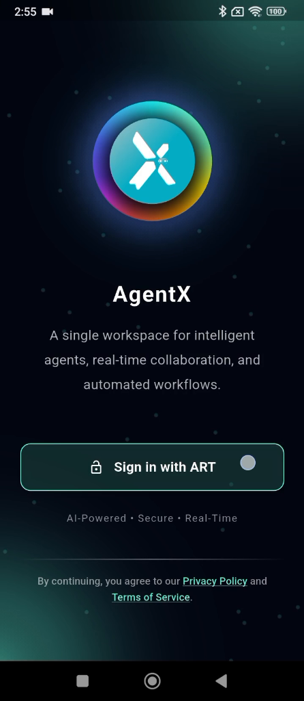

# ART-AGENTX-005 — Agent X authentication screens flicker across Sign in, Sign up, and Forgot Password flows

## Metadata

- **Canonical Bug ID:** ART-AGENTX-005
- **Title:** Agent X authentication screens flicker across Sign in, Sign up, and Forgot Password flows
- **Status:** OPEN
- **Feature:** Agent X
- **Module:** Agent X / Authentication UI
- **Classification:** BUG
- **Severity:** MEDIUM
- **Priority:** P2
- **Assignee:** Unassigned
- **Environment:** Mobile (Android, Agent X Mobile Web/App, Authentication Screens)
- **Tags:** Agent-X, Authentication, UI-Flicker, Screen-Transitions, Rendering-Artifacts, Mobile, P2
- **Date Reported:** 2026-10-06
- **Azure DevOps:** SYNCED ([#68979](https://dev.azure.com/BixBytesSolutions/f3253417-808e-457f-a7f2-5699b2f38aa6/_workitems/edit/68979))

## 1. Problem

In Agent X, visible screen flickering, flashing, and unstable redraw states occur across multiple authentication screens, including Sign in, Sign up, and Forgot Password. During navigation and route transitions between these authentication views, the user interface fails to transition smoothly, instead flashing or re-rendering with visible intermediate artifacts. Because this visual defect affects the common authentication flow across multiple screens, it represents a shared authentication rendering/lifecycle defect.

## 2. Observed Behavior

- The Agent X authentication flow is opened.
- Visible flickering and flashing occur on the Sign in screen.
- Screen flickering is also visible on the Sign up screen.
- The same unstable visual behavior occurs when entering the Forgot Password flow.
- During navigation transitions, the authentication UI flashes, redraws, or briefly renders unstable intermediate frames.
- The visual defect affects multiple authentication screens sharing the same navigation sequence.

## 3. Reproduction

1. Open Agent X on a mobile device or responsive viewport.
2. Tap "Sign in with ART" to enter the authentication flow.
3. Observe the Sign in screen render for visible flickering or redraw flashes.
4. Navigate from Sign in to "Sign up" and observe the transition for flickering.
5. Navigate from Sign in to "Forgot password?" and observe the screen transition for redraw artifacts or flashing.

## 4. Expected Behavior

All Agent X authentication screens should render stably and transition smoothly. Sign in, Sign up, and Forgot Password views should display without flickering, flashing, repeated redraws, unstable intermediate screen states, or visible re-render artifacts during navigation.

## 5. Business Impact

The visual defect impacts the entire authentication entry experience of Agent X. Users encounter an unpolished, flashing interface during account login, registration, and password recovery, diminishing trust and user confidence in the security and stability of the authentication flow.

## 6. User Experience

Users see rapid flickering, flashing, and redraw artifacts whenever they navigate between the Sign in, Sign up, and Forgot Password screens, creating a jarring and unpolished visual impression.

## 7. Investigation Guidance

Inspect the shared Agent X authentication view container, router transitions, and rendering lifecycle used across Sign in, Sign up, and Forgot Password. Trace:
- Route transition listeners and animations between authentication screens.
- Shared wrapper/container mounting, unmounting, and re-rendering behavior.
- State updates, theme/styling re-computations, or asynchronous lifecycle effects triggering duplicate renders on navigation.
- Verify whether the defect stems from a common parent component or layout wrapper shared by all three authentication screens.

## 8. Fix Requirement

The Agent X authentication flow must remain visually stable across Sign in, Sign up, and Forgot Password. Transitions between authentication views must be smooth and free of visible flickering, repeated redraws, or intermediate flashing states, while preserving existing authentication logic and navigation.

## 9. Recommended Solution

Investigate the common authentication layout container and router transition lifecycle. Debounce or consolidate state changes during view switching, prevent redundant unmounting/remounting of shared layout elements, and ensure transition animations render smoothly without flickering or abrupt redraw cycles.

## 10. Minimum Working Fix

Eliminate redundant re-renders or unmount/remount cycles in the shared authentication screen container so that navigation between Sign in, Sign up, and Forgot Password occurs smoothly without visible screen flickering.

## 11. Acceptance Criteria

- The Sign in screen renders cleanly without visible flickering or flashing.
- The Sign up screen renders cleanly without visible flickering or flashing.
- The Forgot Password screen renders cleanly without visible flickering or flashing.
- Navigating between Sign in, Sign up, and Forgot Password produces smooth, visually stable transitions.
- Authentication screens do not repeatedly redraw or flash during loading and navigation.
- All existing authentication actions and navigation links continue to function correctly.

## 12. Environment

Mobile (Android, Agent X Mobile Web/App, Authentication Screens)

## 13. Severity

MEDIUM

## 14. Priority

P2

## 15. Tags

Agent-X, Authentication, UI-Flicker, Screen-Transitions, Rendering-Artifacts, Mobile, P2

## 16. Assignee

Unassigned

## 17. Evidence

| Evidence File | Type | Description | SHA-256 | Size |
| ------------- | ---- | ----------- | ------- | ---- |
| [[ART-AGENTX-005](ART-AGENTX-005__signin-screen-initial__2026-10-06__01.png)] | Screenshot | Agent X Sign in screen displayed during authentication flow. | `a8909fde8d709cfc4a3a2a595c7cbecf80acd1f15ab83a0a5ebb7999f0b98ac7` | 138151 bytes |
| [[ART-AGENTX-005](ART-AGENTX-005__signin-screen-redraw-flicker__2026-10-06__02.png)] | Screenshot | Intermediate redraw/flicker state during Sign in screen rendering. | `a5cb07b466d58bdc923c147095aab176d5d7f0f711cfc22d1a7c41bcb82bfe78` | 114738 bytes |
| [[ART-AGENTX-005](ART-AGENTX-005__forgot-password-screen__2026-10-06__03.png)] | Screenshot | Forgot Password screen exhibiting transition instability and screen flashing. | `1ae54885033bad400d9b2d715b8ffb038d3c2e0239e2f18d3fcba11eea7cc184` | 97992 bytes |
| [[ART-AGENTX-005](ART-AGENTX-005__transition-touch-artifact__2026-10-06__04.png)] | Screenshot | Sign in screen rendering intermediate transition state with touch feedback artifact. | `887acfa9fc6d23ae367200d2c794bb4318cd9ed3dfff8842f9f1dd5eaddfa6d2` | 115551 bytes |
| [[ART-AGENTX-005](ART-AGENTX-005__landing-screen-transition-state__2026-10-06__05.png)] | Screenshot | Agent X landing screen transition state demonstrating redraw/flickering during navigation. | `e94cc26cd9e3c59b9a66fa67345b1136d764cc7e52663a01e9ed202e45a0bd79` | 265253 bytes |

## 18. Discussion

Supplied recording sequence captures visible UI flickering, flashing, and unstable redraw states when entering and navigating across the Agent X Sign in, Sign up, and Forgot Password authentication flows. The issue is tracked as a single common authentication UI defect.

## 19. Azure DevOps

- **Work Item ID:** 68979
- **URL:** [https://dev.azure.com/BixBytesSolutions/f3253417-808e-457f-a7f2-5699b2f38aa6/_workitems/edit/68979](https://dev.azure.com/BixBytesSolutions/f3253417-808e-457f-a7f2-5699b2f38aa6/_workitems/edit/68979)
- **Parent Feature:** Agent X
- **Parent Feature ID:** 68960
- **Assigned To:** Unassigned
- **Sync Status:** SYNCED
- **Note:** Synchronized via Harness 02 V1 to Azure DevOps.
