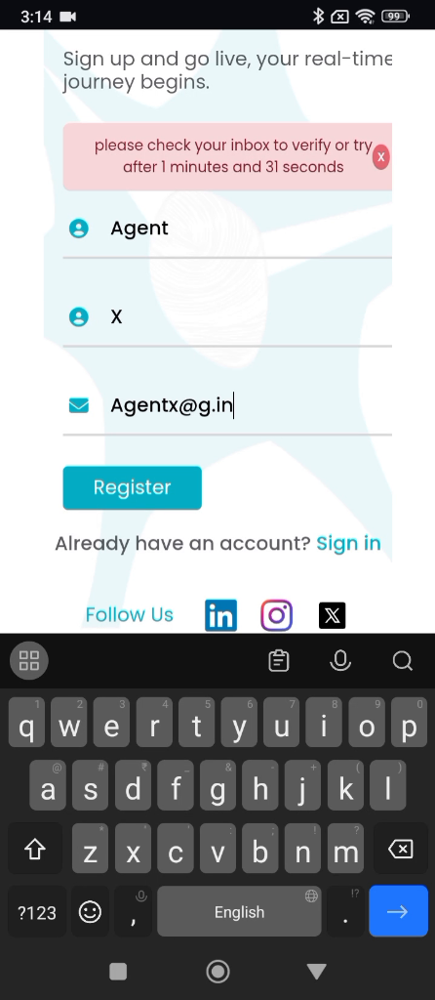
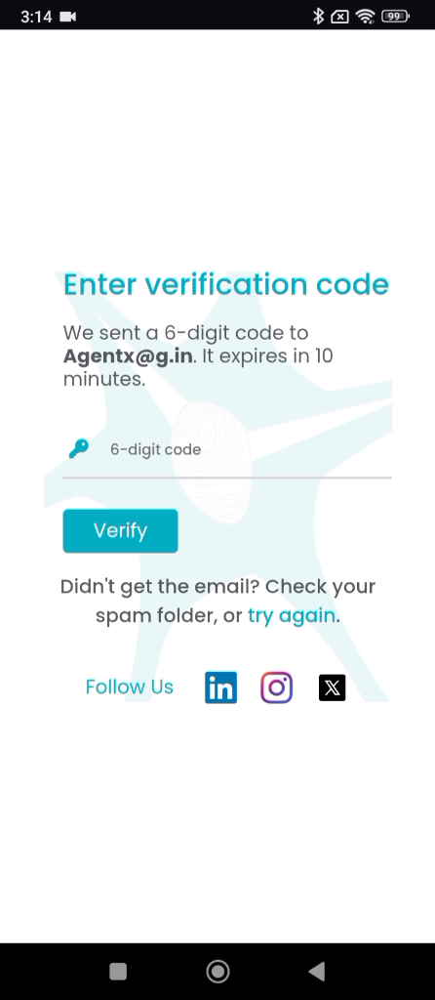
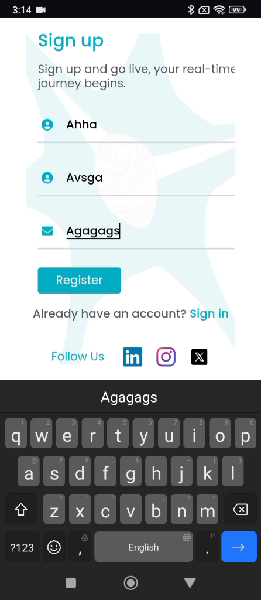
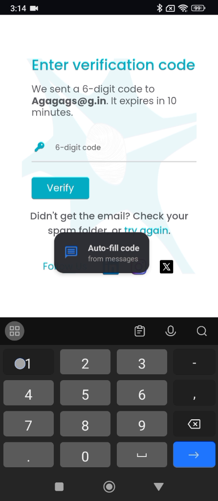
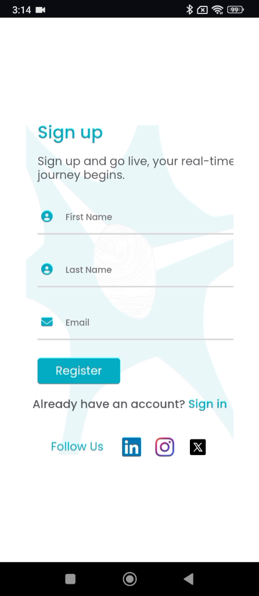

# ART-AGENTX-006 — Agent X verification code screen falls back to Sign Up before code can be entered

## Metadata

- **Canonical Bug ID:** ART-AGENTX-006
- **Title:** Agent X verification code screen falls back to Sign Up before code can be entered
- **Status:** OPEN
- **Feature:** Agent X
- **Module:** Agent X / Authentication / Registration Verification
- **Classification:** BUG
- **Severity:** HIGH
- **Priority:** P2
- **Assignee:** Unassigned
- **Environment:** Mobile (Android, Agent X Mobile Web/App, Registration Flow)
- **Tags:** Agent-X, Authentication, Registration, Email-Verification, Navigation-Reset, Premature-Fallback, Mobile, P2
- **Date Reported:** 2026-10-06
- **Azure DevOps:** NOT_SYNCED

## 1. Problem

In Agent X, after completing the user registration step and triggering an email verification code, the application transitions to the "Enter verification code" screen. However, before the user can enter or submit the received 6-digit code, the authentication interface unexpectedly falls back to the Sign Up registration form. This premature reset interrupts the registration process and prevents the user from submitting the issued verification code, forcing them to re-enter registration information from scratch.

## 2. Observed Behavior

- The user completes the registration fields and taps Register.
- Agent X shows an instruction banner prompting the user to check their inbox.
- The UI transitions to the "Enter verification code" screen, stating that a 6-digit code was sent and expires in 10 minutes.
- A 6-digit code entry field and "Verify" button are displayed.
- Before verification can be completed or submitted, the authentication UI automatically falls back to the blank Sign Up registration screen.
- The active verification code input context is destroyed, preventing the user from entering the code received in their email.
- The original registration and verification attempt is disrupted.

## 3. Reproduction

1. Open Agent X and navigate to the Sign Up registration screen.
2. Enter valid registration information (First Name, Last Name, Email) and submit the form.
3. Observe the transition to the "Enter verification code" screen.
4. Prepare to enter or paste the 6-digit code received via email.
5. Observe the UI prematurely resetting back to the initial Sign Up registration screen before the code is entered or verified.

## 4. Expected Behavior

Once a verification code is issued and the "Enter verification code" screen is presented, Agent X should maintain the verification view until the user successfully verifies the code, the code explicitly expires (e.g. after the stated 10-minute validity period), or the user intentionally cancels or navigates back. The UI must not automatically or prematurely fall back to the Sign Up form while a verification attempt remains active.

## 5. Business Impact

This defect severely disrupts user onboarding. New users who receive an email verification code cannot complete registration because the entry form disappears, creating an authentication blocker and causing drop-offs during the initial signup funnel.

## 6. User Experience

The user fills out registration details, switches to email or waits to receive their verification code, but returns to find the verification screen gone and the app showing an empty Sign Up form, requiring them to re-enter all registration information.

## 7. Investigation Guidance

Inspect the Agent X registration and verification state lifecycle and navigation controller. Trace:
- The state transition from Sign Up to the verification code view.
- Timer, timeout, or polling mechanisms in the verification component that might trigger an unhandled route redirect.
- Route persistence and page lifecycle handling when the app loses focus or when auto-fill/keypad overlays appear.
- Authentication session or temporary token caching during the pending verification state.
Determine why the router or state machine navigates back to the root Sign Up path before verification completes or expires.

## 8. Fix Requirement

The verification code view must remain active and accessible throughout the valid lifetime of the issued verification code. The application must not redirect back to Sign Up unless the user explicitly navigates away, the code timer expires, or a new registration attempt is intentionally initiated.

## 9. Recommended Solution

Ensure the verification route is treated as an active persistent state in the authentication router. Prevent premature timeout redirects, protect the route against lifecycle unmount events when system keyboard or notification overlays trigger, and preserve the pending verification session until user action or official expiry occurs.

## 10. Minimum Working Fix

Remove or fix the automatic redirect/fallback logic on the verification code screen so that the view remains open and functional while the verification attempt is pending.

## 11. Acceptance Criteria

- Submitting valid registration details opens the "Enter verification code" screen and keeps it open.
- The verification screen does not automatically fall back to Sign Up while the verification attempt is active.
- The user can enter or auto-fill the 6-digit code received by email and tap Verify.
- Successful code submission completes the registration/verification flow without restarting.
- Expired or invalid codes are handled with appropriate error messages rather than abrupt screen resets.

## 12. Environment

Mobile (Android, Agent X Mobile Web/App, Registration Flow)

## 13. Severity

HIGH

## 14. Priority

P2

## 15. Tags

Agent-X, Authentication, Registration, Email-Verification, Navigation-Reset, Premature-Fallback, Mobile, P2

## 16. Assignee

Unassigned

## 17. Evidence

| Evidence File | Type | Description | SHA-256 | Size |
| ------------- | ---- | ----------- | ------- | ---- |
| [[ART-AGENTX-006](ART-AGENTX-006__signup-check-inbox-prompt__2026-10-06__01.png)] | Screenshot | Sign Up registration screen displaying prompt to check inbox for verification code. | `e62e5a7385a9b84a443160dc3c0405d91003f8820008481e5ff628e31876537d` | 210565 bytes |
| [[ART-AGENTX-006](ART-AGENTX-006__verification-screen-first-attempt__2026-10-06__02.png)] | Screenshot | Enter verification code screen for first registration attempt showing 6-digit code input field. | `dda8d25af970a381d586962d73482e8abced389a450bc0c841d84c19e077265d` | 121678 bytes |
| [[ART-AGENTX-006](ART-AGENTX-006__signup-second-attempt-input__2026-10-06__03.png)] | Screenshot | Sign Up screen during second registration attempt with user details. | `14ee1e6c06de8cbdf9c785cc328d0a1971db54348162d3dda7ff40994af24992` | 153589 bytes |
| [[ART-AGENTX-006](ART-AGENTX-006__verification-screen-autofill-prompt__2026-10-06__04.png)] | Screenshot | Verification code screen with numeric keypad and auto-fill prompt before premature fallback. | `603733f630c4d6fbf45fca180827f552d5f3be239dc73574284c4158a8445730` | 154965 bytes |
| [[ART-AGENTX-006](ART-AGENTX-006__premature-fallback-to-signup__2026-10-06__05.png)] | Screenshot | Authentication interface unexpectedly returned to Sign Up screen before code entry was completed. | `ad9d7ba1d3110639d591dd69d10a441c382fababd9a992e8d05fd86e85e223a5` | 117939 bytes |

## 18. Discussion

Supplied recording demonstrates that after initiating email verification and reaching the "Enter verification code" interface, the application prematurely resets to the Sign Up view before the user can input the received code, breaking registration continuity.

## 19. Azure DevOps

- **Work Item ID:** Not created
- **URL:** Not created
- **Parent Feature:** Agent X
- **Sync Status:** NOT_SYNCED
