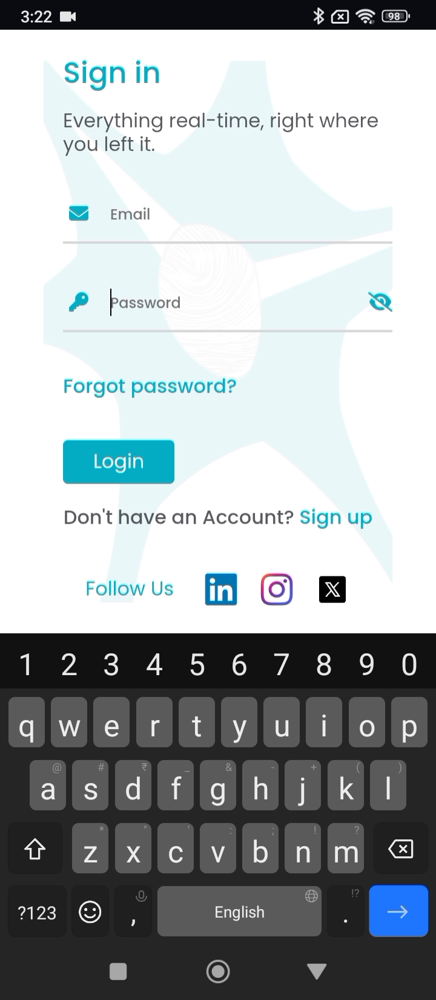
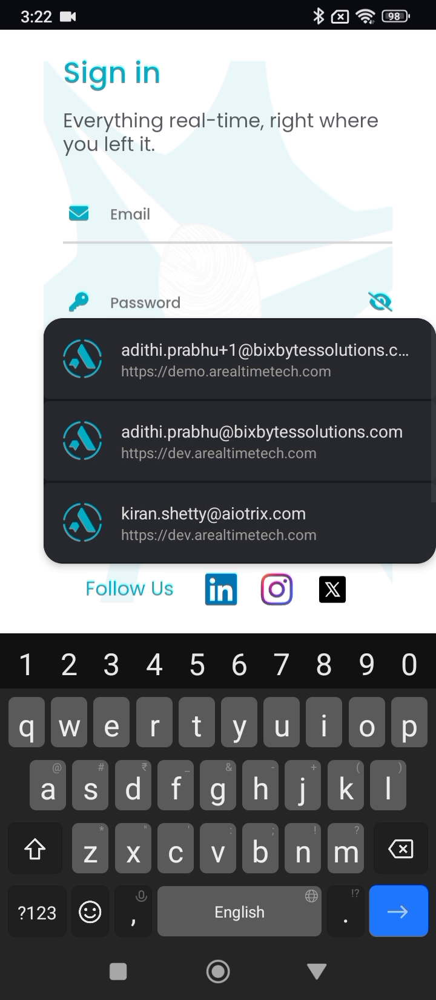
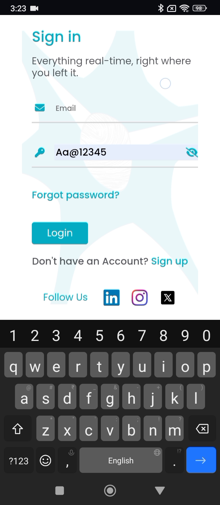

# ART-AGENTX-007 — Agent X sign-in autofill sometimes fills password but leaves email field empty

## Metadata

- **Canonical Bug ID:** ART-AGENTX-007
- **Title:** Agent X sign-in autofill sometimes fills password but leaves email field empty
- **Status:** OPEN
- **Feature:** Agent X
- **Module:** Agent X / Authentication / Sign-in Autofill
- **Classification:** BUG
- **Severity:** MEDIUM
- **Priority:** P2
- **Assignee:** Unassigned
- **Environment:** Mobile (Android, Agent X Mobile Web/App, Sign-in Screen)
- **Tags:** Agent-X, Authentication, Sign-In, Autofill, Form-Handling, Credential-Management, Mobile, P2
- **Date Reported:** 2026-10-06
- **Azure DevOps:** SYNCED

## 1. Problem

In Agent X, saved credential autofill on the Sign in screen is inconsistent. During certain sign-in attempts, device/browser autofill populates the password field with saved credentials, but leaves the corresponding email field blank. This results in only part of the saved credential pair being restored, breaking the automated login experience and requiring the user to manually enter their email address.

## 2. Observed Behavior

- The user navigates to the Agent X Sign in screen.
- Saved credentials / autofill suggestions are available on the device.
- The password field is tapped or receives focus, triggering the credential selector popup.
- The user selects a saved account entry from the credential autofill list.
- The password field is populated automatically with the stored password (displaying autofill styling).
- The corresponding email field remains empty with the placeholder visible.
- The user cannot log in directly and must manually type or copy the email address.
- The behavior is intermittent across repeated sign-in sessions rather than failing deterministically every time.

## 3. Reproduction

1. Open Agent X on a mobile device or browser with saved login credentials for multiple accounts.
2. Navigate to the Sign in screen where both Email and Password fields are empty.
3. Tap on the Password input field to bring up the device credential autofill prompt.
4. Select one of the saved credentials from the autofill list.
5. Observe the Sign in form: the password field is filled, but the email field remains blank.

## 4. Expected Behavior

When a saved credential account is selected from the autofill system, Agent X should consistently populate both the email address and password fields as a complete credential pair. The application should never leave the email field empty while autofilling only the password.

## 5. Business Impact

This defect degrades the primary sign-in user experience. Users relying on saved credentials or password managers experience friction, confusion, and login delays, diminishing confidence in the application's mobile usability and stability.

## 6. User Experience

The user expects a single tap on their saved credentials to fill the entire sign-in form. Instead, only the password appears, forcing them to pause, remember, and manually re-enter their email address before they can log in.

## 7. Investigation Guidance

Inspect the Agent X Sign in form component and its interaction with mobile/browser credential autofill APIs. Trace:
- Form input attributes (`name`, `id`, `autocomplete`, `type`) for both Email and Password fields (e.g. `autocomplete="username"` or `autocomplete="email"` vs `autocomplete="current-password"`).
- Synthetic event handling or controlled component state (e.g., React `onChange`/`onInput`) when an external autofill event occurs without standard keyboard keystrokes.
- Race conditions or state-clearing lifecycle hooks that might reset the email state when focus transitions to the password field or when the autofill overlay closes.
- Form container wrapping (`<form>` element, submission bindings) and how mobile WebKit / Chromium autofill daemons dispatch input events to sibling fields.

## 8. Fix Requirement

Saved credential autofill must populate and preserve both the associated email and password fields consistently when supplied by the device or browser credential autofill service.

## 9. Recommended Solution

Ensure the Sign in form conforms to standard HTML credential autofill contracts:
- Verify that the Email input has `autocomplete="username email"` (or appropriate standard token) and a stable `name="email"` attribute.
- Ensure the form inputs are properly bound within a semantic `<form>` container.
- Implement robust autofill change listener detection so that programmatic or autofill value updates reliably trigger state synchronization without clearing preceding inputs.
- Ensure state updates from field focus transitions do not reset sibling form fields.

## 10. Minimum Working Fix

Ensure the email field properly accepts and retains the autofilled email value alongside the password field during autofill events, preventing empty email states while maintaining normal manual entry.

## 11. Acceptance Criteria

- Selecting a saved credential from autofill populates both the email and password fields.
- The email field is not cleared or left blank when the password field is autofilled.
- Repeated sign-in attempts consistently restore the complete credential pair.
- Manual entry of email and password continues to work normally without interference.
- Existing sign-in authentication flow functions correctly upon submitting the autofilled credentials.

## 12. Environment

Mobile (Android, Agent X Mobile Web/App, Sign-in Screen)

## 13. Severity

MEDIUM

## 14. Priority

P2

## 15. Tags

Agent-X, Authentication, Sign-In, Autofill, Form-Handling, Credential-Management, Mobile, P2

## 16. Assignee

Unassigned

## 17. Evidence

| Evidence File | Type | Description | SHA-256 | Size |
| ------------- | ---- | ----------- | ------- | ---- |
| [[ART-AGENTX-007](ART-AGENTX-007__signin-empty-form-keyboard-active__2026-10-06__01.png)] | Screenshot | Agent X Sign in screen displayed with empty Email and Password fields and keyboard open. | `0c25ee50bcd9e044d63f3de633aedecef93750d5afdc685973af638bd76de82f` | 394754 bytes |
| [[ART-AGENTX-007](ART-AGENTX-007__signin-password-field-focused__2026-10-06__02.png)] | Screenshot | Sign in screen with active focus and cursor positioned in the Password field. | `0bdc833ec47d06326af87841736dc74970784d6e11b32a13e10141f2b7a16950` | 279861 bytes |
| [[ART-AGENTX-007](ART-AGENTX-007__credential-autofill-account-selection-popup__2026-10-06__03.png)] | Screenshot | Device password manager autofill popup displaying available saved credentials. | `6127944140faf744bd531182d427026bfe695fca6e9dc0fe8b644ad212959d65` | 363986 bytes |
| [[ART-AGENTX-007](ART-AGENTX-007__password-autofilled-email-field-empty__2026-10-06__04.png)] | Screenshot | Password field autofilled with saved credential while Email field remains empty. | `129d14562fd1caf7bdaf85bff8cce45f996f1e149ee5942b8febda3ec0aef36e` | 291861 bytes |
| [[ART-AGENTX-007](ART-AGENTX-007__persisted-incomplete-autofill-state__2026-10-06__05.png)] | Screenshot | Intermediate frame showing persistence of incomplete autofill state on the Sign in form. | `fbae8ff6e30fe4e948c27d29d2fb056396c431091d220401133205d6b6419ccb` | 281924 bytes |
| [[ART-AGENTX-007](ART-AGENTX-007__final-affected-state-empty-email__2026-10-06__06.png)] | Screenshot | Final affected state confirming Password field populated while Email field remains blank. | `0576e823ab8a816ee544ff1e50b3cd8832a50c6917fb26f9f7052de0490d01be` | 283968 bytes |

## 18. Discussion

Supplied recording demonstrates inconsistent credential autofill behavior where selecting a saved account populates the password field but leaves the associated email field blank, requiring manual input from the user to complete sign-in.

## 19. Azure DevOps

- **Work Item ID:** 68980
- **URL:** [https://dev.azure.com/BixBytesSolutions/f3253417-808e-457f-a7f2-5699b2f38aa6/_workitems/edit/68980](https://dev.azure.com/BixBytesSolutions/f3253417-808e-457f-a7f2-5699b2f38aa6/_workitems/edit/68980)
- **Parent Feature:** Agent X
- **Parent Feature ID:** 68960
- **Assigned To:** Unassigned
- **Sync Status:** SYNCED
- **Note:** Synchronized via Harness 02 V1 to Azure DevOps.
