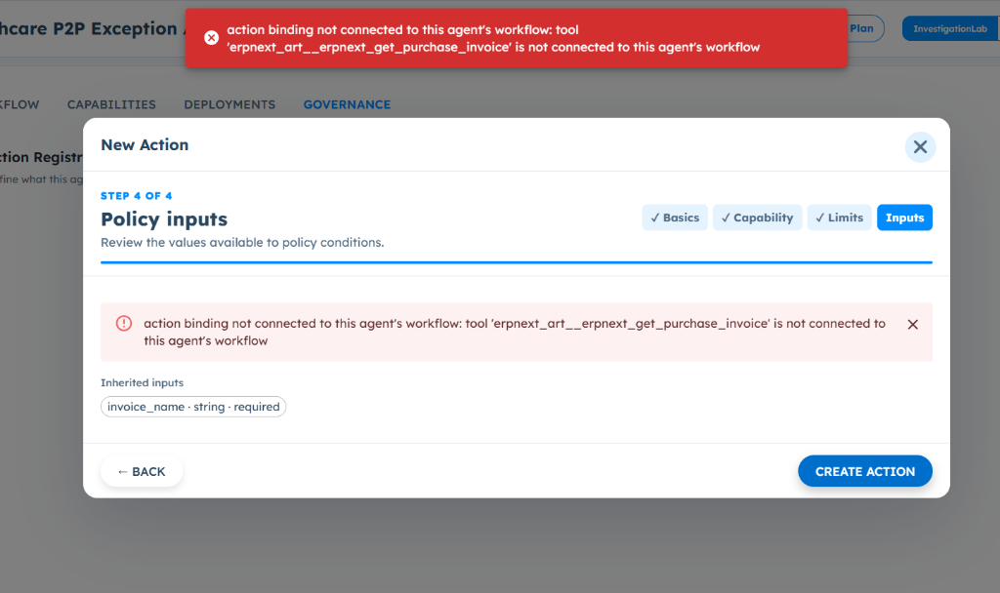

# ART-GOV-004 — Governance Action Creation Fails Even When Required Tool Is Connected to Agent Workflow

- **Canonical Bug ID:** ART-GOV-004
- **Module:** GOV
- **Severity:** HIGH
- **Priority:** P1
- **Environment:** Testing (Healthcare P2P Exception Agent / Governance Action Registry)
- **Assignee:** Unassigned
- **Tags:** Governance, Action-Registry, Tool-Action, Tool-Binding, Agent-Workflow, ERPNext-Tool, Policy-Inputs
- **Status:** OPEN
- **Evidence Count:** 1
- **Azure DevOps:** SYNCED ([#68889](https://dev.azure.com/BixBytesSolutions/f3253417-808e-457f-a7f2-5699b2f38aa6/_workitems/edit/68889))

---

## 1. Problem
In **Agent → Governance → Action Registry**, an action cannot be created for a Tool that is already connected and available in the Agent workflow (e.g. Healthcare P2P Exception Agent with `erpnext_art__erpnext_get_purchase_invoice`).

While creating the action through the **New Action** wizard, ART correctly detects the selected Tool capability and inherits its required input property (`invoice_name · string · required`) in Step 4 (Policy inputs). However, when the user clicks **CREATE ACTION**, the platform halts action creation with a blocking validation error:
```
action binding not connected to this agent's workflow: tool 'erpnext_art__erpnext_get_purchase_invoice' is not connected to this agent's workflow
```
Because the ERPNext Tool is already connected to the Agent workflow, ART falsely identifies the Tool binding as disconnected, preventing builders from registering governed Tool Actions.

---

## 2. Observed Behavior
- **Input Property Inheritance (Working):**
  - In the **New Action** modal under Step 4 of 4 (`Policy inputs`), ART correctly populates `Inherited inputs`:
    ```
    invoice_name · string · required
    ```
  - This demonstrates that the wizard successfully inspected the Tool schema and identified its input contract.
- **Action Creation Rejection (Failing):**
  - Clicking **CREATE ACTION** triggers an error toast banner at the top of the viewport and an inline alert above `Inherited inputs`:
    ```
    action binding not connected to this agent's workflow: tool 'erpnext_art__erpnext_get_purchase_invoice' is not connected to this agent's workflow
    ```
  - Action registration is aborted, and the modal remains open in an un-saveable state.
- **UI Contradiction:**
  - The Governance wizard simultaneously recognizes the tool's input contract while declaring that the tool is not connected to the agent.

---

## 3. Reproduction
1. Open an Agent configured with an active connected Tool (e.g. **Healthcare P2P Exception Agent** with ERPNext Tool `erpnext_art__erpnext_get_purchase_invoice`).
2. Navigate to the **GOVERNANCE** tab and open **Action Registry**.
3. Click **New Action** to launch the action creation wizard.
4. Complete **Step 1 (Basics)**, **Step 2 (Capability)** by selecting the connected Tool, and **Step 3 (Limits)**.
5. In **Step 4 of 4 (Policy inputs)**, verify that `invoice_name · string · required` is visible under `Inherited inputs`.
6. Click **CREATE ACTION**.
7. Observe that action creation is rejected with error: `action binding not connected to this agent’s workflow: tool 'erpnext_art__erpnext_get_purchase_invoice' is not connected to this agent’s workflow`.

---

## 4. Expected Behavior
- When a Tool is connected to an Agent workflow, Governance Action Registry must validate that Tool as an active capability and successfully create the Action record.
- Required inputs defined on the Tool schema must be bound to the Governance Action without false disconnection rejections.
- If a Tool is genuinely missing from an Agent's configuration, validation should fail with an actionable description of which specific configuration or binding is missing.

---

## 5. Business Impact
- **Blocks Policy Enforcement:** Organizations cannot apply governance policies, approval rules, or human review gates to Tool Actions, forcing either ungoverned execution or stalling deployment of critical business workflows (such as purchase invoice approvals in P2P).
- **Broken Capability Handoff:** The platform's integrated workflow-to-governance architecture is severed when Governance fails to recognize tools configured in the agent workflow.

---

## 6. User Experience
- Builders experience a confusing contradiction where the UI successfully retrieves and renders the tool's input schema in the form, but then rejects saving on the claim that the tool is not connected.
- No explanation or resolution path is provided to clarify how to resolve the alleged disconnection.

---

## 7. Investigation Guidance
Inspect the Governance Action Registry creation endpoint and Tool binding validation logic:
- **Identifier Matching:** Compare the tool identifier format in the Agent capability store (e.g. fully qualified `erpnext_art__erpnext_get_purchase_invoice` vs. provider-prefixed vs. unscoped name) with the identifier passed in the Action creation request payload.
- **Node vs. Capability Resolution:** Check whether Governance action validation checks the Agent's capability list or if it erroneously expects a specific canvas node type (e.g. requiring a literal `Tool Connector` node in the visual graph when tools may be bound via agent configuration/capabilities).
- **Workspace/Environment Scoping:** Verify whether the validation routine filters tools by workspace ID, agent ID, or environment, and if an ID mismatch causes valid tools to be excluded from the lookup set.

---

## 8. Fix Requirement
The Governance Action creation validation service must accurately resolve connected Agent tools against the Agent's active capability registry, allowing Action Registry entries to be saved for any tool available to the Agent.

---

## 9. Recommended Solution
1. **Normalize Tool Identifiers:** Ensure the tool identifier format used in Governance matches the canonical identifier stored in the Agent's capability registry.
2. **Capability-Based Validation:** Validate tool bindings against the Agent's configured capabilities rather than relying on strict visual canvas node presence.
3. **Consistent Scope Check:** Ensure workspace and agent scoping during action validation correctly reflects the active agent's runtime environment.
4. **Actionable Diagnostics:** If a tool binding fails validation, log and display both the requested tool identifier and the list of available agent capabilities.

---

## 10. Minimum Working Fix
Update the Governance Action creation backend validator to check `tool_id in agent.get_connected_tools()`, ensuring consistent string normalization so that `erpnext_art__erpnext_get_purchase_invoice` resolves successfully.

---

## 11. Acceptance Criteria
- [ ] A Tool connected and available to an Agent workflow is recognized by Governance as a valid action capability.
- [ ] An Action Registry entry can be successfully created and saved for the connected Tool.
- [ ] Required Tool inputs (e.g. `invoice_name`) continue to be inherited into the action contract.
- [ ] Action creation does not falsely require a specific canvas node when the tool is already configured in the agent.
- [ ] Genuinely disconnected tools continue to be rejected with appropriate diagnostic errors.
- [ ] Unrelated Governance action types (Serverless Functions, Agent actions) remain unaffected.

---

## 12. Environment
- **Platform:** ART Agent Lab / Governance
- **Agent:** Healthcare P2P Exception Agent
- **Component:** Governance → Action Registry (New Action wizard)
- **Tool:** `erpnext_art__erpnext_get_purchase_invoice`
- **Environment:** Testing (InvestigationLab, Professional Plan)

---

## 13. Severity
**HIGH** — Blocks Governance Action creation and policy enforcement for connected Agent tools.

---

## 14. Priority
**P1** — Core Governance capability defect preventing policy-controlled Tool execution.

---

## 15. Tags
- `Governance`
- `Action-Registry`
- `Tool-Action`
- `Tool-Binding`
- `Agent-Workflow`
- `ERPNext-Tool`
- `Policy-Inputs`

---

## 16. Assignee
**Unassigned**

---

## 17. Evidence

| File | Type | Description | SHA256 Hash | Byte Size |
| :--- | :--- | :--- | :--- | :--- |
| [ART-GOV-004__action-binding-not-connected-error__2026-09-30__01.png](./ART-GOV-004__action-binding-not-connected-error__2026-09-30__01.png) | Screenshot | New Action creation modal in Healthcare P2P Exception Agent (Governance -> Action Registry) displaying error 'action binding not connected to this agent\'s workflow: tool erpnext_art__erpnext_get_purchase_invoice is not connected to this agent\'s workflow' despite inheriting required input invoice_name. | `abb5903e9ced2c492ffc1639fe541edb4698ed014ec20255a30508952602f9fd` | 127789 bytes |

### Evidence Visual Gallery

````carousel

*New Action creation modal in Healthcare P2P Exception Agent (Governance -> Action Registry) displaying error 'action binding not connected to this agent\'s workflow: tool erpnext_art__erpnext_get_purchase_invoice is not connected to this agent\'s workflow' despite inheriting required input invoice_name.*
````

---

## 18. Discussion
- **Reporter Note:** In Healthcare P2P Exception Agent (Governance -> Action Registry), attempting to create a Governance Action for the connected ERPNext Tool ('erpnext_art__erpnext_get_purchase_invoice') fails with error 'action binding not connected to this agent’s workflow: tool erpnext_art__erpnext_get_purchase_invoice is not connected to this agent’s workflow'. This occurs despite Step 4 (Policy inputs) correctly inheriting the required input 'invoice_name · string · required', demonstrating that ART sees the tool schema but rejects action creation due to a broken binding check.
- **Intake Validation:** Screenshot preserved with cryptographic SHA256 checksum and verified byte size. Zero Azure DevOps mutations performed during intake.

---

## 19. Azure DevOps
- **Work Item ID:** 68889
- **URL:** [https://dev.azure.com/BixBytesSolutions/f3253417-808e-457f-a7f2-5699b2f38aa6/_workitems/edit/68889](https://dev.azure.com/BixBytesSolutions/f3253417-808e-457f-a7f2-5699b2f38aa6/_workitems/edit/68889)
- **Parent Feature:** Governance
- **Parent Feature ID:** 68812
- **Assigned To:** Unassigned
- **Sync Status:** SYNCED
- **Note:** Synchronized via Harness 02 V1 to Azure DevOps.
