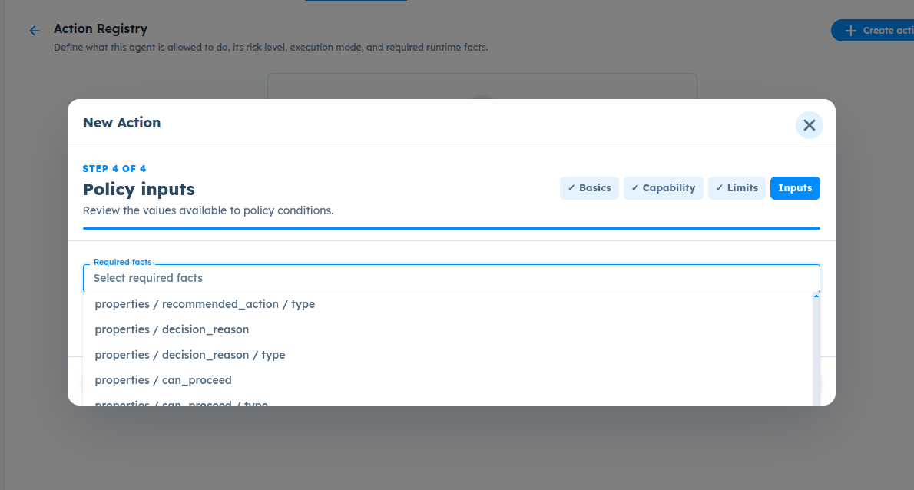
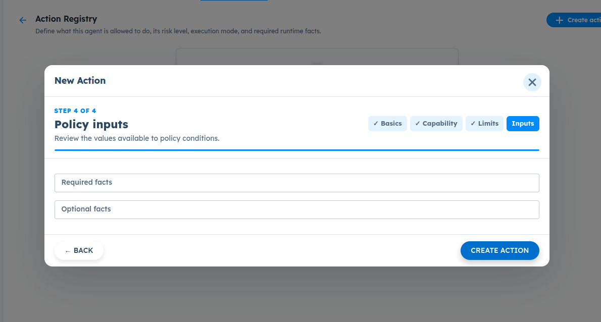

# ART-GOV-005 — Policy Inputs Dropdown Cannot Scroll Through Available Facts

- **Canonical Bug ID:** ART-GOV-005
- **Module:** GOV
- **Severity:** HIGH
- **Priority:** P2
- **Environment:** Testing (Procurement Exception Agent / Governance / Action Registry / Professional Plan / InvestigationLab)
- **Assignee:** Unassigned
- **Tags:** Governance, Action-Registry, Policy-Inputs, Dropdown-Scroll, Modal-Clipping, Schema-Facts, UI-Blocking, P2
- **Status:** OPEN
- **Evidence Count:** 2
- **Azure DevOps:** SYNCED ([#68948](https://dev.azure.com/BixBytesSolutions/f3253417-808e-457f-a7f2-5699b2f38aa6/_workitems/edit/68948))

---

## 1. Problem
In **Governance → Action Registry**, while configuring a new action in **Step 4 — Policy Inputs**, the **Required facts** and **Optional facts** dropdown selectors do not allow the user to scroll through all available fact options.

When the dropdown is expanded, it renders initial schema properties (such as `properties / recommended_action / type`, `properties / decision_reason`, `properties / can_proceed`, etc.), but the dropdown menu is visually clipped by the bottom boundary of the modal dialog and does not scroll vertically. Because facts outside the visible portion cannot be reached or selected, workflow authors are blocked from selecting necessary policy inputs for actions governed by policy rules.

This defect acts as a hard UI blocker for Action Registry configuration on agents with larger or nested output schemas, preventing authors from establishing policy inputs and stalling downstream configuration and testing of Policy Rules and governed action execution.

---

## 2. Observed Behavior
- **Dropdown List Rendered but Cut Off:** When the user clicks "Select required facts" in Step 4 of the New Action modal, the dropdown options list expands downwards.
- **Visual Clipping:** The options container extends past the bottom boundary of the modal (`New Action`) and is visually truncated at `properties / can_proceed / type`.
- **No Scroll Functionality:** Attempting to scroll using the mouse wheel, trackpad, or scrollbar does not scroll the list content; options beyond the initial five items remain inaccessible.
- **Modal Step Context:** The issue occurs in **Step 4 of 4: Policy inputs** after completing Action basics (Step 1), Action capability (Step 2), and Execution limits (Step 3).
- **Selection Blocking:** Since required facts outside the visible area cannot be selected, the user cannot complete action creation with the desired policy input bindings.

---

## 3. Reproduction
1. Open an Agent (e.g. `Procurement Exception Agent`).
2. Go to **Governance → Action Registry**.
3. Click **+ Create action** (or **Create Action**).
4. In **Step 1 (Action basics)**, provide an action name, set status to `ACTIVE`, and click **Continue**.
5. In **Step 2 (Action capability)**, select a capability type (e.g. `Custom`) and click **Continue**.
6. In **Step 3 (Execution limits)**, set execution timeout and click **Continue**.
7. In **Step 4 (Policy inputs)**, click the **Required facts** (or **Optional facts**) dropdown input.
8. Attempt to scroll through the list of available output-schema facts.
9. Observe that the dropdown list cannot be scrolled and options beyond the initial visible list are cut off and inaccessible.

---

## 4. Expected Behavior
- The Required facts and Optional facts dropdowns must have a bounded visible height with functional vertical scrolling.
- Users must be able to scroll through and select every available policy-input field, regardless of schema size or depth.
- Mouse wheel, trackpad, and keyboard arrow keys should smoothly navigate through all available options.
- Long schema paths (e.g. deeply nested objects) should remain readable within the dropdown items.
- Selecting an item must not unexpectedly dismiss or reset the modal dialog.

---

## 5. Business Impact
- **Action Registry Validation Blocked:** Users with agents containing multi-field output schemas cannot bind required facts to governed actions if the target fact is not among the first few properties.
- **Downstream Testing Halted:** Without being able to complete action registration with required policy inputs, downstream Policy Rules, condition builder evaluations, and human-in-the-loop (HIL) reviews cannot be tested or validated.
- **Enterprise Governance Failure:** Governance cannot enforce policies against runtime facts if the authoring UI prevents linking those facts to registered actions.

---

## 6. User Experience
- The user sees a dropdown that opens but is visibly clipped at the modal border, giving the impression that the UI is frozen or broken.
- Scrolling attempts fail silently with no visual feedback.
- Frustrating experience where completing steps 1 through 3 is wasted because step 4 cannot be completed.

---

## 7. Investigation Guidance
Inspect the Policy Inputs dropdown/popover component and its scroll/overflow container hierarchy:
- **Max-Height and Overflow:** Check if the dropdown menu container (e.g. `ul` or `div` holding options) has `max-height` set without `overflow-y: auto`, or if `overflow: hidden` on a parent modal wrapper (`New Action` dialog) is clipping the popover.
- **Portal Rendering:** Determine whether the dropdown is rendered inside the modal DOM hierarchy or via a React portal attached to `document.body`. If inside the modal, check `overflow` on modal body containers.
- **Wheel Event Trapping:** Check if wheel/touch scroll event listeners on the modal backdrop or content container prevent the dropdown from receiving native scroll events.
- **Keyboard Accessibility:** Verify whether `KeyDown` events (ArrowDown / ArrowUp) change the highlighted option and trigger `scrollIntoView()`.
- **Search Filtering:** Investigate adding a filter/search input inside the dropdown to allow quick typing for large schema lists.

---

## 8. Fix Requirement
The Required facts and Optional facts selectors in the Action Registry Policy Inputs step must support full vertical scrolling of all available schema options with bounded height. All options must be reachable and selectable via mouse, trackpad, and keyboard navigation.

---

## 9. Recommended Solution
1. **Bounded Dropdown Height & Auto Scroll:** Apply explicit `max-height: 240px` (or `max-h-60`) and `overflow-y: auto` to the options container.
2. **Prevent Modal Clipping:** If the dropdown is rendered inline, either render it via a portal to break out of the modal overflow boundary or adjust parent modal container padding/overflow.
3. **Keyboard Navigation Support:** Enable arrow key navigation with automatic scroll-into-view for focused options.
4. **Searchable Selection:** Add search/filter input at the top of the dropdown list for schemas with many fields.
5. **Consistency:** Ensure both Required facts and Optional facts selectors utilize the same fixed component behavior.

---

## 10. Minimum Working Fix
Add `max-height: 250px; overflow-y: auto;` to the CSS / style definition of the dropdown menu list container in the Policy Inputs step, ensuring the container permits scrolling and does not overflow outside the modal viewport without scrollbars.

---

## 11. Acceptance Criteria
- [ ] The Policy Inputs Required facts dropdown has a bounded visible height and displays a working vertical scrollbar when options exceed the container height.
- [ ] Users can scroll to and select the last available schema property in the list using mouse wheel, trackpad, and scrollbar.
- [ ] Keyboard navigation (ArrowDown / ArrowUp) scrolls through all options and allows selection with Enter.
- [ ] The Optional facts dropdown behaves identically with working vertical scrolling.
- [ ] Long and nested schema property paths remain readable and properly formatted.
- [ ] Short schemas with few properties continue to render correctly without unnecessary empty scroll space.

---

## 12. Environment
- **Platform:** ART Agent Builder / Governance
- **Module:** Governance — Action Registry
- **Agent Workflow:** Procurement Exception Agent (`6ac3213fdfaa4ac34990c7e4`)
- **Step:** New Action → Step 4 of 4 (Policy inputs)
- **Environment:** Testing (InvestigationLab, Professional Plan)

---

## 13. Severity
**HIGH** — Blocks action creation and policy input binding for any Agent whose required fact is not among the first few visible schema fields.

---

## 14. Priority
**P2** — High priority blocker for Action Registry testing and downstream governance rule configuration.

---

## 15. Tags
- `Governance`
- `Action-Registry`
- `Policy-Inputs`
- `Dropdown-Scroll`
- `Modal-Clipping`
- `Schema-Facts`
- `UI-Blocking`
- `P2`

---

## 16. Assignee
**Unassigned**

---

## 17. Evidence

| File | Type | Description | SHA256 Hash | Byte Size |
| :--- | :--- | :--- | :--- | :--- |
| [ART-GOV-005__policy-inputs-required-facts-dropdown-unscrollable-clipped__2026-10-05__01.png](./ART-GOV-005__policy-inputs-required-facts-dropdown-unscrollable-clipped__2026-10-05__01.png) | Screenshot | New Action creation modal (Step 4 of 4: Policy inputs) in Governance -> Action Registry showing the expanded 'Required facts' dropdown. The dropdown list displays initial schema paths (properties / recommended_action / type, properties / decision_reason, properties / decision_reason / type, properties / can_proceed, properties / can_proceed / type) but is visually cut off and cannot be scrolled, preventing selection of remaining output-schema facts. | `6f6b3e92623325f1e154142ad90ff55d95c2f2f6c1d2b871fa8559751f07d033` | 66566 bytes |
| [ART-GOV-005__new-action-step-4-policy-inputs-modal__2026-10-05__02.png](./ART-GOV-005__new-action-step-4-policy-inputs-modal__2026-10-05__02.png) | Screenshot | New Action creation modal (Step 4 of 4: Policy inputs) showing the initial collapsed state with 'Required facts' and 'Optional facts' selector fields before dropdown expansion. | `79769e22ae8f4c0ffa69d34591332df71619323cc123ab999438cf31f91ebfc3` | 55709 bytes |

### Evidence Visual Gallery

````carousel

*New Action creation modal (Step 4 of 4: Policy inputs) in Governance -> Action Registry showing the expanded 'Required facts' dropdown. The dropdown list displays initial schema paths (properties / recommended_action / type, properties / decision_reason, properties / decision_reason / type, properties / can_proceed, properties / can_proceed / type) but is visually cut off and cannot be scrolled, preventing selection of remaining output-schema facts.*
<!-- slide -->

*New Action creation modal (Step 4 of 4: Policy inputs) showing the initial collapsed state with 'Required facts' and 'Optional facts' selector fields before dropdown expansion.*
````

---

## 18. Discussion
- **Testing Impact:** The QA decision notes that this defect is a hard blocker: Action Registry UI fails, Policy Input discovery is only partially visible, Policy Input selection is blocked, Action creation is blocked by UI, and downstream Policy Rules / HIL runtime cannot be tested.
- **Smallest Safe Fix:** This is a UI container scroll/overflow defect in the New Action Step 4 modal. It requires no changes to governance policy semantics or backend schemas, only a bounded height and vertical overflow correction in the dropdown component.
- **Intake Validation:** Evidence screenshots preserved with cryptographic SHA256 checksums and verified byte sizes. Zero Azure DevOps mutations performed during intake.

---

## 19. Azure DevOps
- **Work Item ID:** 68948
- **URL:** [https://dev.azure.com/BixBytesSolutions/f3253417-808e-457f-a7f2-5699b2f38aa6/_workitems/edit/68948](https://dev.azure.com/BixBytesSolutions/f3253417-808e-457f-a7f2-5699b2f38aa6/_workitems/edit/68948)
- **Parent Feature:** Governance
- **Parent Feature ID:** 68812
- **Assigned To:** Unassigned
- **Sync Status:** SYNCED
- **Note:** Synchronized via Harness 02 V1 to Azure DevOps.
