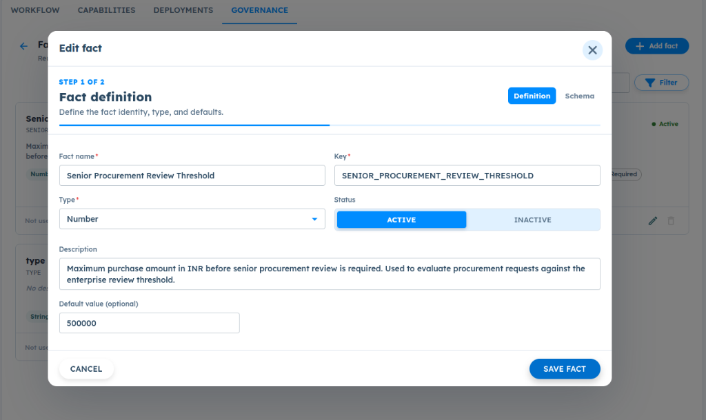
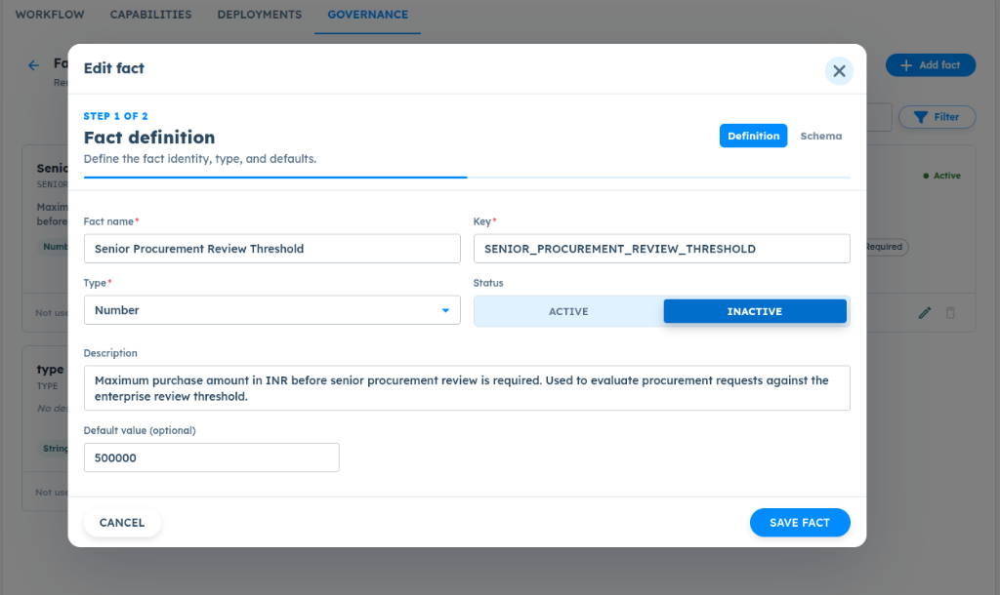

# ART-GOV-006 — Fact Library Runtime Usage is Non-Deterministic and Cannot Be Verified

- **Canonical Bug ID:** ART-GOV-006
- **Module:** GOV
- **Severity:** HIGH
- **Priority:** P1
- **Environment:** Testing (Procurement Exception Agent / Governance / Fact Library / Professional Plan / InvestigationLab)
- **Assignee:** Unassigned
- **Tags:** Governance, Fact-Library, Runtime-State, Non-Deterministic, Cache-Invalidation, Observability, Auditability, P1
- **Status:** OPEN
- **Evidence Count:** 2
- **Azure DevOps:** SYNCED ([#68949](https://dev.azure.com/BixBytesSolutions/f3253417-808e-457f-a7f2-5699b2f38aa6/_workitems/edit/68949))

---

## 1. Problem
In **Governance → Fact Library**, an active Fact value does not produce deterministic runtime behavior across activation/deactivation cycles, and ART provides no visible evidence showing whether the fact was loaded or consumed during Agent execution.

During testing with `SENIOR_PROCUREMENT_REVIEW_THRESHOLD = 500000`:
1. An initial request for ₹7,50,000 returned `APPROVAL_REQUIRED`.
2. When the fact was toggled to `INACTIVE`, the same scenario returned `NO_EXCEPTION`.
3. When the fact was toggled back to `ACTIVE`, the same scenario unexpectedly continued returning `NO_EXCEPTION`.

Because ART lacks runtime provenance and observability into fact resolution, users cannot verify whether a business fact was loaded, stale, cached, or never consumed by an active rule, creating an unpredictable governance execution environment.

---

## 2. Observed Behavior
- **Non-Deterministic Runtime Effect:** With `SENIOR_PROCUREMENT_REVIEW_THRESHOLD` set to 500000:
  - First run (ACTIVE): Evaluation of a ₹7,50,000 request resulted in `APPROVAL_REQUIRED`.
  - Second run (toggled to INACTIVE): Identical request resulted in `NO_EXCEPTION`.
  - Third run (toggled back to ACTIVE): Identical request still returned `NO_EXCEPTION`.
- **Zero Runtime Observability:** Neither Agent Test nor Observability traces display whether `SENIOR_PROCUREMENT_REVIEW_THRESHOLD` was loaded into the execution context, which version was evaluated, or which policy rule consumed it.
- **Ambiguous Policy Binding:** The UI does not indicate whether a Fact Library entry requires an explicit Policy Rule or Action binding to influence model behavior, leaving authors uncertain whether facts act as passive context or active thresholds.
- **UI State vs. Runtime Desynchronization:** Toggling fact status in the Fact Library (`ACTIVE` vs `INACTIVE`) does not reliably propagate to the agent's active execution snapshot.

---

## 3. Reproduction
1. Open an Agent with Governance enabled (e.g. `Procurement Exception Agent`).
2. Go to **Governance → Fact Library**.
3. Create or edit a fact:
   - Fact name: `Senior Procurement Review Threshold`
   - Key: `SENIOR_PROCUREMENT_REVIEW_THRESHOLD`
   - Type: `Number`
   - Default value: `500000`
   - Status: `ACTIVE`
4. Open **Agent Test** and submit a test evaluation request exceeding the threshold (e.g. purchase request for ₹7,50,000 from a non-preferred supplier).
5. Observe that execution returns `APPROVAL_REQUIRED`.
6. Return to **Fact Library**, edit the fact, toggle Status to `INACTIVE`, and save.
7. Re-run the identical request in **Agent Test**; observe that execution returns `NO_EXCEPTION`.
8. Return to **Fact Library**, edit the fact, toggle Status back to `ACTIVE`, and save.
9. Re-run the identical request in **Agent Test**.
10. Observe that execution continues returning `NO_EXCEPTION`, failing to honor the reactivated fact.

---

## 4. Expected Behavior
- Fact activation state and runtime availability must be deterministic across executions.
- When an active fact is configured, ART must consistently expose its resolved value to the governance runtime context.
- Toggling a fact between `ACTIVE` and `INACTIVE` must predictably invalidate cached runtime snapshots and update subsequent runs.
- If a fact requires an associated Policy Rule or Action to participate in decisions, ART should make that dependency explicit in the UI.
- Observability traces must identify which facts were loaded, their source version, and whether they were evaluated.

---

## 5. Business Impact
- **Loss of Governance Integrity:** Enterprise organizations cannot verify whether financial limits, compliance rules, or vendor thresholds defined in the Fact Library are enforced at runtime.
- **Unverifiable Decisions:** Compliance officers cannot audit whether an AI decision was influenced by configured governance facts or arbitrary model output.
- **Testing & Debugging Friction:** Developers cannot determine whether unexpected agent responses are caused by prompt variance, rule misconfiguration, or stale fact caching.

---

## 6. User Experience
- Toggling a fact from Active to Inactive and back to Active produces inconsistent behavior, making the Governance settings feel unresponsive and broken.
- No visibility into runtime fact resolution leaves users guessing about how Fact Library entries interact with agent decisions.

---

## 7. Investigation Guidance
Trace the complete lifecycle of Fact Library entries from definition to runtime execution:
- **Persistence & Versioning:** Check how facts are stored in the database and whether updates bump an entity version or revision hash.
- **Cache Invalidation:** Inspect whether active agent workflows cache runtime snapshots or governance configuration. Verify if saving a fact triggers cache invalidation.
- **Context Injection Pipeline:** Trace where Fact Library entries are compiled into the LLM system prompt or governance evaluation context.
- **Policy Rule Dependency:** Determine whether facts are directly injected into prompt context or if they are only evaluated when referenced by an active Policy Rule or Action condition.
- **Observability Telemetry:** Check what execution metadata is emitted to the trace store; verify if loaded facts and resolved values are logged.

---

## 8. Fix Requirement
Ensure Fact Library state transitions (`ACTIVE` / `INACTIVE`) deterministically update the execution runtime snapshot, and expose runtime provenance in Observability to identify loaded and consumed facts.

---

## 9. Recommended Solution
1. **Deterministic Snapshot Invalidation:** Invalidate and recompile the runtime configuration snapshot whenever Fact Library definitions or activation states are updated.
2. **Context Injection Pipeline:** Ensure active facts are deterministically loaded into the agent/governance execution context on every invocation.
3. **Runtime Fact Provenance in Observability:** Record detailed telemetry for each execution: list of loaded facts, resolved values, version/hash, source, and whether consumed by any policy rule or condition.
4. **UI Consumer Relationship Indicator:** In the Fact Library, display badges or tooltips showing where a fact is consumed (e.g. 'Used in 1 Policy Rule' vs 'Unbound — requires Policy Rule to affect decisions').

---

## 10. Minimum Working Fix
Ensure that saving an update to a Fact Library entry immediately invalidates the agent's cached runtime configuration, and include a `governance_facts` array in the execution trace recording loaded fact keys and resolved values.

---

## 11. Acceptance Criteria
- [ ] Repeated execution against the same published configuration produces consistent fact availability.
- [ ] Toggling a fact between ACTIVE and INACTIVE is deterministically reflected in subsequent test executions.
- [ ] Observability traces identify the fact key, resolved value, version/source, and whether it was loaded and consumed.
- [ ] The UI clearly indicates when a Fact requires an associated Policy Rule or consumer before it can affect decisions.
- [ ] Identical inputs against identical published configurations execute deterministically without stale fact state.

---

## 12. Environment
- **Platform:** ART Agent Builder / Governance
- **Module:** Governance — Fact Library
- **Agent Workflow:** Procurement Exception Agent (`6ac3213fdfaa4ac34990c7e4`)
- **Fact Key:** `SENIOR_PROCUREMENT_REVIEW_THRESHOLD`
- **Environment:** Testing (InvestigationLab, Professional Plan)

---

## 13. Severity
**HIGH** — Breaks governance determinism and auditability; active facts do not reliably influence runtime decisions and cannot be verified in traces.

---

## 14. Priority
**P1** — Core governance defect directly compromising enterprise compliance and policy enforcement.

---

## 15. Tags
- `Governance`
- `Fact-Library`
- `Runtime-State`
- `Non-Deterministic`
- `Cache-Invalidation`
- `Observability`
- `Auditability`
- `P1`

---

## 16. Assignee
**Unassigned**

---

## 17. Evidence

| File | Type | Description | SHA256 Hash | Byte Size |
| :--- | :--- | :--- | :--- | :--- |
| [ART-GOV-006__fact-library-senior-procurement-threshold-active__2026-10-05__01.png](./ART-GOV-006__fact-library-senior-procurement-threshold-active__2026-10-05__01.png) | Screenshot | Fact definition modal in Governance -> Fact Library showing SENIOR_PROCUREMENT_REVIEW_THRESHOLD configured as Number with default value 500000 and status set to ACTIVE. | `2efb557e1a0e5cb1c47f964aeed0879cbb515c60812f15cf2e2f26093c169bf6` | 124773 bytes |
| [ART-GOV-006__fact-library-senior-procurement-threshold-inactive__2026-10-05__02.png](./ART-GOV-006__fact-library-senior-procurement-threshold-inactive__2026-10-05__02.png) | Screenshot | Fact definition modal in Governance -> Fact Library showing SENIOR_PROCUREMENT_REVIEW_THRESHOLD toggled to INACTIVE status. | `ec4ebb8b0f529e514aa031fc9f3d33c17aa34942c0724e6ae30b8300710f14ca` | 125195 bytes |

### Evidence Visual Gallery

````carousel

*Fact definition modal in Governance -> Fact Library showing SENIOR_PROCUREMENT_REVIEW_THRESHOLD configured as Number with default value 500000 and status set to ACTIVE.*
<!-- slide -->

*Fact definition modal in Governance -> Fact Library showing SENIOR_PROCUREMENT_REVIEW_THRESHOLD toggled to INACTIVE status.*
````

---

## 18. Discussion
- **Reporter Analysis:** An active Fact Library value does not produce consistent runtime behavior, and ART provides no visible evidence showing whether the fact was loaded or used during the Agent execution. Enterprise users cannot reliably determine whether governed business facts are actually influencing AI decisions.
- **Traceability Need:** The lack of runtime provenance makes it impossible to distinguish between a fact that was not loaded, a fact that was loaded with stale data, or a fact that was loaded but ignored because no policy rule was bound to it.
- **Intake Validation:** Evidence screenshots preserved with cryptographic SHA256 checksums and verified byte sizes. Zero Azure DevOps mutations performed during intake.

---

## 19. Azure DevOps
- **Work Item ID:** 68949
- **URL:** [https://dev.azure.com/BixBytesSolutions/f3253417-808e-457f-a7f2-5699b2f38aa6/_workitems/edit/68949](https://dev.azure.com/BixBytesSolutions/f3253417-808e-457f-a7f2-5699b2f38aa6/_workitems/edit/68949)
- **Parent Feature:** Governance
- **Parent Feature ID:** 68812
- **Assigned To:** Unassigned
- **Sync Status:** SYNCED
- **Note:** Synchronized via Harness 02 V1 to Azure DevOps.
