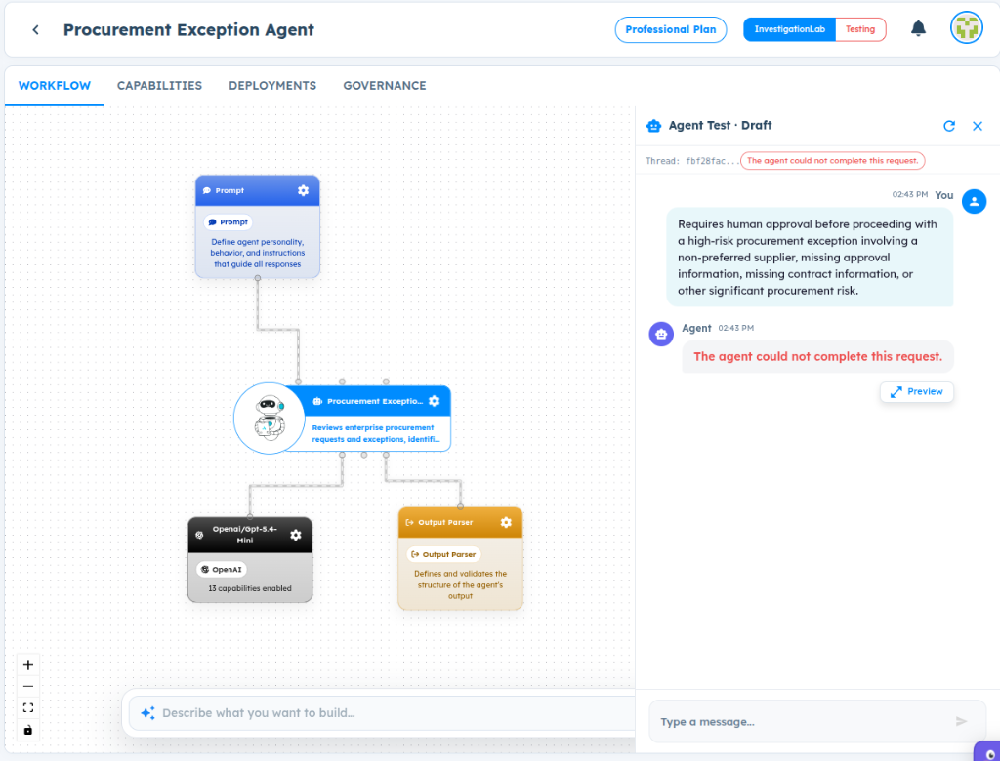
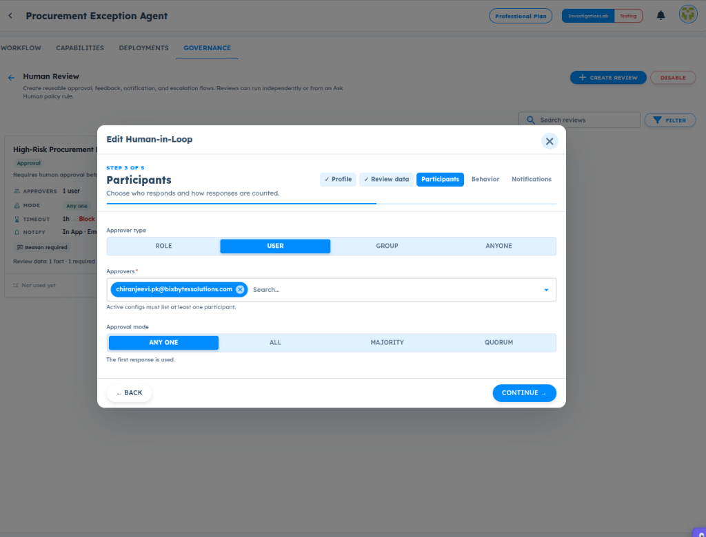

# ART-GOV-007 — Human Review Execution Fails After Agent Identifies Review Requirement

- **Canonical Bug ID:** ART-GOV-007
- **Module:** GOV
- **Severity:** HIGH
- **Priority:** P1
- **Environment:** Testing (Procurement Exception Agent / Governance / Human Review / Professional Plan / InvestigationLab)
- **Assignee:** Unassigned
- **Tags:** Governance, Human-Review, Human-in-the-Loop, HIL-Execution, Participant-Resolution, Approval-Request, Policy-Rule-Dependency, P1
- **Status:** OPEN
- **Evidence Count:** 3
- **Azure DevOps:** SYNCED ([#68950](https://dev.azure.com/BixBytesSolutions/f3253417-808e-457f-a7f2-5699b2f38aa6/_workitems/edit/68950))

---

## 1. Problem
In **Governance → Human Review**, an active Human-in-the-Loop (HIL) approval configuration exists for high-risk procurement exceptions with a specific user configured as approver. When an Agent processes a high-risk procurement request and correctly determines that human review is required, the Agent Test execution fails with the generic error:

> **"The agent could not complete this request."**

Instead of initiating the configured Human Review, creating a pending approval request for the designated participant, and pausing or routing execution, the runtime crashes or halts abruptly. No approval notification is generated, no review modal/banner appears, and the Human Review configuration card continues to display **"Not used yet"**.

Furthermore, ART provides no diagnostic explanation indicating whether participant resolution failed (e.g. resolving user email to participant identity), whether an explicit "Ask Human" Policy Rule is required to bind the review to the execution path, or if an unhandled internal exception occurred.

---

## 2. Observed Behavior
- **Correct Model Evaluation:** The Agent successfully processes the high-risk scenario and emits a structured result with `human_review_required: true`, `risk_assessment: "High risk..."`, `exception_type: "NON_PREFERRED_SUPPLIER"`, and `recommended_next_action: "Escalate for human review..."` (verified in Observability trace `9833e3e1`).
- **Execution Failure in Agent Test:** In Agent Test (thread `fbf28fac...`), instead of triggering an approval workflow or human review pause, the session terminates with red error banner:
  `The agent could not complete this request.`
- **Configured Human Review Ignored:** In Governance → Human Review, `High-Risk Procurement Exception` is configured with:
  - Approver type: `USER`
  - Approvers: `chiranjeevi.pk@bixbytessolutions.com`
  - Mode: `Any one`
  - Timeout: `1h · Block`
  - Notify: `In App · Email`
  - Card status: displays `Not used yet`.
- **Zero Diagnostics:** No diagnostic toast, error code, or trace details explain why the review was not invoked or why the agent failed.

---

## 3. Reproduction
1. Open an Agent with Governance enabled (e.g. `Procurement Exception Agent`).
2. Navigate to **Governance → Human Review**.
3. Create or edit a Human-in-the-Loop approval configuration (e.g. `High-Risk Procurement Exception`):
   - Set Approver type to `USER`.
   - Specify approver email: `chiranjeevi.pk@bixbytessolutions.com`.
   - Set Approval mode to `ANY ONE`.
   - Save and ensure the review is active.
4. Open **Agent Test** in Draft mode.
5. Submit a high-risk prompt (e.g. `"Requires human approval before proceeding with a high-risk procurement exception involving a non-preferred supplier..."`).
6. Observe that the Agent evaluates the scenario, but execution terminates with:
   `The agent could not complete this request.`
7. Verify in Observability that the model produced `human_review_required: true`, yet no approval request was created.

---

## 4. Expected Behavior
- When an Agent determines that human review is required and matching Human Review configuration exists, ART must create an approval request for the configured participant and pause/route execution accordingly.
- If Human Review execution requires an explicit Policy Rule (e.g. an "Ask Human" action in Policy Rules) to connect the Agent's output to the Human Review configuration:
  - The UI must make this dependency explicit (e.g. "Review is inactive until linked to a Policy Rule").
  - The runtime must emit a clear diagnostic rather than aborting with a generic failure.
- If participant resolution fails (e.g. user lookup error), ART must report a specific diagnostic error rather than masking it behind "The agent could not complete this request."

---

## 5. Business Impact
- **Complete HIL Governance Failure:** Enterprise workflows requiring human validation for high-risk, high-value, or compliance-sensitive actions cannot function.
- **Unreliable Testing:** Builders cannot test Human Review workflows in Agent Test, blocking validation of approval mechanisms, notifications, and escalation timeouts.
- **Diagnostic Blindspot:** Generic error messages obscure whether the failure is an Agent model issue, a policy rule configuration gap, or a runtime participant resolution bug.

---

## 6. User Experience
- The user configures a Human Review flow and triggers it with an appropriate prompt, only to receive a cryptic red error: "The agent could not complete this request."
- The configuration card continues showing "Not used yet", giving no indication of how to connect or activate the review flow properly.

---

## 7. Investigation Guidance
Investigate the Human Review execution and dispatch pipeline:
- **Execution Path:** Trace `Agent structured output → governance evaluation → Human Review configuration lookup → participant resolution → approval-request creation → execution pause/resume → Agent Test response`.
- **USER Participant Resolution:** Specifically inspect how `Approver type: USER` with email addresses (e.g. `chiranjeevi.pk@bixbytessolutions.com`) is resolved at runtime. Check whether the resolver expects an internal user UUID rather than an email address, causing an unhandled lookup failure.
- **Policy Rule Connection:** Determine whether Human Review configurations can execute autonomously based on Agent output schema fields (e.g. `human_review_required: true`), or if they strictly require a corresponding Policy Rule of type "Ask Human" in Policy Rules.
- **Error Propagation:** Inspect the catch block in the Agent Test runner that converts governance/HIL exceptions into the generic string `"The agent could not complete this request."`.

---

## 8. Fix Requirement
The runtime must either successfully initiate the Human Review flow (creating the approval request for the configured participant and pausing execution) or return a specific, actionable diagnostic explaining why Human Review could not be executed. Generic agent failure messages must not mask governance/HIL routing errors.

---

## 9. Recommended Solution
1. **Fix Participant Resolution:** Ensure the Human Review participant resolver properly resolves user email strings to valid system user identities during execution.
2. **Clarify Policy Rule Binding:** If Human Review requires a Policy Rule to trigger, update the UI to indicate this dependency (e.g. badge showing "Requires Policy Rule" instead of passive "Not used yet") and log a specific warning if invoked without a binding.
3. **Structured HIL Test Experience:** In Agent Test, when a Human Review is triggered, display an interactive approval banner (e.g. "Waiting for approval from chiranjeevi.pk...") with options to simulate approve/reject.
4. **Actionable Error Responses:** Emit typed error responses (e.g. `HIL_EXECUTION_ERROR`, `PARTICIPANT_NOT_FOUND`) with diagnostic details when human review creation fails.

---

## 10. Minimum Working Fix
In the governance evaluation pipeline, catch Human Review invocation failures specifically and return an informative error message (identifying whether participant resolution failed or if a policy rule binding was missing) rather than allowing an unhandled exception to bubble up and trigger "The agent could not complete this request."

---

## 11. Acceptance Criteria
- [ ] Submitting a prompt that triggers human review successfully initiates the configured Human Review flow or reports an explicit, actionable diagnostic.
- [ ] Configured USER participants (by email address) are resolved without unhandled exceptions.
- [ ] If Human Review requires an associated Policy Rule, the requirement is clearly indicated in both the Governance UI and execution diagnostics.
- [ ] The generic error "The agent could not complete this request" is not used to mask governance/HIL execution failures.
- [ ] Agent Test displays the pending approval state or human review prompt when HIL is triggered.

---

## 12. Environment
- **Platform:** ART Agent Builder / Governance
- **Module:** Governance — Human Review / Human-in-the-Loop
- **Agent Workflow:** Procurement Exception Agent (`6ac3213fdfaa4ac34990c7e4`)
- **Review Name:** High-Risk Procurement Exception
- **Participant:** `chiranjeevi.pk@bixbytessolutions.com` (Type: USER)
- **Environment:** Testing (InvestigationLab, Professional Plan)

---

## 13. Severity
**HIGH** — Breaks Human-in-the-Loop governance execution, causing agent runs to abort with generic errors when human review is required.

---

## 14. Priority
**P1** — Core governance capability defect preventing human review validation and deployment.

---

## 15. Tags
- `Governance`
- `Human-Review`
- `Human-in-the-Loop`
- `HIL-Execution`
- `Participant-Resolution`
- `Approval-Request`
- `Policy-Rule-Dependency`
- `P1`

---

## 16. Assignee
**Unassigned**

---

## 17. Evidence

| File | Type | Description | SHA256 Hash | Byte Size |
| :--- | :--- | :--- | :--- | :--- |
| [ART-GOV-007__agent-test-could-not-complete-request-hil-failure__2026-10-05__01.png](./ART-GOV-007__agent-test-could-not-complete-request-hil-failure__2026-10-05__01.png) | Screenshot | Agent Test in Procurement Exception Agent showing the execution failure 'The agent could not complete this request.' when evaluating a high-risk procurement prompt that requires human approval, failing to create an approval request or initiate Human Review. | `03d2e8f41ae0126cbb8b18ed80804d621c19f4fe1b0b50fda8ddd7afb2f0444e` | 303465 bytes |
| [ART-GOV-007__observability-structured-output-human-review-required-true__2026-10-05__02.png](./ART-GOV-007__observability-structured-output-human-review-required-true__2026-10-05__02.png) | Screenshot | Observability Conversation Explorer (thread 9833e3e1) showing the Agent successfully generated a complete structured output with human_review_required: true, risk_assessment: 'High risk...', and recommended_next_action: 'Escalate for human review...' for a ₹18,75,000 purchase request. | `6fe6f9ebbf5d72a71a775fb58c03912c2bd8335fb149c63d18719e9e432bb7da` | 251506 bytes |
| [ART-GOV-007__human-in-loop-configuration-user-participant__2026-10-05__03.png](./ART-GOV-007__human-in-loop-configuration-user-participant__2026-10-05__03.png) | Screenshot | Edit Human-in-Loop modal in Governance -> Human Review showing Step 3 Participants configured with Approver type USER, approver 'chiranjeevi.pk@bixbytessolutions.com', and Approval mode ANY ONE, while the background summary card indicates 'Not used yet'. | `aac265dc853d6fc25b48039689fb2718eeef08f7025adf6f8d23257c87d9a742` | 140116 bytes |

### Evidence Visual Gallery

````carousel

*Agent Test in Procurement Exception Agent showing the execution failure 'The agent could not complete this request.' when evaluating a high-risk procurement prompt that requires human approval, failing to create an approval request or initiate Human Review.*
<!-- slide -->

*Observability Conversation Explorer (thread 9833e3e1) showing the Agent successfully generated a complete structured output with human_review_required: true, risk_assessment: 'High risk...', and recommended_next_action: 'Escalate for human review...' for a ₹18,75,000 purchase request.*
<!-- slide -->

*Edit Human-in-Loop modal in Governance -> Human Review showing Step 3 Participants configured with Approver type USER, approver 'chiranjeevi.pk@bixbytessolutions.com', and Approval mode ANY ONE, while the background summary card indicates 'Not used yet'.*
````

---

## 18. Discussion
- **Reporter Analysis:** The Agent successfully determines that human review is required and includes this in its structured output (`human_review_required: true`), but the execution pipeline fails when attempting to invoke the Human Review flow. The generic error "The agent could not complete this request" conceals whether the issue is participant resolution (USER email vs ID) or a missing Policy Rule binding.
- **Architectural Ambiguity:** ART allows users to configure Human Review independently in Governance, but displays "Not used yet" on the summary card. If Human Review cannot execute without an explicit Policy Rule in the Policy Rules tab, ART should enforce or guide that relationship rather than allowing independent configuration that fails silently at runtime.
- **Intake Validation:** Evidence screenshots preserved with cryptographic SHA256 checksums and verified byte sizes. Zero Azure DevOps mutations performed during intake.

---

## 19. Azure DevOps
- **Work Item ID:** 68950
- **URL:** [https://dev.azure.com/BixBytesSolutions/f3253417-808e-457f-a7f2-5699b2f38aa6/_workitems/edit/68950](https://dev.azure.com/BixBytesSolutions/f3253417-808e-457f-a7f2-5699b2f38aa6/_workitems/edit/68950)
- **Parent Feature:** Governance
- **Parent Feature ID:** 68812
- **Assigned To:** Unassigned
- **Sync Status:** SYNCED
- **Note:** Synchronized via Harness 02 V1 to Azure DevOps.
