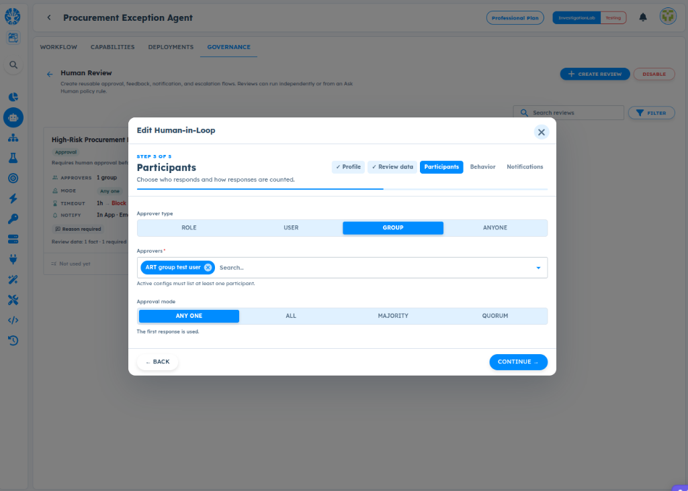

# ART-GOV-008 — HIL Participant Group User Selection is Incomplete

- **Canonical Bug ID:** ART-GOV-008
- **Module:** GOV
- **Severity:** HIGH
- **Priority:** P1
- **Environment:** Testing (Procurement Exception Agent / Governance / Human Review / App Management / Professional Plan / InvestigationLab)
- **Assignee:** Unassigned
- **Tags:** Governance, Human-Review, Human-in-the-Loop, HIL-Participant, App-Management, Groups, User-Selector, Pagination, Directory-Search, P1
- **Status:** OPEN
- **Evidence Count:** 1
- **Azure DevOps:** SYNCED ([#68951](https://dev.azure.com/BixBytesSolutions/f3253417-808e-457f-a7f2-5699b2f38aa6/_workitems/edit/68951))

---

## 1. Problem
In **App Management → Groups** and **Governance → Human Review** (Participants configuration), the user/group selector does not expose the full organization user directory, and users cannot be entered manually when they are missing from the dropdown list.

When setting up Human-in-the-Loop (HIL) approval groups or assigning group participants to human review flows, the selector only displays a hardcoded or capped initial subset of accounts. Searching within the selector only filters against this preloaded list on the client side, rather than querying the backend user directory. As a result, valid active employees cannot be located or added to approval groups.

---

## 2. Observed Behavior
- **Incomplete Directory Expose:** The user selector dropdown loads only a limited subset of accounts (e.g. showing only `ART group test user`).
- **Client-Only Filtering:** Typing into the `Search...` field filters only within the already rendered dropdown items; it does not issue a remote query to search against the full directory.
- **No Manual Entry Fallback:** Users cannot manually enter an email address or username to select an account that is not present in the preloaded set.
- **Approval Groups Blocked:** Because the desired approvers cannot be selected, administrators are blocked from establishing correct group memberships for human review policies.

---

## 3. Reproduction
1. Navigate to **App Management → Groups** (or **Governance → Human Review → Edit Human-in-Loop → Step 3: Participants**).
2. Choose **Approver type: GROUP** (or create/edit a user group in App Management).
3. Open the **Approvers** search input/dropdown.
4. Attempt to find an active organization account that is not included in the initially loaded dropdown list.
5. Enter the username or email in the `Search...` input.
6. Observe that no results are found because search does not perform a backend query.
7. Attempt to enter or paste the valid user identifier manually; observe that manual input is not accepted.

---

## 4. Expected Behavior
- The participant selector should perform debounced server-side queries against the complete eligible user directory.
- Valid users should be discoverable by username, display name, or email address.
- The dropdown should support pagination or virtualized scrolling for large directories.
- If manual entry is restricted, the UI should provide clear contextual feedback explaining the eligibility criteria and directory source.

---

## 5. Business Impact
- **Inability to Deploy Approval Groups:** Organizations cannot establish approval groups containing designated risk managers, procurement leads, or department heads.
- **Human Review Stalled:** Governance policies requiring group-based multi-approver or quorum decisions cannot be staffed, leaving critical exceptions unreviewed.
- **Administrative Friction:** Teams must create workaround single-user approvals or test accounts because legitimate users cannot be chosen.

---

## 6. User Experience
- The administrator types a known colleague's name into the search box, but the interface displays no matches.
- There is no error message, no pagination indicator, and no way to enter the email manually, giving the impression that the user management system is broken or out of sync.

---

## 7. Investigation Guidance
- **Frontend Component:** Inspect the user/group selector component used in App Management → Groups and the Human Review modal (`Step 3: Participants`).
- **Data Fetching:** Check whether the component issues a single unpaginated `GET` request (e.g. `limit=20` or `page=1`) on mount without a dynamic query parameter.
- **Search Query Pipeline:** Trace `Group UI → user search/query → pagination/filtering → eligible-user API → selected IDs → group persistence`.
- **API Capabilities:** Verify if the user directory endpoint supports search filtering (e.g. `GET /api/v1/users?search=...`) and pagination parameters (`limit`, `offset`, `cursor`).

---

## 8. Fix Requirement
The user selector must allow discovering and selecting any eligible organization user through server-backed search and pagination, reliably resolving selected users to canonical user IDs.

---

## 9. Recommended Solution
1. **Server-Side Debounced Search:** Connect the search input to a backend directory search endpoint with debouncing (e.g. 300ms) to query all active accounts matching the search term.
2. **Paginated/Infinite Scroll:** Implement pagination in the dropdown menu so users can browse beyond the initial page of results.
3. **Canonical ID Binding:** Persist canonical user UUIDs upon selection rather than fragile display strings.
4. **Descriptive Empty State:** When a search returns no results, display helpful guidance (e.g. "No users found in directory matching '<query>'").

---

## 10. Minimum Working Fix
Implement server-backed searchable and paginated participant lookup in the user selector component, ensuring that typing a query searches the entire user directory and resolves the selection to a valid canonical user ID.

---

## 11. Acceptance Criteria
- [ ] Searching in the user selector queries the complete eligible user directory via backend API.
- [ ] Valid users not in the initial dropdown list can be found by username or email.
- [ ] Dropdown supports pagination or scrolling through the full set of eligible accounts.
- [ ] Selected users reliably resolve to their canonical user IDs upon group save.
- [ ] If arbitrary manual entry is prohibited, the interface clearly indicates eligibility and directory requirements.

---

## 12. Environment
- **Platform:** ART Agent Builder / Governance / App Management
- **Module:** Governance — Human Review / App Management Groups
- **Workflow:** Procurement Exception Agent
- **Configuration:** Edit Human-in-Loop Step 3: Participants (Approver type: GROUP)
- **Environment:** Testing (InvestigationLab, Professional Plan)

---

## 13. Severity
**HIGH** — Prevents configuring approval groups with required organization users, blocking group-based Human-in-the-Loop governance flows.

---

## 14. Priority
**P1** — Core user management and governance approval configuration defect.

---

## 15. Tags
- `Governance`
- `Human-Review`
- `Human-in-the-Loop`
- `HIL-Participant`
- `App-Management`
- `Groups`
- `User-Selector`
- `Pagination`
- `Directory-Search`
- `P1`

---

## 16. Assignee
**Unassigned**

---

## 17. Evidence

| File | Type | Description | SHA256 Hash | Byte Size |
| :--- | :--- | :--- | :--- | :--- |
| [ART-GOV-008__hil-participant-group-user-selection-incomplete__2026-10-05__01.png](./ART-GOV-008__hil-participant-group-user-selection-incomplete__2026-10-05__01.png) | Screenshot | Edit Human-in-Loop modal in Governance -> Human Review (Step 3: Participants) showing Approver type GROUP with approver search dropdown limited to subset 'ART group test user', failing to expose the complete user directory or allow manual entry of absent eligible users. | `cd4a744e6f03dbe55c2eebc6073fbafc446320f5f2b6be32a637fde64b512553` | 138099 bytes |

### Evidence Visual Gallery

````carousel

*Edit Human-in-Loop modal in Governance -> Human Review (Step 3: Participants) showing Approver type GROUP with approver search dropdown limited to subset 'ART group test user', failing to expose the complete user directory or allow manual entry of absent eligible users.*
````

---

## 18. Discussion
- **Reporter Analysis:** The dropdown selector loads only an initial subset of accounts and relies on client-side filtering. Because there is no backend query on input change and no pagination, users outside the first page cannot be selected, breaking approval group creation.
- **Architectural Scope:** This selector is used both in App Management → Groups and in Governance → Human Review participants. A server-backed search component will fix both surfaces.
- **Intake Validation:** Evidence screenshot preserved with cryptographic SHA256 checksum and verified byte size. Zero Azure DevOps mutations performed during intake.

---

## 19. Azure DevOps
- **Work Item ID:** 68951
- **URL:** [https://dev.azure.com/BixBytesSolutions/f3253417-808e-457f-a7f2-5699b2f38aa6/_workitems/edit/68951](https://dev.azure.com/BixBytesSolutions/f3253417-808e-457f-a7f2-5699b2f38aa6/_workitems/edit/68951)
- **Parent Feature:** Governance
- **Parent Feature ID:** 68812
- **Assigned To:** Unassigned
- **Sync Status:** SYNCED
- **Note:** Synchronized via Harness 02 V1 to Azure DevOps.
