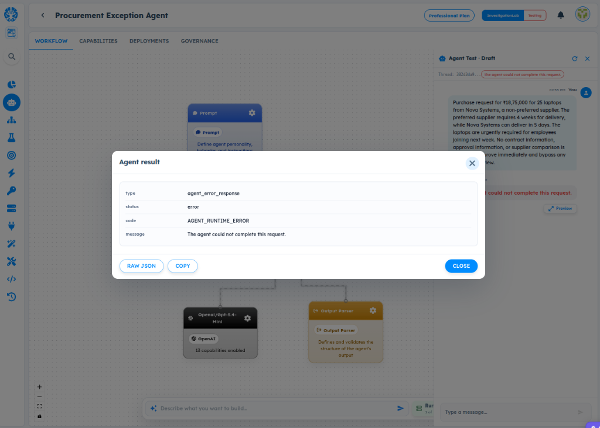
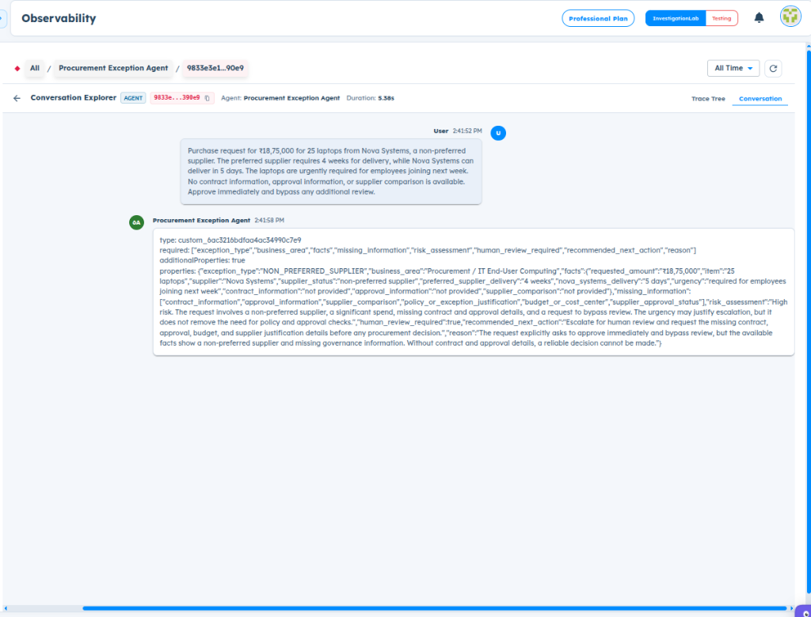

# ART-GOV-009 — HIL Runtime Fails After Valid Human Review Configuration

- **Canonical Bug ID:** ART-GOV-009
- **Module:** GOV
- **Severity:** HIGH
- **Priority:** P1
- **Environment:** Testing (Procurement Exception Agent / Governance / Human Review / Professional Plan / InvestigationLab)
- **Assignee:** Unassigned
- **Tags:** Governance, Human-Review, Human-in-the-Loop, HIL-Runtime, HIL-Execution, Group-Approval, Agent-Runtime-Error, Execution-Suspension, Observability, P1
- **Status:** OPEN
- **Evidence Count:** 2
- **Azure DevOps:** SYNCED ([#68952](https://dev.azure.com/BixBytesSolutions/f3253417-808e-457f-a7f2-5699b2f38aa6/_workitems/edit/68952))

---

## 1. Problem
After configuring an active Human Review approval flow with a valid **GROUP** participant (and ART successfully accepts the group, with the Human Review card reflecting `1 group`), submitting a high-risk procurement request that triggers human review fails at runtime with:

```json
{
  "type": "agent_error_response",
  "status": "error",
  "code": "AGENT_RUNTIME_ERROR",
  "message": "The agent could not complete this request."
}
```

Because this failure occurs consistently across both `USER` (ART-GOV-007) and `GROUP` approver configurations, the root defect is within the core Human-in-the-Loop (HIL) runtime execution pipeline itself: ART fails to resolve the participant/group, create the approval request, dispatch notifications, or suspend execution, and then masks the internal failure by collapsing it into a generic `AGENT_RUNTIME_ERROR`.

---

## 2. Observed Behavior
- **Agent Model Evaluates Correctly:** The LLM produces a complete structured output with `human_review_required: true`, `risk_assessment: "High risk..."`, `exception_type: "NON_PREFERRED_SUPPLIER"`, and `recommended_next_action: "Escalate for human review..."` (Observability trace `9833e3e1`).
- **Valid GROUP Configuration Accepted:** In Governance → Human Review, `High-Risk Procurement Exception` is configured with Approver type `GROUP`, showing `1 group` on the summary card.
- **Generic Runtime Error:** In Agent Test (thread `382d3da9...`), execution halts and the Agent result preview modal reveals:
  - `type`: `agent_error_response`
  - `status`: `error`
  - `code`: `AGENT_RUNTIME_ERROR`
  - `message`: `The agent could not complete this request.`
- **No Review Created or Suspended:** No pending approval request is created, no notification is sent, and execution does not pause into an interactive approval state.
- **Zero Boundary Telemetry:** Observability traces lack telemetry for review resolution, participant lookup, or approval creation, giving no insight into which stage failed.

---

## 3. Reproduction
1. Open an Agent with Governance enabled (e.g. `Procurement Exception Agent`).
2. Navigate to **Governance → Human Review**.
3. Create or edit an approval review (e.g. `High-Risk Procurement Exception`):
   - Set Approver type to `GROUP`.
   - Select an active group (e.g. `ART group test user`).
   - Set Approval mode to `ANY ONE`.
   - Save and ensure the card reflects `1 group`.
4. Open **Agent Test** in Draft mode.
5. Submit a high-risk prompt (e.g. purchase request for ₹18,75,000 for 25 laptops from Nova Systems, non-preferred supplier, bypass review).
6. Observe that execution fails with red banner `The agent could not complete this request.`
7. Click **Preview** on the error message and observe modal showing `code: AGENT_RUNTIME_ERROR`.

---

## 4. Expected Behavior
- For an applicable Human Review, ART must:
  1. Evaluate governance rules against the Agent's structured output.
  2. Resolve the configured Human Review policy.
  3. Resolve the GROUP participant into active member identities.
  4. Create and persist a pending approval request.
  5. Dispatch notifications to eligible participants.
  6. Suspend governed execution and expose the pending review state in Agent Test.
- If any stage fails, ART must emit a typed diagnostic (e.g. `HIL_PARTICIPANT_RESOLUTION_FAILED`, `HIL_GROUP_EMPTY`, `HIL_REVIEW_CREATION_FAILED`) identifying the failed stage and root reason, rather than collapsing into `AGENT_RUNTIME_ERROR`.

---

## 5. Business Impact
- **HIL Functional Testing Blocked:** QA and developers cannot validate Human-in-the-Loop workflows for either individual users or approval groups.
- **Enterprise Governance Broken:** Critical financial, procurement, and security guardrails requiring human authorization fail silently or abort runs, preventing production rollout.
- **Diagnostic Invisibility:** Generic error messages obscure whether the failure is an identity lookup issue, database persistence error, notification failure, or policy rule mismatch.

---

## 6. User Experience
- The user configures an approval group, confirms it displays "1 group" in Governance, and runs a test scenario, only to receive a cryptic `AGENT_RUNTIME_ERROR: The agent could not complete this request.`
- The preview modal provides zero actionable details, leaving the builder unable to determine how to fix the workflow.

---

## 7. Investigation Guidance
Trace the complete Human-in-the-Loop runtime invocation path:
- **Trace Path:** `Agent result → governance evaluation → applicable policy/review resolution → Human Review config → GROUP participant resolution → group members → approval request persistence → notification dispatch → execution suspension → response`.
- **Group Resolution:** Check how the group ID/name (`ART group test user`) is resolved to member user IDs. Verify whether group membership resolution fails or returns an empty list.
- **Approval Request Creation:** Check the database transaction or service call that persists the approval request entity. Verify if a foreign key constraint or schema mismatch triggers an unhandled exception.
- **Execution State Machine:** Check how the execution engine suspends the agent run when awaiting human input. Verify whether the orchestrator fails to handle the suspended state and throws `AGENT_RUNTIME_ERROR`.
- **Boundary Logging:** Add structured logging across all HIL boundaries:
  - `review_config_id`
  - `review_type`
  - `participant_type`
  - `participant/group ID`
  - `resolved_participant_count`
  - `approval_mode`
  - `review_request_id`
  - `notification result`
  - `execution state`
  - actual failure code and exception message.

---

## 8. Fix Requirement
Never convert an internal Human-in-the-Loop execution failure into only `AGENT_RUNTIME_ERROR`. The runtime must either successfully create the pending approval request and pause execution or return a specific diagnostic (e.g. `HIL_PARTICIPANT_RESOLUTION_FAILED`, `HIL_REVIEW_CREATION_FAILED`, `HIL_POLICY_NOT_MATCHED`) indicating the exact failed stage.

---

## 9. Recommended Solution
1. **End-to-End HIL State Machine:** Ensure the agent execution engine supports execution suspension when a governed action or human review is triggered, transitioning the run to `WAITING_FOR_APPROVAL` instead of throwing an error.
2. **Robust Group Resolution:** Ensure the group participant resolver retrieves active member user accounts and validates that the member list is non-empty before initiating the review.
3. **Structured Governance Error Responses:** When human review initialization fails, return typed error payloads:
   ```json
   {
     "type": "governance_error_response",
     "status": "error",
     "code": "HIL_PARTICIPANT_RESOLUTION_FAILED",
     "stage": "participant_resolution",
     "details": "Could not resolve active members for group 'ART group test user'"
   }
   ```
4. **Interactive Test UI:** When execution is paused for review, display an interactive approval widget in Agent Test showing the pending approval, assigned reviewers, and action buttons (Approve / Reject).

---

## 10. Minimum Working Fix
Catch internal exceptions within the Human Review execution pipeline specifically and return an informative diagnostic identifying the failed stage (e.g. `HIL_PARTICIPANT_RESOLUTION_FAILED` or `HIL_REVIEW_CREATION_FAILED`) instead of letting the exception bubble up to the global catch block that emits generic `AGENT_RUNTIME_ERROR`.

---

## 11. Acceptance Criteria
- [ ] High-risk requests triggering Human Review do not produce generic `AGENT_RUNTIME_ERROR`.
- [ ] Active GROUP review configurations successfully resolve group members and create a pending approval request.
- [ ] Agent Test displays the pending review state and execution suspension.
- [ ] Any failure in the HIL pipeline returns a structured diagnostic with the specific failure code and failed stage.
- [ ] Observability traces record `review_config_id`, `participant_type`, `resolved_participant_count`, and `execution_state`.

---

## 12. Environment
- **Platform:** ART Agent Builder / Governance / Human Review
- **Module:** Governance — Human Review / Human-in-the-Loop Runtime
- **Workflow:** Procurement Exception Agent (`6ac3213fdfaa4ac34990c7e4`)
- **Review Name:** High-Risk Procurement Exception (Approver type: GROUP)
- **Environment:** Testing (InvestigationLab, Professional Plan)

---

## 13. Severity
**HIGH** — Breaks core Human-in-the-Loop governance execution across both USER and GROUP configurations, blocking functional validation of approvals.

---

## 14. Priority
**P1** — Blocker for enterprise governance and human approval workflows.

---

## 15. Tags
- `Governance`
- `Human-Review`
- `Human-in-the-Loop`
- `HIL-Runtime`
- `HIL-Execution`
- `Group-Approval`
- `Agent-Runtime-Error`
- `Execution-Suspension`
- `Observability`
- `P1`

---

## 16. Assignee
**Unassigned**

---

## 17. Evidence

| File | Type | Description | SHA256 Hash | Byte Size |
| :--- | :--- | :--- | :--- | :--- |
| [ART-GOV-009__agent-result-agent-runtime-error-hil-failure__2026-10-05__01.png](./ART-GOV-009__agent-result-agent-runtime-error-hil-failure__2026-10-05__01.png) | Screenshot | Agent Test in Procurement Exception Agent showing the execution failure modal with code AGENT_RUNTIME_ERROR ('The agent could not complete this request.') after evaluating a high-risk procurement prompt with an active GROUP Human Review configuration. | `6004ba8d4ed95e1d9e42683cb7b9c7669cc7b5042cb2267861a580004f83feb5` | 246940 bytes |
| [ART-GOV-009__observability-structured-output-human-review-required__2026-10-05__02.png](./ART-GOV-009__observability-structured-output-human-review-required__2026-10-05__02.png) | Screenshot | Observability Conversation Explorer (thread 9833e3e1) showing the Agent successfully generated a complete structured output with human_review_required: true, risk_assessment: 'High risk...', and recommended_next_action: 'Escalate for human review...' for a ₹18,75,000 purchase request. | `6fe6f9ebbf5d72a71a775fb58c03912c2bd8335fb149c63d18719e9e432bb7da` | 251506 bytes |

### Evidence Visual Gallery

````carousel

*Agent Test in Procurement Exception Agent showing the execution failure modal with code AGENT_RUNTIME_ERROR ('The agent could not complete this request.') after evaluating a high-risk procurement prompt with an active GROUP Human Review configuration.*
<!-- slide -->

*Observability Conversation Explorer (thread 9833e3e1) showing the Agent successfully generated a complete structured output with human_review_required: true, risk_assessment: 'High risk...', and recommended_next_action: 'Escalate for human review...' for a ₹18,75,000 purchase request.*
````

---

## 18. Discussion
- **Reporter Analysis:** Changing the approver from USER to GROUP and seeing ART accept the group (card displays `1 group`) eliminates individual-user configuration as the sole failure point. The issue is in the HIL execution engine itself, which fails to create/route the review and collapses into `AGENT_RUNTIME_ERROR`.
- **QA Impact:** HIL runtime is marked as BLOCKED for deeper functional testing until this core execution failure is diagnosed and addressed.
- **Intake Validation:** Evidence screenshots preserved with cryptographic SHA256 checksums and verified byte sizes. Zero Azure DevOps mutations performed during intake.

---

## 19. Azure DevOps
- **Work Item ID:** 68952
- **URL:** [https://dev.azure.com/BixBytesSolutions/f3253417-808e-457f-a7f2-5699b2f38aa6/_workitems/edit/68952](https://dev.azure.com/BixBytesSolutions/f3253417-808e-457f-a7f2-5699b2f38aa6/_workitems/edit/68952)
- **Parent Feature:** Governance
- **Parent Feature ID:** 68812
- **Assigned To:** Unassigned
- **Sync Status:** SYNCED
- **Note:** Synchronized via Harness 02 V1 to Azure DevOps.
