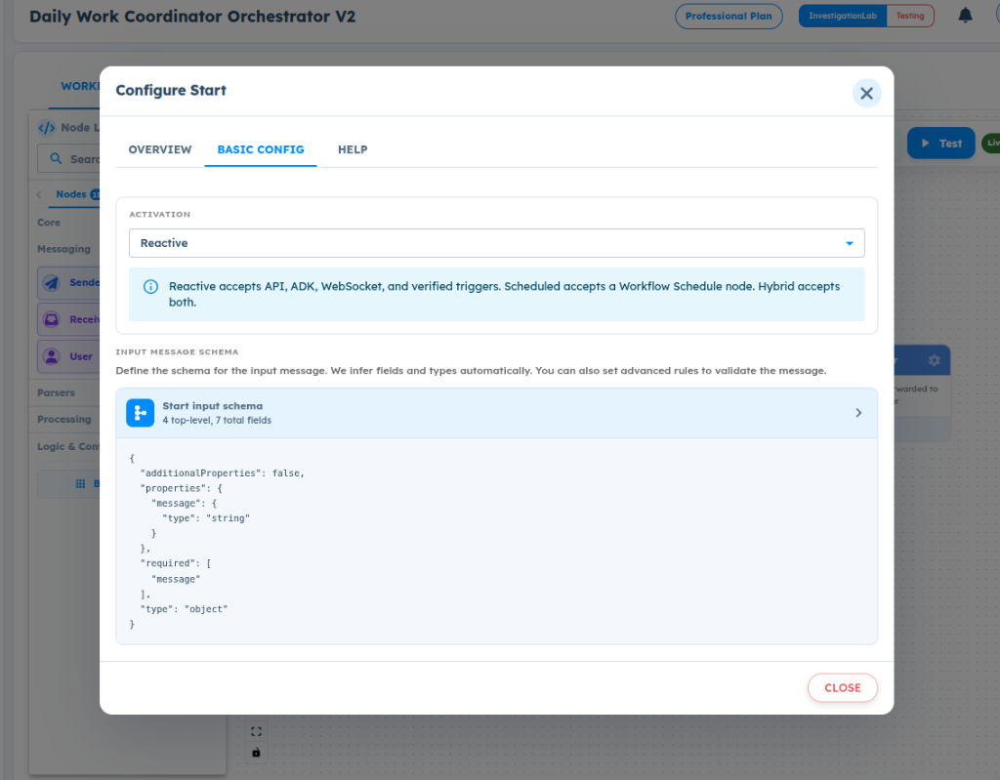
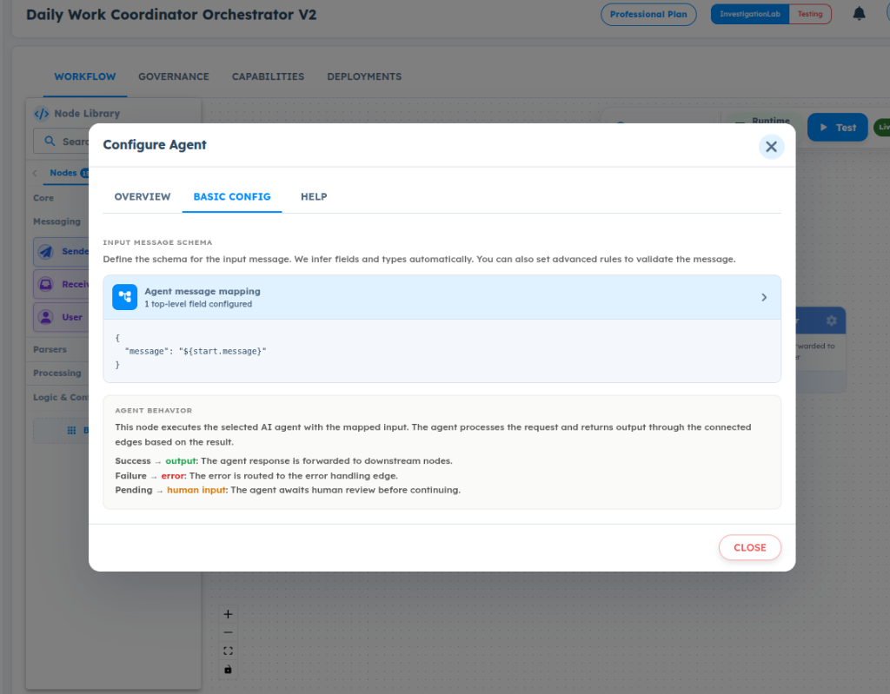
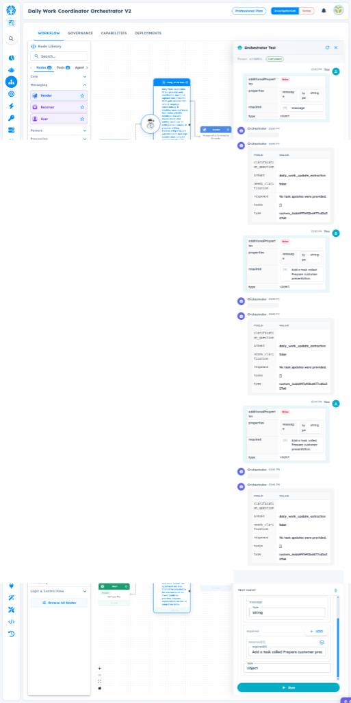
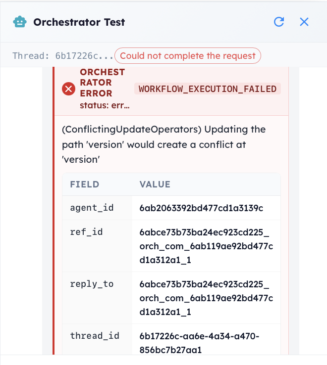

# ART-ORCHESTRATOR-004 — Daily Work Coordinator V2 Works Differently When Executed Through Orchestrator Agent Node

- **Canonical Bug ID:** ART-ORCHESTRATOR-004
- **Module:** ORCHESTRATOR
- **Severity:** HIGH
- **Priority:** P1
- **Environment:** Testing (Daily Work Coordinator Orchestrator V2 / Daily Work Coordinator V2)
- **Assignee:** Unassigned
- **Tags:** Orchestrator, Agent-Node, Input-Mapping, Workflow-Execution, Data-Handoff, ConflictingUpdateOperators
- **Status:** OPEN
- **Evidence Count:** 4
- **Azure DevOps:** SYNCED ([#68880](https://dev.azure.com/BixBytesSolutions/f3253417-808e-457f-a7f2-5699b2f38aa6/_workitems/edit/68880))

---

## 1. Problem
In Daily Work Coordinator Orchestrator V2, when the Daily Work Coordinator V2 agent is executed through an Orchestrator Agent node using mapped input (`message = ${start.message}`), the linked Agent fails to extract or recognize task information from the mapped message string.

While direct execution of Daily Work Coordinator V2 in Agent Test accurately parses task entities (task name, status, priority, deadline) from natural language inputs and returns populated structured data, executing the exact same agent through the Orchestrator results in the Agent returning an empty task array (`tasks: []`) accompanied by a clarification message (`response: No task information was provided in the message.` or `No task updates were provided.`). 

Furthermore, Orchestrator test executions intermittently fail completely with a workflow execution error: `(ConflictingUpdateOperators) Updating the path 'version' would create a conflict at 'version'`. This indicates an inconsistency between direct Agent execution and Orchestrator-mediated Agent execution, likely stemming from input mapping handoff, linked runtime resolution, or execution state persistence conflicts.

---

## 2. Observed Behavior
- **Configuration Context:**
  - In `Configure Start`, the Start node input schema is defined with a required `message` string (`additionalProperties: false`, `type: object`).
  - In `Configure Agent`, the linked Agent is Daily Work Coordinator V2, with message mapping set to:
    ```json
    {
      "message": "${start.message}"
    }
    ```
- **Direct Agent Test (Working):**
  - When tested directly in Agent Lab, Daily Work Coordinator V2 identifies task information from natural-language messages and returns complete structured task objects.
- **Orchestrator Execution (Failing to Extract Tasks):**
  - Tested with:
    > "Add a task called ORCHESTRATOR-MAPPING-TEST-947. Set priority to HIGH and deadline to 6 PM."
    
    The Start node receives the message, but the linked Agent outputs:
    ```json
    {
      "intent": "parse_daily_work_update",
      "needs_clarification": true,
      "response": "No task information was provided in the message.",
      "tasks": []
    }
    ```
  - Tested with:
    > "I need to finish the Agent X Play Store screenshots by 4 PM. This is high priority."
    
    The Agent outputs `tasks: []` and states no task updates were provided.
  - Tested with:
    > "Add a task called Prepare customer presentation."
    
    The Agent outputs `tasks: []` and `response: No task updates were provided.`.
- **Workflow Execution Failure:**
  - In Thread `6b17226c-aa6e-4a34-a470-856bc7b27aa1`, Orchestrator Test halts with error badge `Could not complete the request`:
    - Error: `ORCHESTRATOR ERROR: WORKFLOW_EXECUTION_FAILED`
    - Exception: `(ConflictingUpdateOperators) Updating the path 'version' would create a conflict at 'version'`
    - Metadata: `agent_id: 6ab2063392bd477cd1a3139c`, `ref_id: 6abce73b73ba24ec923cd225_orch_com_6ab119ae92bd477cd1a312a1_1`

---

## 3. Reproduction
1. Open **Daily Work Coordinator Orchestrator V2** in Orchestrator Builder.
2. Verify that the **Start** node input schema specifies a required `message` field of type `string` with `additionalProperties: false`.
3. Verify that the **Agent** node is linked to **Daily Work Coordinator V2** with message mapping `message = "${start.message}"`.
4. Open **Orchestrator Test**.
5. Submit a natural-language task prompt into the Test Input form:
   > "Add a task called ORCHESTRATOR-MAPPING-TEST-947. Set priority to HIGH and deadline to 6 PM."
6. Run the workflow and inspect the resulting output from the Agent node.
7. Observe that the Agent returns `tasks: []` and claims no task information was provided.
8. Submit alternative task creation prompts (e.g. "I need to finish the Agent X Play Store screenshots by 4 PM. This is high priority.") and observe identical behavior.
9. Observe that certain execution runs encounter `WORKFLOW_EXECUTION_FAILED` with `(ConflictingUpdateOperators) Updating the path 'version' would create a conflict at 'version'`.

---

## 4. Expected Behavior
- The Orchestrator Agent node must evaluate the `${start.message}` mapping and pass the exact runtime string to the linked Agent.
- Given equivalent input, the linked Agent's execution behavior, intent classification, and structured task extraction must be identical whether executed directly in Agent Lab or via an Orchestrator Agent node.
- If input mapping or handoff fails, ART should surface an explicit mapping error rather than silently invoking the Agent with an empty or unresolved payload.
- Workflow execution state persistence must execute cleanly without database update operator conflicts on `version`.

---

## 5. Business Impact
- **Broken End-to-End Orchestration:** Orchestrators cannot reliably invoke agents to extract and track tasks, breaking the core workflow automation promise of the ART platform.
- **Silent Failures:** Workflows proceed along success branches while emitting empty data (`tasks: []`), causing downstream nodes (e.g. condition nodes, notifications, sheet updates) to process empty payloads.
- **Workflow Halts:** Database conflict errors (`ConflictingUpdateOperators`) crash orchestrator executions, causing failed runs and broken end-user integrations.

---

## 6. User Experience
- Builders who successfully build and test an Agent in Agent Lab experience unexpected failures when connecting the Agent to an Orchestrator workflow.
- The UI displays green/successful runs even though the Agent failed to extract any tasks, obscuring the root cause and complicating workflow debugging.

---

## 7. Investigation Guidance
Investigate the Orchestrator-to-Agent execution and data handoff pipeline:
- **Expression Evaluation & Handoff:** Trace how `${start.message}` is resolved during node execution. Verify the actual payload delivered to the linked agent runtime service. Check if the string is passed under the expected parameter name or if an empty string/null is received by the agent prompt.
- **Agent Identity & Version Resolution:** Check which agent definition is loaded by `agent_id: 6ab2063392bd477cd1a3139c`. Verify whether the Orchestrator Agent node points to the latest configured version of Daily Work Coordinator V2 or a stale/unconfigured draft.
- **Database Update Operator Conflict:** Investigate the persistence routine saving workflow execution state:
  - Error: `(ConflictingUpdateOperators) Updating the path 'version' would create a conflict at 'version'`
  - Check the MongoDB/document store update query for concurrent or conflicting operators (e.g. mixing `$set: { version: ... }` and `$inc: { version: 1 }` in the same update document).

---

## 8. Fix Requirement
The Orchestrator Agent node execution pipeline must correctly resolve input mappings from upstream nodes, provide the complete runtime input to the linked agent, and ensure workflow execution records are persisted without document update conflicts.

---

## 9. Recommended Solution
1. **Fix Parameter Mapping:** Ensure the Orchestrator runtime expression evaluator properly substitutes `${start.message}` with the runtime input string and formats the Agent execution request payload matching the Agent's expected input schema.
2. **Align Agent Runtime Configuration:** Verify that the linked Agent node loads the active, configured Agent graph and system prompts rather than an incomplete stub.
3. **Resolve Database Update Conflict:** Refactor the workflow execution state update query to use a single update operator on the `version` field (e.g., standardizing on `$inc: { version: 1 }` or `$set: { version: new_version }`, never both).

---

## 10. Minimum Working Fix
Ensure the mapped `${start.message}` string is correctly passed to the Agent's prompt execution payload, and remove the redundant or conflicting `version` operator in the workflow execution update query.

---

## 11. Acceptance Criteria
- [ ] Mapped input strings (`${start.message}`) passed to an Agent node in Orchestrator extract task information consistently with direct Agent execution.
- [ ] When valid task instructions are submitted in Orchestrator Test, the Agent node returns a populated `tasks` array.
- [ ] Orchestrator workflow executions complete without `ConflictingUpdateOperators` errors on the `version` path.
- [ ] If mapping resolution fails, an explicit execution/mapping error is raised rather than returning a silent empty extraction.

---

## 12. Environment
- **Platform:** ART Orchestrator / Agent Lab
- **Component:** Daily Work Coordinator Orchestrator V2 / Daily Work Coordinator V2
- **Agent ID:** `6ab2063392bd477cd1a3139c`
- **Linked Schema:** `custom_6abb997e92bd477cd1a327b8`
- **Execution Thread:** `6b17226c-aa6e-4a34-a470-856bc7b27aa1`
- **Environment:** Testing (InvestigationLab, Professional Plan)

---

## 13. Severity
**HIGH** — Breaks Orchestrator-to-Agent integration and causes execution engine crashes.

---

## 14. Priority
**P1** — Core product defect blocking end-to-end multi-agent orchestration.

---

## 15. Tags
- `Orchestrator`
- `Agent-Node`
- `Input-Mapping`
- `Workflow-Execution`
- `Data-Handoff`
- `ConflictingUpdateOperators`

---

## 16. Assignee
**Unassigned**

---

## 17. Evidence

| File | Type | Description | SHA256 Hash | Byte Size |
| :--- | :--- | :--- | :--- | :--- |
| [ART-ORCHESTRATOR-004__start-node-input-schema-configuration__2026-09-30__01.png](./ART-ORCHESTRATOR-004__start-node-input-schema-configuration__2026-09-30__01.png) | Screenshot | Configure Start modal in Daily Work Coordinator Orchestrator V2 showing Reactive activation and Start input schema with required property 'message' of type 'string' (additionalProperties: false). | `7501eb631b57159c85d255520a355de1b02a62703757240375f4cd83c493261e` | 176102 bytes |
| [ART-ORCHESTRATOR-004__agent-node-message-mapping-configuration__2026-09-30__02.png](./ART-ORCHESTRATOR-004__agent-node-message-mapping-configuration__2026-09-30__02.png) | Screenshot | Configure Agent modal in Daily Work Coordinator Orchestrator V2 showing Agent message mapping configured as '{"message": "${start.message}"}'. | `ac9794f385baff2101acc7e44a062a9b3a0e83e52bacf7f1ea18f92939845107` | 209804 bytes |
| [ART-ORCHESTRATOR-004__orchestrator-test-empty-task-extraction-result__2026-09-30__03.png](./ART-ORCHESTRATOR-004__orchestrator-test-empty-task-extraction-result__2026-09-30__03.png) | Screenshot | Orchestrator Test execution session showing that despite valid task input messages in Test Input, the Agent node returns empty tasks array and response 'No task updates were provided.'. | `04e25062fd67ad676d6609083514bb6b8fea04af7905ce834454ad1b85042691` | 182312 bytes |
| [ART-ORCHESTRATOR-004__orchestrator-execution-failed-conflicting-update-operators__2026-09-30__04.png](./ART-ORCHESTRATOR-004__orchestrator-execution-failed-conflicting-update-operators__2026-09-30__04.png) | Screenshot | Orchestrator Test error modal showing WORKFLOW_EXECUTION_FAILED with error '(ConflictingUpdateOperators) Updating the path 'version' would create a conflict at 'version''. | `667f7160c7e57f01b240db8d68e8b9bb9cf7646a36b321778596ab3f76b0be0b` | 171211 bytes |

### Evidence Visual Gallery

````carousel

*Configure Start modal in Daily Work Coordinator Orchestrator V2 showing Reactive activation and Start input schema with required property 'message' of type 'string' (additionalProperties: false).*
<!-- slide -->

*Configure Agent modal in Daily Work Coordinator Orchestrator V2 showing Agent message mapping configured as '{"message": "${start.message}"}'.*
<!-- slide -->

*Orchestrator Test execution session showing that despite valid task input messages in Test Input, the Agent node returns empty tasks array and response 'No task updates were provided.'.*
<!-- slide -->

*Orchestrator Test error modal showing WORKFLOW_EXECUTION_FAILED with error '(ConflictingUpdateOperators) Updating the path 'version' would create a conflict at 'version''.*
````

---

## 18. Discussion
- **Reporter Note:** Observed in Daily Work Coordinator Orchestrator V2 linked to Daily Work Coordinator V2. While direct agent testing parses task information reliably, running through the Orchestrator Agent node returns `tasks: []` and claims no task updates were provided. Certain runs crash with `WORKFLOW_EXECUTION_FAILED: (ConflictingUpdateOperators) Updating the path 'version' would create a conflict at 'version'`.
- **Intake Validation:** All 4 screenshots preserved with cryptographic checksums and verified byte sizes. Zero Azure DevOps mutations performed during intake.

---

## 19. Azure DevOps
- **Work Item ID:** 68880
- **URL:** [https://dev.azure.com/BixBytesSolutions/f3253417-808e-457f-a7f2-5699b2f38aa6/_workitems/edit/68880](https://dev.azure.com/BixBytesSolutions/f3253417-808e-457f-a7f2-5699b2f38aa6/_workitems/edit/68880)
- **Parent Feature:** Orchestrator
- **Parent Feature ID:** 68806
- **Assigned To:** Unassigned
- **Sync Status:** SYNCED
- **Note:** Synchronized via Harness 02 V1 to Azure DevOps.
