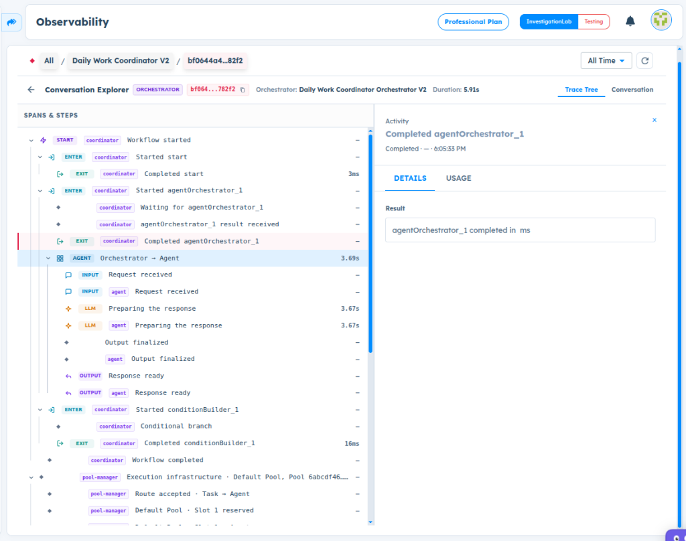
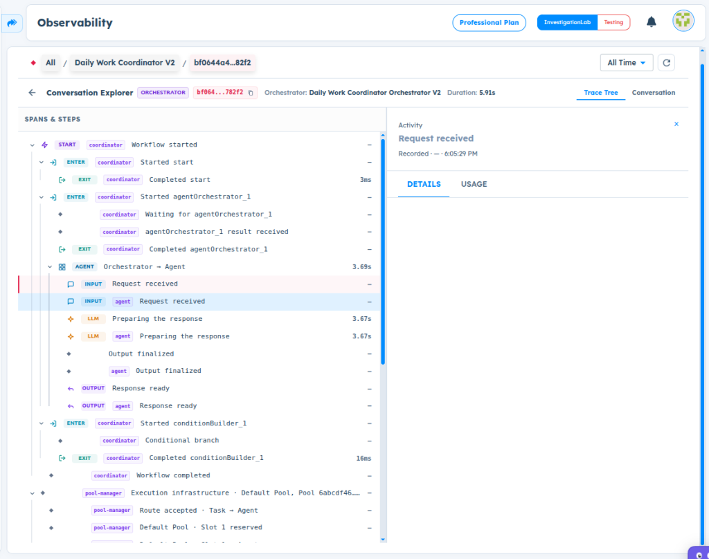
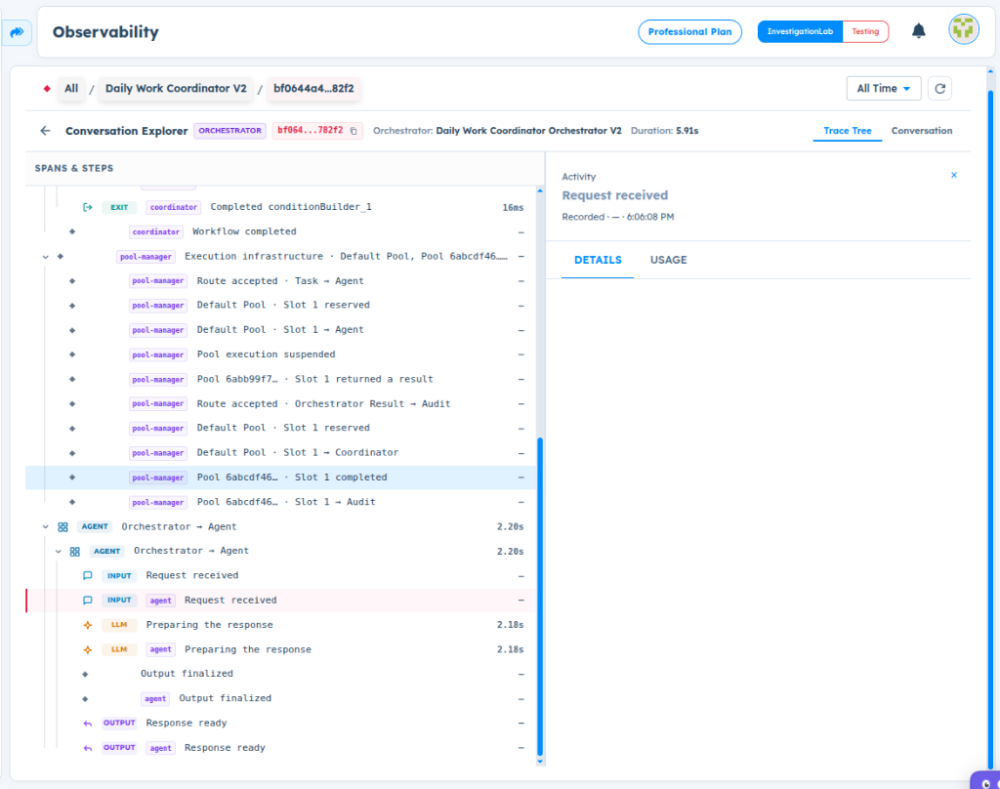

# ART-ORCHESTRATOR-005 — Observability Does Not Display Runtime Input and Output Details for Orchestrator Agent Execution

- **Canonical Bug ID:** ART-ORCHESTRATOR-005
- **Module:** ORCHESTRATOR
- **Severity:** MEDIUM
- **Priority:** P2
- **Environment:** Testing (Daily Work Coordinator Orchestrator V2 / Observability Conversation Explorer)
- **Assignee:** Unassigned
- **Tags:** Orchestrator, Observability, Trace-Tree, Conversation-Explorer, Agent-Execution, Details-Panel, Runtime-Diagnostics, UX-Clarity
- **Status:** OPEN
- **Evidence Count:** 3
- **Azure DevOps:** SYNCED ([#68888](https://dev.azure.com/BixBytesSolutions/f3253417-808e-457f-a7f2-5699b2f38aa6/_workitems/edit/68888))

---

## 1. Problem
In Orchestrator Observability (Conversation Explorer), the Trace Tree records individual workflow execution steps for Agent nodes—such as `Completed agentOrchestrator_1`, `Request received`, `Preparing the response`, `Output finalized`, and `Response ready`. However, when these activities are selected, the **Details panel is completely blank and fails to display runtime payloads**.

Specifically, selecting `Request received` does not reveal the input payload passed from the Orchestrator Start node to the Agent. Similarly, selecting output-related trace events (`Output finalized`, `Response ready`) provides no output inspection. The parent activity `Completed agentOrchestrator_1` only outputs a generic placeholder string (`agentOrchestrator_1 completed in ms`). Consequently, builders and testers cannot determine what data actually entered or exited the Agent, disabling workflow diagnostics.

---

## 2. Observed Behavior
- **Parent Activity Placeholder:**
  - Selecting `Completed agentOrchestrator_1` in the Trace Tree displays a Details panel containing only:
    ```
    agentOrchestrator_1 completed in ms
    ```
    No input mapping data, runtime arguments, or return values are provided.
- **Blank Child Activity Details:**
  - Selecting `INPUT agent Request received` (timestamp `6:05:29 PM`) results in a completely blank Details panel below the activity header.
  - Selecting subsequent `Request received` activities (timestamp `6:06:08 PM`) similarly renders an empty Details pane with no request payload.
  - Output stages (`Output finalized`, `Response ready`) fail to expose the structured task output or agent response text.
- **Omission of Runtime Diagnostics:**
  - The Trace Tree visualizes step durations (e.g. `2.20s`, `2.18s`, `3.69s`), but payload inspection is unavailable across all sub-steps.

---

## 3. Reproduction
1. Open an Orchestrator workflow containing an Agent node (e.g. **Daily Work Coordinator Orchestrator V2**).
2. Execute a test run in **Orchestrator Test**.
3. Open **Observability** and select the execution run from **Conversation Explorer** (e.g. execution thread `bf0644a4...82f2`).
4. Ensure the **Trace Tree** tab is active.
5. In the **Spans & Steps** tree, select the parent Agent activity `Completed agentOrchestrator_1`.
6. Inspect the **Details** panel: observe that it only shows generic text `agentOrchestrator_1 completed in ms` with zero payload details.
7. Select the child activity `INPUT agent Request received` (or subsequent `Request received` steps).
8. Inspect the **Details** panel: observe that the panel is completely empty.

---

## 4. Expected Behavior
- When an execution activity is selected in the Trace Tree, the **Details** panel must render meaningful structured runtime data:
  - `Request received`: Must display the resolved input payload passed from the Orchestrator to the Agent (e.g., mapped `${start.message}` parameter and values).
  - `Output finalized` / `Response ready`: Must display the finalized structured Agent output payload (e.g., intent, extracted tasks, clarification response).
  - Parent Agent node activity: Should display execution summary metrics, input/output summary, and execution status.
  - Error/failure states: Must expose the specific failure reason, error codes, and the execution stage where failure occurred.
- Sensitive fields should be masked or redacted according to platform privacy rules, without omitting the entire diagnostic payload.

---

## 5. Business Impact
- **Severely Degraded Debuggability:** Builders, developers, and QA engineers cannot verify whether an Orchestrator workflow provided correct input to an Agent or if the Agent produced an invalid response.
- **Prolonged Investigation Cycles:** Issues like empty task arrays or failed mappings require manual external logging or trial-and-error speculation because the platform's native Observability tool hides runtime payloads.
- **Undermined Observability Value:** The core value proposition of an enterprise Observability dashboard is defeated when trace events omit the actual runtime data payloads.

---

## 6. User Experience
- Users click into individual trace activities expecting to inspect payloads, only to be presented with an empty white pane.
- The UI indicates that steps were executed and recorded, but provides no visibility into why an Agent produced a specific output or failed to parse an input.

---

## 7. Investigation Guidance
Investigate the Orchestrator execution event emission and Observability trace storage pipeline:
- **Span Event Payload Capture:** Inspect where the Orchestrator agent runner emits trace events (`Request received`, `Preparing the response`, `Output finalized`). Check whether runtime input/output arguments are serialized into the event span attributes or dropped prior to emission.
- **Trace Ingestion & Persistence:** Verify whether the Observability ingestion service stores event attributes in the backend trace database or if attributes are stripped for size/performance.
- **Conversation Explorer Frontend Details Component:** Inspect the React/Vue component rendering the `DETAILS` tab in Conversation Explorer. Check whether it handles event attribute payloads or if it expects a specific schema/format that the backend is currently not supplying.
- **Timing String Placeholder Bug:** In `Completed agentOrchestrator_1`, the string `agentOrchestrator_1 completed in ms` is missing the numeric duration value (e.g. `completed in <duration> ms`), indicating a template formatting bug in the span result serializer.

---

## 8. Fix Requirement
Observability must capture, persist, and render structured runtime input payloads for `Request received` events and structured output payloads for `Output finalized` / `Response ready` events within the Conversation Explorer Details panel, while formatting execution duration correctly in parent completion summaries.

---

## 9. Recommended Solution
1. **Payload Attachment at Bridge:** Ensure the Orchestrator-to-Agent execution bridge attaches the resolved request object to the `Request received` span event.
2. **Output Attachment:** Attach the model's finalized response and structured JSON payload to the `Output finalized` span event.
3. **Frontend Details Renderer:** Update the Conversation Explorer Details pane to render formatted JSON code blocks for events containing payload attributes.
4. **Fix Duration Placeholder:** Correct the template string in the agent completion handler so that numeric duration is properly interpolated (e.g. `completed in 3690 ms`).
5. **Sensitive Data Masking:** Integrate existing redaction helpers to mask sensitive properties (passwords, tokens, PII) while preserving payload keys and structure.

---

## 10. Minimum Working Fix
Serialize and attach the raw input dictionary to the `Request received` span event and the output dictionary to the `Output finalized` span event, and update the Details panel component to render `JSON.stringify(event.payload, null, 2)` when a payload exists.

---

## 11. Acceptance Criteria
- [ ] Selecting `Request received` in the Trace Tree displays the resolved input payload supplied to the Agent in the Details panel.
- [ ] Selecting `Output finalized` or `Response ready` displays the actual structured Agent output in the Details panel.
- [ ] Parent completion activity displays properly formatted duration (e.g., `completed in <X> ms`).
- [ ] Execution error events display the error code, reason, and failing step.
- [ ] Sensitive field values are masked without hiding the surrounding diagnostic structure.
- [ ] The displayed trace data matches the selected execution run.

---

## 12. Environment
- **Platform:** ART Observability / Conversation Explorer
- **Workflow:** Daily Work Coordinator Orchestrator V2
- **Agent:** Daily Work Coordinator V2
- **Trace Thread ID:** `bf0644a4...82f2` (`bf064...782f2`)
- **Module:** Orchestrator (Conversation Explorer / Trace Tree)
- **Environment:** Testing (InvestigationLab, Professional Plan)

---

## 13. Severity
**MEDIUM** — Observability functional defect; hides runtime data payloads necessary for workflow debugging.

---

## 14. Priority
**P2** — Important defect impacting developer troubleshooting and platform diagnostic capability.

---

## 15. Tags
- `Orchestrator`
- `Observability`
- `Trace-Tree`
- `Conversation-Explorer`
- `Agent-Execution`
- `Details-Panel`
- `Runtime-Diagnostics`
- `UX-Clarity`

---

## 16. Assignee
**Unassigned**

---

## 17. Evidence

| File | Type | Description | SHA256 Hash | Byte Size |
| :--- | :--- | :--- | :--- | :--- |
| [ART-ORCHESTRATOR-005__trace-tree-completed-agent-node-generic-details__2026-09-30__01.png](./ART-ORCHESTRATOR-005__trace-tree-completed-agent-node-generic-details__2026-09-30__01.png) | Screenshot | Conversation Explorer Trace Tree selecting parent activity 'Completed agentOrchestrator_1' showing generic Details result 'agentOrchestrator_1 completed in ms' without payload details. | `a939888347da9d0624a82c5516b7b7cd0a2b59d3f499384ba7e1d52560aa78bf` | 199917 bytes |
| [ART-ORCHESTRATOR-005__trace-tree-agent-request-received-blank-details__2026-09-30__02.png](./ART-ORCHESTRATOR-005__trace-tree-agent-request-received-blank-details__2026-09-30__02.png) | Screenshot | Conversation Explorer Trace Tree selecting child activity 'INPUT agent Request received' (6:05:29 PM) showing completely blank Details panel with no input payload. | `9388dce56732b9cbab3ab6632307dd6da5f970e4486946e6208350b5fd30389a` | 191461 bytes |
| [ART-ORCHESTRATOR-005__trace-tree-subsequent-request-received-blank-details__2026-09-30__03.png](./ART-ORCHESTRATOR-005__trace-tree-subsequent-request-received-blank-details__2026-09-30__03.png) | Screenshot | Conversation Explorer Trace Tree selecting subsequent activity 'Request received' (6:06:08 PM) showing completely blank Details panel with no payload details. | `cb3870abfabcc6f0dfb71c0a0857235c288a5dbbcc95145a6bbc940f53194bea` | 191922 bytes |

### Evidence Visual Gallery

````carousel

*Conversation Explorer Trace Tree selecting parent activity 'Completed agentOrchestrator_1' showing generic Details result 'agentOrchestrator_1 completed in ms' without payload details.*
<!-- slide -->

*Conversation Explorer Trace Tree selecting child activity 'INPUT agent Request received' (6:05:29 PM) showing completely blank Details panel with no input payload.*
<!-- slide -->

*Conversation Explorer Trace Tree selecting subsequent activity 'Request received' (6:06:08 PM) showing completely blank Details panel with no payload details.*
````

---

## 18. Discussion
- **Reporter Note:** In Orchestrator Observability (Daily Work Coordinator Orchestrator V2, execution thread bf0644a4...82f2), clicking into Agent execution activities in the Trace Tree reveals that the Details panel is completely blank for 'Request received' and other child steps, and only shows generic text ('agentOrchestrator_1 completed in ms') for parent completion. This makes it impossible to inspect what data actually entered or exited the Agent, severely hindering diagnostic capability.
- **Intake Validation:** All 3 screenshots preserved with cryptographic SHA256 checksums and verified byte sizes. Zero Azure DevOps mutations performed during intake.

---

## 19. Azure DevOps
- **Work Item ID:** 68888
- **URL:** [https://dev.azure.com/BixBytesSolutions/f3253417-808e-457f-a7f2-5699b2f38aa6/_workitems/edit/68888](https://dev.azure.com/BixBytesSolutions/f3253417-808e-457f-a7f2-5699b2f38aa6/_workitems/edit/68888)
- **Parent Feature:** Orchestrator
- **Parent Feature ID:** 68806
- **Assigned To:** Unassigned
- **Sync Status:** SYNCED
- **Note:** Synchronized via Harness 02 V1 to Azure DevOps.
