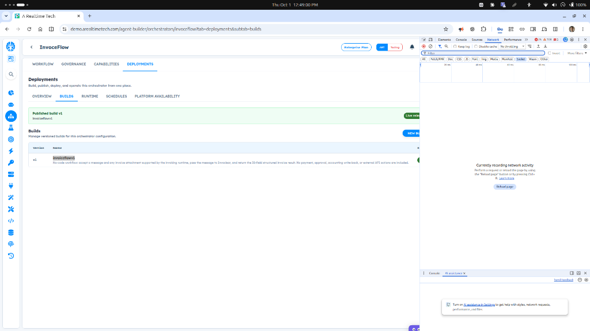

# ART-ORCHESTRATOR-006 — Media Node File Upload does not support PDF/non-image files and provides no clear response

- **Canonical Bug ID:** ART-ORCHESTRATOR-006
- **Module:** ORCHESTRATOR
- **Severity:** MEDIUM
- **Priority:** P2
- **Environment:** Testing (InvoiceFlow Orchestrator / Invoclear Runtime / Media Node)
- **Assignee:** Unassigned
- **Tags:** Orchestrator, Media-Node, File-Upload, Document-Processing, PDF-Support, Validation-Error, UX-Feedback
- **Status:** OPEN
- **Evidence Count:** 1
- **Azure DevOps:** SYNCED ([#68905](https://dev.azure.com/BixBytesSolutions/f3253417-808e-457f-a7f2-5699b2f38aa6/_workitems/edit/68905))

---

## 1. Problem
In the **Orchestrator Media Node**, the file upload component does not properly handle non-image document formats such as **PDF**. When a PDF or other unsupported/non-image file is selected for upload, the file is neither accepted nor processed as expected. Furthermore, the UI provides no clear validation response, error banner, or explanatory message indicating whether the file format is unsupported, the upload failed, or a validation issue occurred.

This defect prevents workflows intended for document intake (such as `InvoiceFlow`, configured to accept invoice attachments and pass them to the `Invoclear` runtime) from reliably receiving standard business documents like PDF invoices, while leaving users with an unresponsive upload control.

---

## 2. Observed Behavior
- **Non-Image/PDF Upload Failure:** When a PDF or non-image document format is selected in the Media Node file upload control, the file is not accepted or processed into the workflow.
- **Silent Rejection and Missing Feedback:** The UI does not display any validation error, toast banner, or inline message explaining why the file was rejected or which file formats are supported.
- **Unresponsive Interface:** The upload component remains unresponsive following file selection, leaving builders unable to determine whether the issue is caused by format restrictions, upload network failures, or node execution errors.
- **Workflow Build Context:** In the `InvoiceFlow` Orchestrator deployment (`invoiceflowv1`), the workflow is explicitly defined to "accept a message and any invoice attachment supported by the invoicing runtime, pass the message to Invoclear, and return the 50-field structured invoice result", yet non-image invoice formats like PDF cannot be processed through the Media Node.

---

## 3. Reproduction
1. Open an Orchestrator workflow containing a Media Node (e.g. **InvoiceFlow** at `demo.arealtimetech.com/agent-builder/orchestrators/invoiceflow`).
2. Access the Media Node configuration or test execution file upload interface.
3. Select a PDF document (e.g., a standard invoice PDF) or another non-image file format in the file selection dialog.
4. Attempt to upload the selected file.
5. Observe that the file is not accepted or processed into the node.
6. Observe that the UI displays no error, validation message, or indication of supported file types, leaving the upload control unresponsive.

---

## 4. Expected Behavior
- The Media Node should handle file selection deterministically:
  1. If document formats including PDF are intended for the workflow (e.g. invoice extraction workflows), PDF files must upload and process successfully.
  2. If a selected file format is unsupported, the UI must immediately display a clear and visible validation message explaining that the file format is unsupported and listing the permitted file types.
- The UI must never silently fail or remain unresponsive after a file is selected.
- Existing image and media file upload functionality must continue working without regression.

---

## 5. Business Impact
- Workflows that require document inputs (such as invoice processing in `InvoiceFlow`) cannot reliably use the Media Node to ingest PDFs.
- Builders and end-users cannot distinguish between unsupported formats, network transmission errors, or runtime execution bugs due to the lack of error feedback.

---

## 6. User Experience
- The file upload control appears broken or frozen when non-image files are chosen.
- Users receive no guidance regarding which file formats are supported or why their selected document was rejected.

---

## 7. Investigation Guidance
Inspect the Media Node's file-picker restrictions, frontend validation, upload API validation, supported MIME types, and error-response handling:
- **File Input Restrictions:** Inspect the `<input type="file">` `accept` attribute in the Media Node frontend component to verify whether it restricts selection to image MIME types (e.g., `image/*`) or omits `application/pdf` / `.pdf`.
- **Frontend Validation Logic:** Check file selection event handlers for client-side MIME type or extension filtering. Identify unhandled rejection paths that fail silently without setting error state or displaying a user notification.
- **Upload API Endpoint & Supported MIME Types:** Inspect the backend upload route handling Media Node file uploads. Verify whether the server rejects non-image MIME types with 4xx/415 status codes and whether the frontend client swallows or ignores these HTTP errors.
- **Architectural Intent:** Confirm whether the Media Node is architecturally intended to support document formats (such as PDF) for document-processing pipelines or if a separate document ingestion node is planned. If PDF is intended for Media Node, ensure upload and storage handlers accommodate PDF MIME types.

---

## 8. Fix Requirement
The Media Node must handle file selection deterministically. Supported file formats must upload and bind successfully; unsupported formats must be rejected immediately with an explicit, visible validation message indicating that the file type is unsupported and listing allowed formats. If PDF is an intended supported format, the upload and validation pipeline must accept PDF files.

---

## 9. Recommended Solution
1. **Frontend Validation & Feedback:** Add explicit client-side validation in the Media Node file selection handler. If an unsupported file is chosen, display an immediate inline validation banner or toast (e.g., "Unsupported file type. Supported formats: PNG, JPG, WEBP, PDF").
2. **File Picker Filtering:** Update the `accept` attribute on the file input element to match the intended allowed file formats, preventing selection of disallowed formats by default.
3. **PDF Ingestion Support:** If PDF documents are intended for downstream document workflows (e.g., Invoclear invoice extraction), update the Media Node upload endpoint and validator to permit `application/pdf`.
4. **Error Handling:** Ensure API error responses (400 Bad Request, 415 Unsupported Media Type, 413 Payload Too Large) are captured and displayed to the user with clear diagnostic messages.

---

## 10. Minimum Working Fix
Display an immediate and visible validation error in the Media Node UI when an unsupported file type is selected, specifying the supported file formats. If PDF is intended to be supported, add `application/pdf` and `.pdf` to the allowed formats list and file picker `accept` filter.

---

## 11. Acceptance Criteria
- [ ] Supported file formats upload successfully through the Media Node.
- [ ] PDF files upload and process successfully if PDF is an intended supported format.
- [ ] Selecting an unsupported file type immediately displays a visible validation message.
- [ ] The validation message identifies that the file type is unsupported and indicates the allowed formats.
- [ ] The UI does not silently fail or remain unresponsive after file selection.
- [ ] Existing image and media file uploads continue working without regression.

---

## 12. Environment
- **Platform:** ART Agent Builder / Orchestrator
- **Workflow:** InvoiceFlow (`demo.arealtimetech.com/agent-builder/orchestrators/invoiceflow`)
- **Published Build:** `invoiceflowv1`
- **Component:** Media Node / File Upload
- **Environment:** Testing (Enterprise Plan, ART Testing)

---

## 13. Severity
**MEDIUM** — Functional defect in Media Node input handling; silent rejection and missing document support blocks document workflows and degrades authoring UX.

---

## 14. Priority
**P2** — Important defect affecting workflow input capabilities and user feedback clarity.

---

## 15. Tags
- `Orchestrator`
- `Media-Node`
- `File-Upload`
- `Document-Processing`
- `PDF-Support`
- `Validation-Error`
- `UX-Feedback`

---

## 16. Assignee
**Unassigned**

---

## 17. Evidence

| File | Type | Description | SHA256 Hash | Byte Size |
| :--- | :--- | :--- | :--- | :--- |
| [ART-ORCHESTRATOR-006__invoiceflow-deployments-media-upload__2026-10-01__01.png](./ART-ORCHESTRATOR-006__invoiceflow-deployments-media-upload__2026-10-01__01.png) | Screenshot | Orchestrator Deployments view for InvoiceFlow (invoiceflowv1) specifying invoice attachment support for Invoclear runtime, where Media Node file upload does not accept PDF/non-image documents and provides no validation feedback. | `5a647722e3c5716b396c2ab340e8d145dc360876f81b1b09bdba2dd70dd37dc1` | 97919 bytes |

### Evidence Visual Gallery

````carousel

*Orchestrator Deployments view for InvoiceFlow (invoiceflowv1) specifying invoice attachment support for Invoclear runtime, where Media Node file upload does not accept PDF/non-image documents and provides no validation feedback.*
````

---

## 18. Discussion
- **Reporter Note:** User testing identified that non-image/document input such as PDF is not accepted by the Media Node in Orchestrator workflows (e.g. InvoiceFlow), and the UI provides no error message, validation banner, or explanation of supported formats. The upload appears completely unresponsive.
- **Intake Validation:** Evidence screenshot preserved with cryptographic SHA256 checksum and verified byte size. Zero Azure DevOps mutations performed during intake.

---

## 19. Azure DevOps
- **Work Item ID:** 68905
- **URL:** [https://dev.azure.com/BixBytesSolutions/f3253417-808e-457f-a7f2-5699b2f38aa6/_workitems/edit/68905](https://dev.azure.com/BixBytesSolutions/f3253417-808e-457f-a7f2-5699b2f38aa6/_workitems/edit/68905)
- **Parent Feature:** Orchestrator
- **Parent Feature ID:** 68806
- **Assigned To:** Unassigned
- **Sync Status:** SYNCED
- **Note:** Synchronized via Harness 02 V1 to Azure DevOps.
