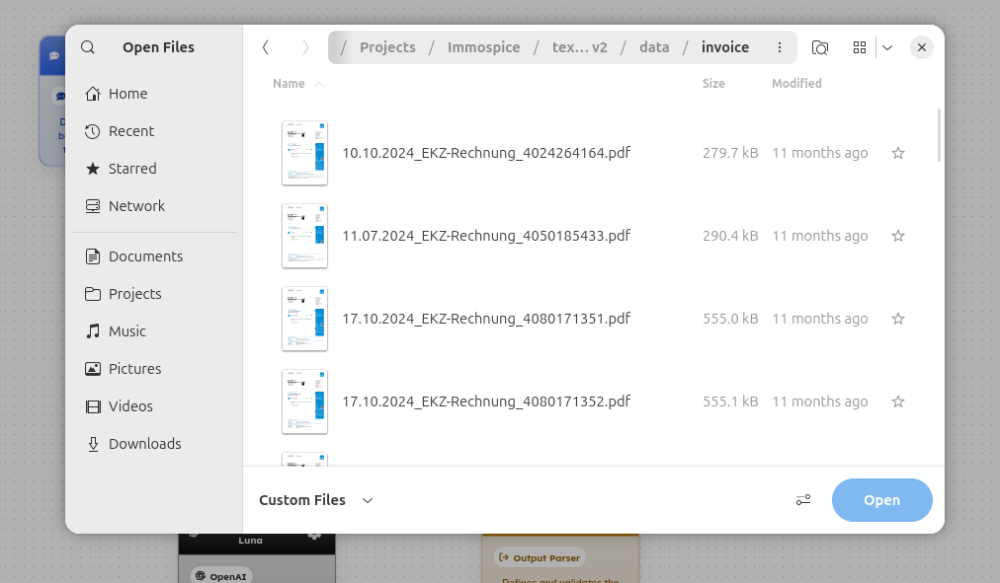
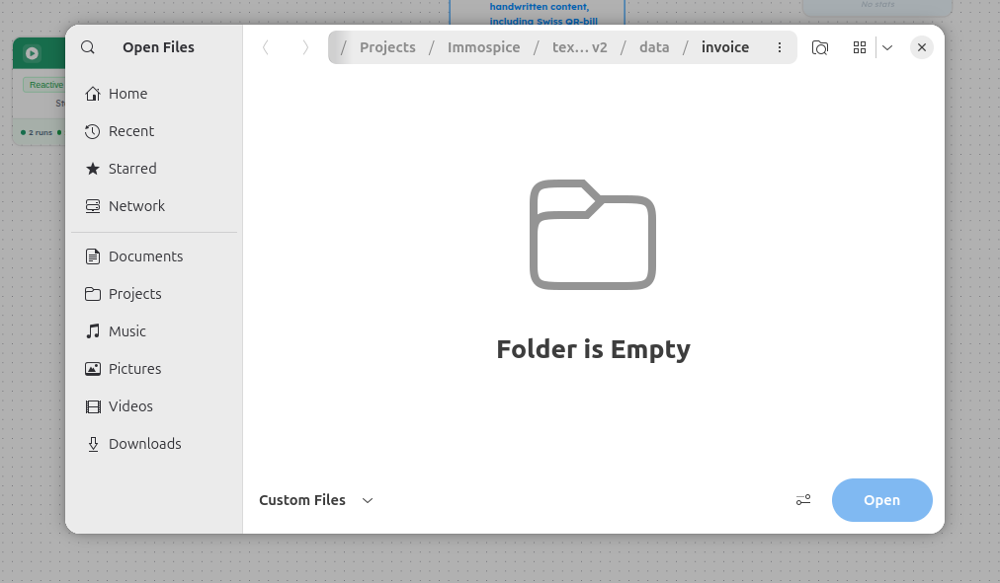

# ART-ORCHESTRATOR-007 — Orchestrator Test UI does not allow PDF upload while Agent Lab Test UI supports PDF

- **Canonical Bug ID:** ART-ORCHESTRATOR-007
- **Module:** ORCHESTRATOR
- **Severity:** MEDIUM
- **Priority:** P2
- **Environment:** Testing (Agent Lab Test vs Orchestrator Test / File Upload)
- **Assignee:** Unassigned
- **Tags:** Orchestrator, Agent-Lab, Test-UI, File-Upload, PDF-Support, File-Picker, Consistency, UX-Inconsistency
- **Status:** OPEN
- **Evidence Count:** 2
- **Azure DevOps:** SYNCED ([#68907](https://dev.azure.com/BixBytesSolutions/f3253417-808e-457f-a7f2-5699b2f38aa6/_workitems/edit/68907))

---

## 1. Problem
There is inconsistent file-upload support between **Agent Lab Test** and **Orchestrator Test**. In Agent Lab Test, the file picker allows PDF files to be selected and uploaded from a folder. However, when testing an Orchestrator workflow with file/media input, the same folder containing PDF files appears as **"Folder is Empty"** because the Orchestrator Test file picker filters out PDF files.

Both testing interfaces navigate to the same local folder (`/Projects/Immospice/tex...v2/data/invoice`) containing multiple PDF invoice documents. Agent Lab Test correctly displays and allows selection of these PDF files, while Orchestrator Test excludes them entirely without any indication or explanation. This prevents end-to-end testing of document-processing Orchestrator workflows even when the underlying Agent supports PDF input.

---

## 2. Observed Behavior
- **Agent Lab Test (Working):** The file picker displays PDF files in the `/Projects/Immospice/tex...v2/data/invoice` folder. Multiple PDF invoice files (`10.10.2024_EKZ-Rechnung_4024264164.pdf`, `11.07.2024_EKZ-Rechnung_4050185433.pdf`, `17.10.2024_EKZ-Rechnung_4080171351.pdf`, `17.10.2024_EKZ-Rechnung_4080171352.pdf`) are visible with file sizes and modification dates. The `Custom Files` filter is active, and the `Open` button is available for selection.
- **Orchestrator Test (Failing):** The file picker navigated to the identical folder path (`/Projects/Immospice/tex...v2/data/invoice`) displays **"Folder is Empty"**. The PDF files present in the folder are completely filtered out by the Orchestrator file picker, making it impossible to select any PDF file.
- **No Feedback:** The Orchestrator Test file picker provides no indication that files exist but are being filtered. The user sees an empty folder with no explanation.

---

## 3. Reproduction
1. Open an Agent that supports PDF/document input in Agent Lab (e.g. Immospice text extraction Agent V2).
2. In Agent Lab Test, click the file attachment/upload control.
3. Navigate to a folder containing PDF files (e.g. `/Projects/Immospice/tex...v2/data/invoice`).
4. Observe that PDF files (e.g. EKZ-Rechnung invoices) are visible and selectable in the file picker.
5. Now open the Orchestrator that connects to the same Agent.
6. In Orchestrator Test, click the file attachment/upload control.
7. Navigate to the same folder containing the PDF files.
8. Observe that the folder displays "Folder is Empty" — PDF files are filtered out by the Orchestrator file picker.

---

## 4. Expected Behavior
- If PDF is a supported input type in Agent Lab, Orchestrator Test should also allow PDF input when the connected workflow/Agent supports document input.
- The supported file types should remain consistent across both testing interfaces.
- If the Orchestrator file picker restricts file types, a clear message should explain which formats are supported.

---

## 5. Business Impact
- Document-processing workflows cannot be tested end-to-end through Orchestrator Test even though the underlying Agent supports the same PDF input.
- This blocks validation of invoice extraction, document processing, and similar workflows at the orchestration level.
- Testers must resort to testing the Agent in isolation, which does not validate the complete Orchestrator data flow.

---

## 6. User Experience
- The behavior is inconsistent and misleading. A PDF works as an Agent input but the Orchestrator file picker makes the same file unavailable without explaining why.
- Users see "Folder is Empty" in a folder they know contains files, creating confusion about whether the folder path is wrong or the system is broken.

---

## 7. Investigation Guidance
Compare the accepted file types and MIME-type configurations used by the **Agent Lab Test file picker** with the **Orchestrator Test file picker**:
- **Accept Attribute:** Check whether the Orchestrator Test file input element uses a restrictive `accept` attribute (e.g. `image/*`) that excludes `application/pdf` / `.pdf`, while Agent Lab Test uses a broader or unrestricted `accept` value.
- **Frontend File Filtering:** Inspect whether Orchestrator Test applies additional client-side filtering (e.g. extension-based or MIME-based filtering in the file selection handler) that Agent Lab Test does not apply.
- **Shared Configuration:** Determine whether both test interfaces read from a shared accepted-file-types configuration or if they have independent, hardcoded filter lists.
- **Runtime Propagation:** Before enabling PDF selection in Orchestrator Test, verify that the Orchestrator runtime input handler can correctly propagate uploaded PDF files to the connected Agent node. Changing only the UI filter without confirming backend support could introduce a new failure.

---

## 8. Fix Requirement
Orchestrator Test must allow supported document formats, including PDF, when those formats are valid for the workflow's input path. File-type validation must be consistent with the actual runtime capabilities and with Agent Lab Test behavior.

---

## 9. Recommended Solution
1. **Align File Picker Filters:** Update the Orchestrator Test file picker `accept`/MIME-type configuration to include `application/pdf` and `.pdf` when the workflow supports document input, matching the Agent Lab Test behavior.
2. **Remove Hardcoded Restriction:** Remove or update any hardcoded image-only `accept` attribute in the Orchestrator Test file upload component.
3. **Runtime Propagation:** Ensure the Orchestrator runtime correctly propagates PDF files to the connected Agent node.
4. **Shared Configuration:** Maintain a shared/common accepted-file-types configuration so that Agent Lab Test and Orchestrator Test remain consistent.

---

## 10. Minimum Working Fix
Enable PDF (`application/pdf` / `.pdf`) selection in the Orchestrator Test file picker when PDF is a supported workflow input, and ensure the selected file reaches the downstream Agent correctly.

---

## 11. Acceptance Criteria
- [ ] PDF files visible in Agent Lab Test are also selectable from Orchestrator Test when the workflow supports document input.
- [ ] `.pdf` / `application/pdf` is not incorrectly filtered from the Orchestrator file picker.
- [ ] Uploaded PDF reaches the connected Agent through the Orchestrator runtime.
- [ ] Existing supported image/media uploads continue working without regression.
- [ ] Unsupported file types remain blocked with a clear validation message.
- [ ] Agent Lab and Orchestrator Test expose consistent supported-file behavior for equivalent workflows.

---

## 12. Environment
- **Platform:** ART Agent Builder
- **Interfaces:** Agent Lab Test vs Orchestrator Test
- **Component:** File Upload / File Picker
- **Test Folder:** `/Projects/Immospice/tex...v2/data/invoice`
- **Environment:** Testing

---

## 13. Severity
**MEDIUM** — Functional inconsistency between Agent Lab Test and Orchestrator Test file pickers; blocks document-based workflow testing at the orchestration level.

---

## 14. Priority
**P2** — Important defect preventing end-to-end testing of document-processing Orchestrator workflows.

---

## 15. Tags
- `Orchestrator`
- `Agent-Lab`
- `Test-UI`
- `File-Upload`
- `PDF-Support`
- `File-Picker`
- `Consistency`
- `UX-Inconsistency`

---

## 16. Assignee
**Unassigned**

---

## 17. Evidence

| File | Type | Description | SHA256 Hash | Byte Size |
| :--- | :--- | :--- | :--- | :--- |
| [ART-ORCHESTRATOR-007__agent-lab-file-picker-pdf-visible__2026-10-01__01.png](./ART-ORCHESTRATOR-007__agent-lab-file-picker-pdf-visible__2026-10-01__01.png) | Screenshot | Agent Lab Test file picker navigated to /Projects/Immospice/tex...v2/data/invoice showing multiple PDF invoice files (EKZ-Rechnung) available for selection with 'Custom Files' filter and Open button. | `3486a0c685aa7f7c5e0eb0f03b42449ef88b82ddf63a31d324af9b32f4c83be4` | 111081 bytes |
| [ART-ORCHESTRATOR-007__orchestrator-test-file-picker-folder-empty__2026-10-01__02.png](./ART-ORCHESTRATOR-007__orchestrator-test-file-picker-folder-empty__2026-10-01__02.png) | Screenshot | Orchestrator Test file picker navigated to the same /Projects/Immospice/tex...v2/data/invoice folder displaying 'Folder is Empty' — PDF files are filtered out by the Orchestrator file picker, making the folder appear empty. | `b869d27938b13dc7733867570b36880cd5d593d01df989788ba8e0884d13b157` | 74417 bytes |

### Evidence Visual Gallery

````carousel

*Agent Lab Test file picker navigated to /Projects/Immospice/tex...v2/data/invoice showing multiple PDF invoice files (EKZ-Rechnung) available for selection with 'Custom Files' filter and Open button.*
<!-- slide -->

*Orchestrator Test file picker navigated to the same /Projects/Immospice/tex...v2/data/invoice folder displaying 'Folder is Empty' — PDF files are filtered out by the Orchestrator file picker, making the folder appear empty.*
````

---

## 18. Discussion
- **Reporter Note:** The same folder (`/Projects/Immospice/tex...v2/data/invoice`) containing PDF invoice files is accessible from both Agent Lab Test and Orchestrator Test file pickers. Agent Lab Test shows the PDFs and allows selection, while Orchestrator Test filters them out and shows "Folder is Empty". This is a clear file-picker configuration inconsistency between the two test interfaces.
- **Relationship to ART-ORCHESTRATOR-006:** ART-ORCHESTRATOR-006 describes the Media Node runtime not accepting PDF files and providing no feedback. This bug (ART-ORCHESTRATOR-007) focuses specifically on the Orchestrator Test UI file picker filtering out PDFs before they can even be selected, while Agent Lab Test does not have this restriction.
- **Intake Validation:** Both screenshots preserved with cryptographic SHA256 checksums and verified byte sizes. Zero Azure DevOps mutations performed during intake.

---

## 19. Azure DevOps
- **Work Item ID:** 68907
- **URL:** [https://dev.azure.com/BixBytesSolutions/f3253417-808e-457f-a7f2-5699b2f38aa6/_workitems/edit/68907](https://dev.azure.com/BixBytesSolutions/f3253417-808e-457f-a7f2-5699b2f38aa6/_workitems/edit/68907)
- **Parent Feature:** Orchestrator
- **Parent Feature ID:** 68806
- **Assigned To:** Unassigned
- **Sync Status:** SYNCED
- **Note:** Synchronized via Harness 02 V1 to Azure DevOps.
