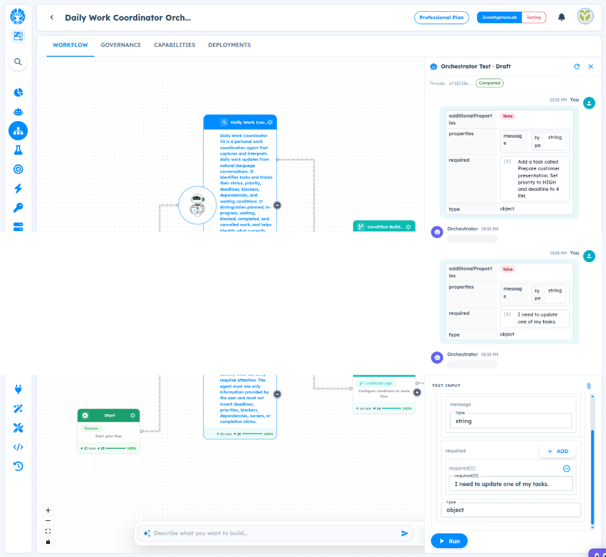

# ART-ORCHESTRATOR-008 — Orchestrator Test Shows Blank Response After Successful Workflow Execution

- **Canonical Bug ID:** ART-ORCHESTRATOR-008
- **Module:** ORCHESTRATOR
- **Severity:** HIGH
- **Priority:** P1
- **Environment:** Testing (Daily Work Coordinator Orchestrator V2 / Orchestrator Test / Professional Plan / InvestigationLab)
- **Assignee:** Unassigned
- **Tags:** Orchestrator, Test-UI, Response-Rendering, Blank-Response, Workflow-Output, Agent-Output, UX-Critical, Response-Resolver
- **Status:** OPEN
- **Evidence Count:** 1
- **Azure DevOps:** SYNCED ([#68915](https://dev.azure.com/BixBytesSolutions/f3253417-808e-457f-a7f2-5699b2f38aa6/_workitems/edit/68915))

---

## 1. Problem
When testing an Orchestrator workflow, the workflow completes successfully (thread header shows **Completed**) but the Orchestrator's response in the Test conversation panel is **completely blank**. The user input is received and displayed correctly, but the Orchestrator response bubbles contain no text, structured data, or any visible content.

This creates a critical UX contradiction: **"Completed" communicates success while giving the user no usable result.** The user cannot determine whether the Agent returned a valid output, the Condition node routed correctly, or the workflow produced any meaningful result.

The Orchestrator Test should always resolve a completed execution into a displayable response. Workflows such as `Start → Agent` or `Start → Agent → Condition` should expose the result of the completed execution path rather than silently returning blank. An empty assistant bubble must never be rendered for a completed execution.

---

## 2. Observed Behavior
- **Execution Status:** The Orchestrator Test thread `af1821e...` is marked **Completed**, indicating the workflow finished without error.
- **User Input Displayed Correctly:** Two user messages are rendered in the conversation panel as structured schema tables showing `additionalProperties: false`, `properties: message / type / string`, `required: [0]` with the user's input text (`Add a task called Prepare customer presentation. Set priority to HIGH and deadline to 4 PM.` and `I need to update one of my tasks.`).
- **Blank Orchestrator Responses:** Two Orchestrator response bubbles appear (green icon, timestamp `03:33 PM`) but contain **no visible content** — the response area is completely empty white space.
- **No Error Indication:** There is no error banner, warning toast, or diagnostic message indicating that the response could not be resolved. The blank bubble silently implies a successful but empty result.
- **Workflow Canvas Context:** The workflow consists of `Start` → `Daily Work Coordinator` (Agent node, 23 runs, 100%) → `Condition Builder` (14 runs, 100%). Both nodes show successful execution statistics.
- **TEST INPUT Panel:** Correctly shows `message: string`, `required[0]: "I need to update one of my tasks."`, `type: object`, with `▶ Run` button.

---

## 3. Reproduction
1. Open the Daily Work Coordinator Orchestrator (or any Orchestrator with a `Start → Agent → Condition` workflow and no explicit Sender/response node).
2. Open **Orchestrator Test** (Draft mode).
3. Submit a test input such as `"Add a task called Prepare customer presentation. Set priority to HIGH and deadline to 4 PM."` or `"I need to update one of my tasks."`.
4. Wait for the workflow to complete — observe the thread header shows **Completed**.
5. Inspect the Orchestrator response bubbles in the Test conversation panel.
6. Observe that the Orchestrator response bubbles (green icon, timestamped `03:33 PM`) are completely blank with no text, structured data, or any content displayed.

---

## 4. Expected Behavior
- A successfully completed Orchestrator execution must always provide a visible response or an explicit no-output state.
- The Orchestrator Test should resolve the workflow result using a deterministic fallback chain:
  1. **Explicit workflow response/output** (e.g., Sender node output)
  2. **Output of the final successful user-facing node** (e.g., branch result from Condition)
  3. **Latest successful Agent output** (e.g., the Agent's structured response)
  4. **Structured workflow result rendered as JSON** (e.g., the raw completion payload)
  5. **Explicit "No response was produced by this workflow"** message
- An empty assistant bubble must **never** be rendered for a completed execution.
- Sender should not be required for the Test panel to display results. A workflow consisting of `Start → Agent` must still display the Agent's result in Test.

---

## 5. Business Impact
- **Unreliable Testing:** Users cannot determine whether the workflow produced the expected result, making Orchestrator testing unreliable for validating Agent behavior, condition routing, and downstream node execution.
- **False Failure Impression:** A "Completed" status with a blank response creates the false impression that the workflow is broken, even when the underlying Agent executed correctly.
- **Blocked Validation:** Workflow authors cannot validate Agent output, condition routing results, or downstream node behavior through the Test UI without adding a Sender node, which should not be a requirement for testing.
- **Combined with Observability Gap:** When paired with ART-ORCHESTRATOR-005 (Observability not showing runtime input/output), users have no way to inspect what data the workflow produced — neither through Test UI nor through Observability.

---

## 6. User Experience
- The user sees their input rendered correctly but receives blank responses from the Orchestrator, creating confusion about whether the workflow is functioning.
- The "Completed" badge communicates success while providing no evidence of success, undermining user trust in the testing interface.
- Users are forced to add Sender nodes solely to make Test usable, which is a workflow design burden that should not exist.

---

## 7. Investigation Guidance
Investigate the Orchestrator Test response rendering pipeline and the workflow output resolution mechanism:
- **Response Resolution Logic:** Inspect how the Orchestrator Test conversation component resolves the displayable response after workflow completion. Check whether it only renders output from explicit Sender/response nodes or if it can resolve output from the final executed node in the workflow graph.
- **Agent Output Availability:** The Agent node (`Daily Work Coordinator`) executed successfully (23 runs, 100%). Check whether the Agent's structured output (e.g., `needs_clarification`, `clarification_question`, `tasks`) is available in the execution context but not being resolved by the Test response renderer.
- **Condition Node Output:** The Condition Builder node also executed successfully. Check whether the output of the selected condition branch is available but not propagated to the Test conversation.
- **Empty Bubble Rendering:** Identify the frontend component that renders the Orchestrator response bubble. Check whether it renders regardless of content availability or if it should have a guard to prevent rendering when no content is resolved.
- **Relationship to ART-ORCHESTRATOR-005:** The blank response in Test and the blank Details panel in Observability may share a common root cause — the execution pipeline may not be storing or propagating node outputs to downstream consumers (Test renderer, Observability trace store).

---

## 8. Fix Requirement
The Orchestrator Test must never display a blank response bubble for a completed execution. The Test conversation renderer must resolve the workflow result through a deterministic fallback chain and always display either the resolved output or an explicit no-output message. Sender nodes must not be required for Test to display results.

---

## 9. Recommended Solution
1. **Orchestrator Response Resolver:** Add a deterministic response resolution pipeline that resolves the final displayable result from a completed workflow execution.
2. **Resolution Priority Chain:**
   - Explicit workflow response/output (Sender node)
   - Output of the final successful user-facing node
   - Latest successful Agent output
   - Structured workflow result rendered as JSON
   - Explicit "No response was produced by this workflow" state
3. **Structured Output Rendering:** When the resolved result is structured JSON (e.g., Agent output with `needs_clarification`, `clarification_question`, `tasks`), render the human-facing field intelligently (e.g., display `clarification_question` text) or display the full structured object in a formatted code block.
4. **Never Empty:** The Test conversation must never render an empty assistant bubble for a completed execution. If no output exists after all resolution fallbacks, display an explicit no-output message.
5. **Sender Independence:** The response resolver must not require a Sender node. A workflow consisting of `Start → Agent` should still display the Agent's result in Test.

---

## 10. Minimum Working Fix
Resolve the latest successful Agent output from the completed workflow execution context and render it in the Orchestrator Test response bubble. If the output is structured JSON, render it as a formatted code block. If no output is available, display "No response was produced by this workflow" instead of an empty bubble.

---

## 11. Acceptance Criteria
- [ ] A completed Orchestrator workflow execution always displays a visible response or an explicit no-output message in the Test conversation.
- [ ] The Orchestrator Test response resolver follows a deterministic fallback chain (explicit output → final node output → Agent output → structured result → no-output message).
- [ ] Empty assistant bubbles are never rendered for completed executions.
- [ ] Workflows without a Sender node (e.g., `Start → Agent`) still display the Agent's result in Test.
- [ ] Structured Agent output (e.g., JSON with `needs_clarification`, `clarification_question`) is rendered in a readable format.
- [ ] Existing workflows with explicit Sender/response nodes continue working without regression.

---

## 12. Environment
- **Platform:** ART Agent Builder / Orchestrator
- **Workflow:** Daily Work Coordinator Orchestrator V2
- **Agent:** Daily Work Coordinator V2
- **Workflow Structure:** Start → Daily Work Coordinator (Agent) → Condition Builder
- **Test Mode:** Orchestrator Test (Draft)
- **Thread ID:** `af1821e...`
- **Environment:** Testing (InvestigationLab, Professional Plan)

---

## 13. Severity
**HIGH** — Completed workflow executions render blank responses, making Orchestrator testing unreliable and hiding actual workflow results from users.

---

## 14. Priority
**P1** — Critical UX defect that directly blocks reliable Orchestrator workflow testing and validation.

---

## 15. Tags
- `Orchestrator`
- `Test-UI`
- `Response-Rendering`
- `Blank-Response`
- `Workflow-Output`
- `Agent-Output`
- `UX-Critical`
- `Response-Resolver`

---

## 16. Assignee
**Unassigned**

---

## 17. Evidence

| File | Type | Description | SHA256 Hash | Byte Size |
| :--- | :--- | :--- | :--- | :--- |
| [ART-ORCHESTRATOR-008__orchestrator-test-completed-blank-response__2026-10-01__01.png](./ART-ORCHESTRATOR-008__orchestrator-test-completed-blank-response__2026-10-01__01.png) | Screenshot | Daily Work Coordinator Orchestrator Test panel showing thread af1821e marked Completed with two user messages rendered as structured schema tables and two blank Orchestrator response bubbles (green icon, 03:33 PM, empty content). Workflow canvas shows Start → Daily Work Coordinator Agent → Condition Builder. TEST INPUT displays message: string, required[0]: 'I need to update one of my tasks.' | `2ccd2b989aeb46a37cead266cc9fbb596960695451f93088bc2a92c8d88dc8fe` | 322082 bytes |

### Evidence Visual Gallery

````carousel

*Daily Work Coordinator Orchestrator Test panel showing thread af1821e marked Completed with two user messages rendered as structured schema tables and two blank Orchestrator response bubbles (green icon, 03:33 PM, empty content). Workflow canvas shows Start → Daily Work Coordinator Agent → Condition Builder. TEST INPUT displays message: string, required[0]: 'I need to update one of my tasks.'*
````

---

## 18. Discussion
- **Reporter Analysis:** This is an Orchestrator product defect, not a configuration mistake. The Orchestrator Test panel needs its own output contract. A perfectly valid workflow (`Start → Agent`) should display the Agent's result in Test without requiring a Sender node. The response resolver should follow a deterministic fallback chain to ensure completed executions always produce visible output.
- **Relationship to ART-ORCHESTRATOR-005:** This defect compounds with the Observability gap (ART-ORCHESTRATOR-005). When the Test UI shows blank responses AND Observability does not expose node input/output details, the user has zero visibility into what the workflow produced. These two defects working together create a complete diagnostic blind spot.
- **Relationship to ART-ORCHESTRATOR-003:** ART-ORCHESTRATOR-003 reports that user input is rendered as schema definition structure rather than runtime input fields. The evidence for this bug also shows user messages rendered as structured schema tables (`additionalProperties: false`, `properties`, `required`, `type: object`) rather than plain text, confirming ART-ORCHESTRATOR-003 is still active.
- **Intake Validation:** Evidence screenshot preserved with cryptographic SHA256 checksum and verified byte size. Zero Azure DevOps mutations performed during intake.

---

## 19. Azure DevOps
- **Work Item ID:** 68915
- **URL:** [https://dev.azure.com/BixBytesSolutions/f3253417-808e-457f-a7f2-5699b2f38aa6/_workitems/edit/68915](https://dev.azure.com/BixBytesSolutions/f3253417-808e-457f-a7f2-5699b2f38aa6/_workitems/edit/68915)
- **Parent Feature:** Orchestrator
- **Parent Feature ID:** 68806
- **Assigned To:** Unassigned
- **Sync Status:** SYNCED
- **Note:** Synchronized via Harness 02 V1 to Azure DevOps.
