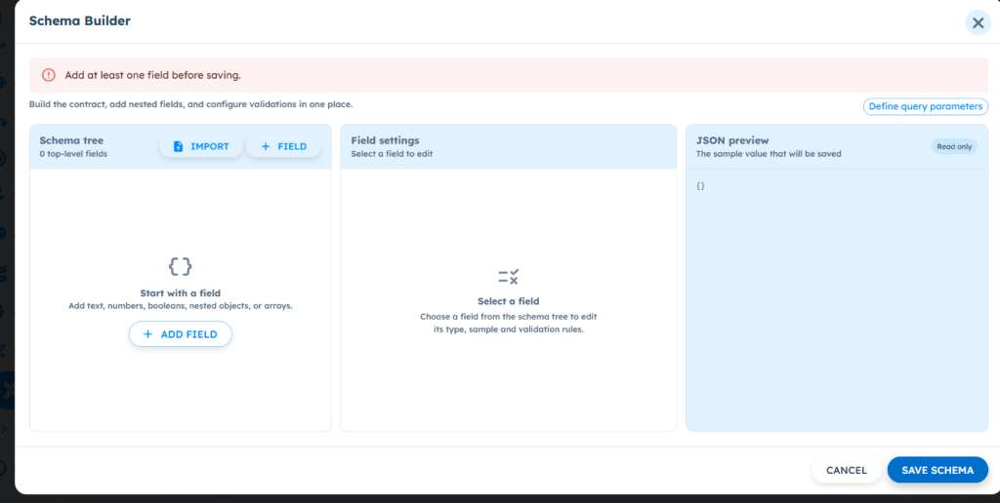

# ART-TOOL-001 — Tool Builder: Added HTTPS Schema Fields Cannot Be Deleted

- **Canonical Bug ID:** ART-TOOL-001
- **Module:** TOOL
- **Severity:** MEDIUM
- **Priority:** P2
- **Environment:** Testing (Tool Builder / HTTPS Tool Configuration)
- **Assignee:** Unassigned
- **Tags:** Tool-Builder, HTTPS-Tool, Schema-Builder, Schema-Tree, Field-Settings, JSON-Preview, UX-Clarity
- **Status:** OPEN
- **Evidence Count:** 1
- **Azure DevOps:** SYNCED ([#68883](https://dev.azure.com/BixBytesSolutions/f3253417-808e-457f-a7f2-5699b2f38aa6/_workitems/edit/68883))

---

## 1. Problem
In Tool Builder, while configuring an HTTPS tool contract via Schema Builder, users can manually add fields to the Schema tree. However, once a field is added, there is no option or control to delete or remove that field from the schema.

If a field is added accidentally, misnamed, or becomes obsolete during configuration, the schema cannot be modified to prune the unwanted field. The configuration becomes effectively permanent after a field is created, forcing the user to discard the entire schema draft or recreate the tool configuration from scratch just to eliminate an errant field.

---

## 2. Observed Behavior
- In the **Schema Builder** modal for HTTPS tools, the interface provides controls to add fields (`+ FIELD`, `+ ADD FIELD`), import schemas (`IMPORT`), and configure field properties within the `Field settings` panel.
- After a field is added to the Schema tree, the UI displays no delete button, trash icon, context menu, or keyboard shortcut to remove the field from the schema tree.
- The `Field settings` panel does not expose any "Delete Field" or "Remove" action.
- The `JSON preview` reflects the added field, but there is no mechanism to prune or revert added fields prior to clicking `SAVE SCHEMA`.
- The only way to remove an unwanted field is to cancel the modal entirely (`CANCEL` or `X`), discarding all other configured fields and starting over.

---

## 3. Reproduction
1. Navigate to **Tool Builder** in the ART platform.
2. Select or create an **HTTPS tool** configuration.
3. Open the **Schema Builder** modal (for request payload or response schema).
4. Observe the initial 3-panel layout: Schema tree (0 top-level fields), Field settings, and JSON preview.
5. Click **+ FIELD** or **+ ADD FIELD** to manually add a new field to the schema tree.
6. Attempt to remove or delete the newly created field from the Schema tree or Field settings panel.
7. Observe that no delete/remove button, context option, or removal action is available anywhere in the UI.

---

## 4. Expected Behavior
- Every manually added schema field in the Schema Builder (both top-level and nested fields) should provide an accessible and prominent delete/remove action (e.g., a trash can icon in the Schema tree item row and a "Delete Field" button in the Field settings panel).
- Triggering the delete action should immediately remove the selected field (and its children, if an object or array) from the Schema tree and update the JSON preview accordingly.
- Unrelated schema fields, types, and configurations must remain untouched.
- If all fields are deleted, the Schema Builder should cleanly return to its empty state and display the validation requirement (`Add at least one field before saving.`).

---

## 5. Business Impact
- **Increased Configuration Overhead:** Even a minor typo or accidental field addition forces builders to restart schema configuration from scratch, wasting time and degrading developer productivity.
- **Payload Contamination:** Users who do not realize the schema cannot be pruned may leave unused or incorrect fields in the saved contract, sending unintended properties to downstream APIs.
- **Frustrating Onboarding for Non-Technical Users:** Non-technical operators creating API integrations encounter friction when simple UI undo/deletion actions are missing.

---

## 6. User Experience
- The builder experiences a "trap" dynamic where additive operations are supported, but reductive operations are impossible without abandoning all progress.
- Lack of delete actions violates standard form and schema editor UX conventions, causing confusion and perceived platform fragility.

---

## 7. Investigation Guidance
Investigate the Schema Builder frontend component tree in the Tool Builder module:
- **Component Hierarchy:** Locate the Schema Builder dialog/modal component that renders the three-column layout (`Schema tree`, `Field settings`, `JSON preview`).
- **Schema Tree Item Renderer:** Inspect the list/tree item rendering logic for schema fields. Check whether actions are limited to selection/expansion and why an action menu or delete button is absent.
- **Field Settings Component:** Inspect the `Field settings` pane. Determine if a removal handler (e.g. `onDeleteField(fieldId)` or `removeFieldAtPath(path)`) exists in the schema state reducer/hook but lacks UI wiring.
- **State Management:** Verify how the schema state (AST or JSON Schema object) is maintained. Ensure the deletion handler properly prunes nested keys, cleans up selection state if the deleted field was currently selected, and triggers re-rendering of the JSON preview.

---

## 8. Fix Requirement
The Schema Builder in Tool Builder must provide a delete/remove control for every user-created field (top-level and nested). Removing a field must immediately excise it from the schema tree state and update the JSON preview in real time, while preserving all other fields.

---

## 9. Recommended Solution
1. **Tree Item Action:** Add a delete icon button (e.g. trash icon) on hover/focus for each item in the Schema tree.
2. **Field Settings Action:** Add a secondary "Delete Field" button with confirmation or instant undo at the bottom of the `Field settings` panel for the active field.
3. **State Pruning Handler:** Implement a recursive field deletion handler in the Schema Builder state manager that removes the targeted node by key/ID, removes it from any parent object properties or array item definitions, and adjusts selection state to null or a sibling node.
4. **Validation Synchronisation:** Re-evaluate schema validity upon deletion (e.g. restoring "Add at least one field before saving" when field count reaches 0).

---

## 10. Minimum Working Fix
Add a "Delete Field" button in the `Field settings` pane that removes the currently selected field from the schema state dictionary and deselects the field, triggering an immediate update of the Schema tree and JSON preview.

---

## 11. Acceptance Criteria
- [ ] Every user-added field in the Schema Builder displays an accessible delete/remove action in the UI.
- [ ] Deleting a top-level field removes it from the Schema tree and JSON preview without affecting other fields.
- [ ] Deleting a nested field removes only that child field and leaves parent and sibling fields intact.
- [ ] When the active/selected field is deleted, the Field settings pane cleanly resets to the unselected state ("Select a field").
- [ ] Deleting the last remaining field returns the Schema Builder to the initial empty state and prevents saving.

---

## 12. Environment
- **Platform:** ART Tool Builder
- **Component:** HTTPS Tool Configuration — Schema Builder
- **Modal:** Schema Builder (`Schema tree` / `Field settings` / `JSON preview`)
- **Environment:** Testing

---

## 13. Severity
**MEDIUM** — Functional gap in Schema Builder; prevents field removal and forces schema recreation upon error.

---

## 14. Priority
**P2** — Important usability defect in core Tool Builder schema authoring workflow.

---

## 15. Tags
- `Tool-Builder`
- `HTTPS-Tool`
- `Schema-Builder`
- `Schema-Tree`
- `Field-Settings`
- `JSON-Preview`
- `UX-Clarity`

---

## 16. Assignee
**Unassigned**

---

## 17. Evidence

| File | Type | Description | SHA256 Hash | Byte Size |
| :--- | :--- | :--- | :--- | :--- |
| [ART-TOOL-001__schema-builder-modal-missing-delete-control__2026-09-30__01.png](./ART-TOOL-001__schema-builder-modal-missing-delete-control__2026-09-30__01.png) | Screenshot | Schema Builder modal in Tool Builder showing 3-panel layout (Schema tree, Field settings, JSON preview) with Add Field controls but no mechanism to delete or remove added fields. | `02c757910adf20dbdd54229791eda154cc3dc19c60e6a310d9222ce398c7ac2d` | 85145 bytes |

### Evidence Visual Gallery

````carousel

*Schema Builder modal in Tool Builder showing 3-panel layout (Schema tree, Field settings, JSON preview) with Add Field controls but no mechanism to delete or remove added fields.*
````

---

## 18. Discussion
- **Reporter Note:** While configuring an HTTPS tool in Tool Builder, fields can be added to the Schema Builder manually. However, if a field is added accidentally or is no longer required, there is no available option to delete/remove that field from the schema. This makes the schema configuration effectively permanent after a field has been added, forcing users to recreate or reset the configuration.
- **Intake Validation:** Screenshot preserved with cryptographic SHA256 checksum and verified byte size. Zero Azure DevOps mutations performed during intake.

---

## 19. Azure DevOps
- **Work Item ID:** 68883
- **URL:** [https://dev.azure.com/BixBytesSolutions/f3253417-808e-457f-a7f2-5699b2f38aa6/_workitems/edit/68883](https://dev.azure.com/BixBytesSolutions/f3253417-808e-457f-a7f2-5699b2f38aa6/_workitems/edit/68883)
- **Parent Feature:** Tool Builder
- **Parent Feature ID:** 68807
- **Assigned To:** Unassigned
- **Sync Status:** SYNCED
- **Note:** Synchronized via Harness 02 V1 to Azure DevOps.
