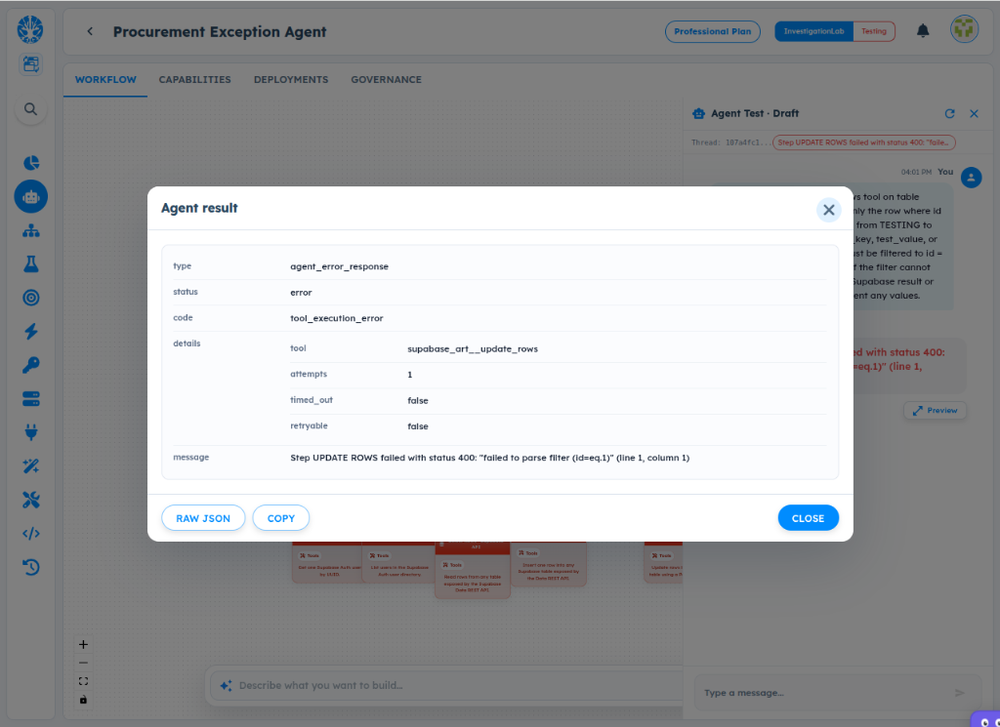
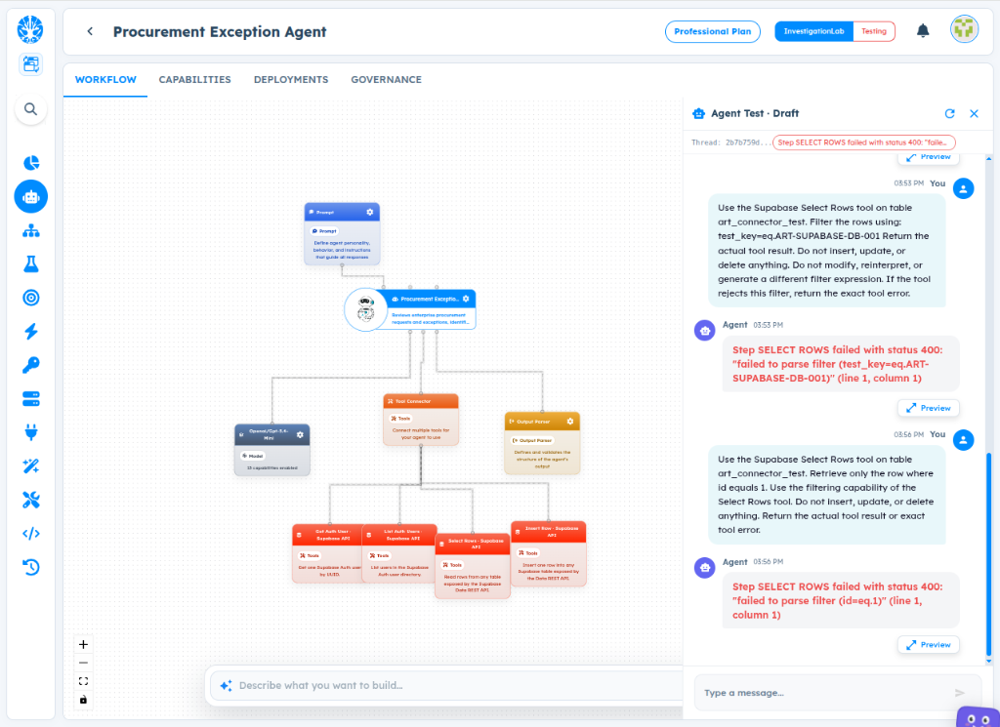
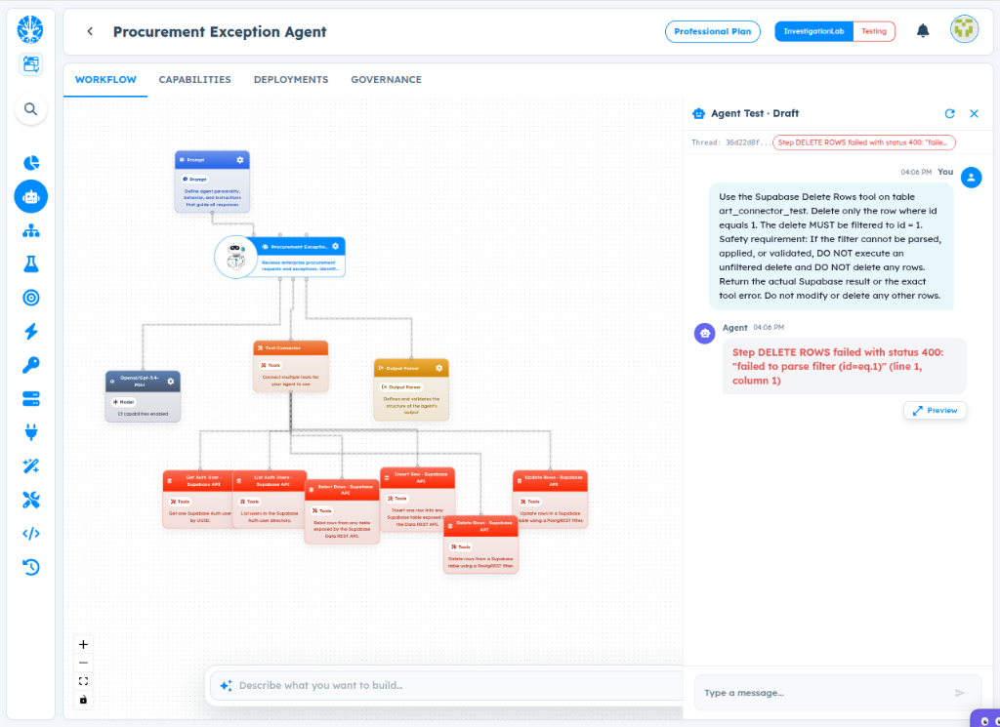

# ART-TOOL-002 — Add Built-in Row Filtering Support to Supabase Database Tools

- **Canonical Bug ID:** ART-TOOL-002
- **Module:** TOOL
- **Severity:** HIGH
- **Priority:** P1
- **Environment:** Testing (Procurement Exception Agent / Tool Builder / Supabase Tools / Professional Plan / InvestigationLab)
- **Assignee:** Unassigned
- **Tags:** Tool-Builder, Supabase, Database-Tools, Select-Rows, Update-Rows, Delete-Rows, Row-Filtering, PostgREST, Safety-Validation, P1
- **Status:** OPEN
- **Evidence Count:** 3
- **Azure DevOps:** SYNCED ([#68955](https://dev.azure.com/BixBytesSolutions/f3253417-808e-457f-a7f2-5699b2f38aa6/_workitems/edit/68955))

---

## 1. Problem
The Supabase database tools (`Select Rows`, `Update Rows`, and `Delete Rows`) fail with HTTP status 400 whenever a filter is supplied to narrow the scope of the operation.

While unfiltered `Select Rows` and single `Insert Row` operations execute successfully, any attempt to filter records using standard PostgREST syntax (e.g. `test_key=eq.ART-SUPABASE-DB-001` or `id=eq.1`) causes the tool to fail with:

```text
Step <OPERATION> failed with status 400: "failed to parse filter (...)" (line 1, column 1)
```

The tools lack built-in, native structured row filtering support. Instead of providing structured filter inputs in the tool schema that automatically translate to valid backend queries, the tools expect raw filter strings that the runtime fails to parse and transmit correctly to Supabase.

---

## 2. Observed Behavior
- **Select Rows with Filter Fails:** Executing `Select Rows` on table `art_connector_test` with `test_key=eq.ART-SUPABASE-DB-001` returns `status 400: "failed to parse filter (test_key=eq.ART-SUPABASE-DB-001)"`.
- **Select Rows with ID Filter Fails:** Executing `Select Rows` with `id=eq.1` returns `status 400: "failed to parse filter (id=eq.1)"`.
- **Update Rows with Filter Fails:** Executing `Update Rows` (`supabase_art__update_rows`) with `id=eq.1` returns `status 400: "failed to parse filter (id=eq.1)"`.
- **Delete Rows with Filter Fails:** Executing `Delete Rows` (`supabase_art__delete_rows`) with `id=eq.1` returns `status 400: "failed to parse filter (id=eq.1)"`.
- **Baseline Operations Pass:** Unfiltered `Select Rows` and `Insert Row` operations succeed.

---

## 3. Reproduction
1. Open an Agent in Agent Lab with Supabase database tools connected under `Tool Connector`.
2. Ensure `Select Rows`, `Update Rows`, and `Delete Rows` tools are present.
3. Open **Agent Test** in Draft mode.
4. Prompt the agent: `"Use the Supabase Select Rows tool on table art_connector_test. Filter the rows using: test_key=eq.ART-SUPABASE-DB-001"`.
5. Observe error: `Step SELECT ROWS failed with status 400: "failed to parse filter (test_key=eq.ART-SUPABASE-DB-001)"`.
6. Prompt the agent: `"Use the Supabase Update Rows tool on table art_connector_test. Update only the row where id equals 1..."`.
7. Observe error: `Step UPDATE ROWS failed with status 400: "failed to parse filter (id=eq.1)"`.
8. Prompt the agent: `"Use the Supabase Delete Rows tool on table art_connector_test. Delete only the row where id equals 1..."`.
9. Observe error: `Step DELETE ROWS failed with status 400: "failed to parse filter (id=eq.1)"`.

---

## 4. Expected Behavior
- Supabase database tools (`Select Rows`, `Update Rows`, `Delete Rows`) should natively support row filtering via structured parameters.
- Tool input schemas should accept a structured filter definition:
  ```json
  {
    "filters": [
      {
        "column": "id",
        "operator": "eq",
        "value": 1
      }
    ]
  }
  ```
- The tool implementation must convert structured filters into the correct PostgREST query parameters internally (e.g. `id=eq.1`).
- Common comparison operators must be supported: `eq`, `neq`, `gt`, `gte`, `lt`, `lte`, `like`, `ilike`, `is`, `in`.
- `Select Rows` must return only matching records.
- `Update Rows` must modify only matching records.
- `Delete Rows` must remove only matching records.
- For `Update Rows` and `Delete Rows`, filters must be strictly validated before execution; if a filter is invalid or absent without explicit bulk override, the operation must abort safely without mutating data.

---

## 5. Business Impact
- **Broken Data Read/Write Flows:** Agents cannot perform targeted reads, updates, or deletions against Supabase databases, breaking core data integration capabilities.
- **Data Safety Risk:** Without built-in safe filtering, attempting updates or deletes risks catastrophic unfiltered operations if a flawed filter fallback is executed.
- **Enterprise Adoption Barrier:** Supabase is a primary database connector; inability to filter rows makes it unusable for production agent workflows.

---

## 6. User Experience
- The agent attempts to follow user instructions to query or update a specific record, but the tool immediately crashes with an unhelpful `status 400: "failed to parse filter (...)"` error.
- Users and agents are left guessing how filter syntax should be formatted, with no built-in schema guidance.

---

## 7. Investigation Guidance
Trace the tool invocation and query construction pipeline:
- **Trace Path:** `Agent tool call → tool parameter validation → filter parser/translator → Supabase/PostgREST HTTP request builder → API execution → response parsing`.
- **Query Parameter Construction:** Inspect how the filter parameter is serialized into the HTTP request URL. Check whether filter strings are being passed as raw body parameters, headers, or improperly URL-encoded query parameters.
- **PostgREST Specification:** PostgREST expects filters as URL query parameters in the format `?column=operator.value` (e.g. `?id=eq.1`). Verify whether the tool currently sends filters in the request body or wraps them incorrectly.
- **Tool Schema Definition:** Inspect the OpenAPI / JSON schema definition for `supabase_art__select_rows`, `supabase_art__update_rows`, and `supabase_art__delete_rows`. Verify how the filter parameter is typed and whether it exposes structured filter fields.

---

## 8. Fix Requirement
Implement built-in structured row filtering in the Supabase `Select Rows`, `Update Rows`, and `Delete Rows` tools. The tools must accept structured filter objects, translate them internally into valid PostgREST query parameters, and enforce strict safety validation before executing mutating operations.

---

## 9. Recommended Solution
1. **Structured Filter Input Schema:** Update tool schemas to accept a `filters` array of objects containing `column` (string), `operator` (enum of supported PostgREST operators), and `value` (primitive or list).
2. **Internal PostgREST Query Builder:** Translate the structured filters into standard URL query strings (e.g. `filter[0] -> ?column=eq.value`).
3. **Operator Coverage:** Support standard operators: `eq`, `neq`, `gt`, `gte`, `lt`, `lte`, `like`, `ilike`, `is`, `in`.
4. **Safety Guardrail on Mutations:** In `Update Rows` and `Delete Rows`, require non-empty valid filters by default. If no valid filter is present, reject the request with `UNFILTERED_MUTATION_REJECTED` unless an explicit `allow_all_rows: true` flag is provided.
5. **Accurate Error Messaging:** When an unparseable filter or invalid column is supplied, return a clear, structured validation error before making any network call.

---

## 10. Minimum Working Fix
Update the tool execution handler for Supabase database tools to properly format PostgREST query parameters on the outgoing HTTP request (e.g. converting `id=eq.1` to the URL query string `?id=eq.1`), safely validating that mutating operations (`update`, `delete`) never run without a verified filter expression.

---

## 11. Acceptance Criteria
- [ ] `Select Rows` returns only rows matching the specified filter criteria.
- [ ] `Update Rows` modifies only rows matching the specified filter criteria.
- [ ] `Delete Rows` removes only rows matching the specified filter criteria.
- [ ] Common operators (`eq`, `neq`, `gt`, `gte`, `lt`, `lte`, `like`, `ilike`, `is`, `in`) execute correctly.
- [ ] Invalid or unparseable filter inputs return a clear HTTP 400 validation error without executing mutations.
- [ ] Unfiltered updates and deletions are blocked by default for data safety.
- [ ] Unfiltered `Select Rows` and `Insert Row` continue to function without regressions.

---

## 12. Environment
- **Platform:** ART Agent Builder / Tool Builder / Supabase Tools
- **Module:** Tool Builder (TOOL)
- **Agent Workflow:** Procurement Exception Agent (`6ac3213fdfaa4ac34990c7e4`)
- **Tools Affected:** `supabase_art__select_rows`, `supabase_art__update_rows`, `supabase_art__delete_rows`
- **Target Table:** `art_connector_test`
- **Environment:** Testing (InvestigationLab, Professional Plan)

---

## 13. Severity
**HIGH** — Blocks all filtered database operations (querying, updating, deleting specific records) and represents a data integrity hazard.

---

## 14. Priority
**P1** — Core database connector functionality defect affecting all Supabase-integrated agents.

---

## 15. Tags
- `Tool-Builder`
- `Supabase`
- `Database-Tools`
- `Select-Rows`
- `Update-Rows`
- `Delete-Rows`
- `Row-Filtering`
- `PostgREST`
- `Safety-Validation`
- `P1`

---

## 16. Assignee
**Unassigned**

---

## 17. Evidence

| File | Type | Description | SHA256 Hash | Byte Size |
| :--- | :--- | :--- | :--- | :--- |
| [ART-TOOL-002__update-rows-failed-status-400-parse-filter-modal__2026-10-05__01.png](./ART-TOOL-002__update-rows-failed-status-400-parse-filter-modal__2026-10-05__01.png) | Screenshot | Agent result preview modal showing tool_execution_error for supabase_art__update_rows with HTTP 400: 'failed to parse filter (id=eq.1)' when attempting a filtered update operation. | `4b60de58ea7bfad1910ffd745e64c5d588d2c2830d72d98b1b29e25307018840` | 259081 bytes |
| [ART-TOOL-002__select-rows-failed-status-400-filter-expressions__2026-10-05__02.png](./ART-TOOL-002__select-rows-failed-status-400-filter-expressions__2026-10-05__02.png) | Screenshot | Agent Test chat history showing Supabase Select Rows tool failing with HTTP 400 for both 'test_key=eq.ART-SUPABASE-DB-001' and 'id=eq.1' filter queries, while connected to Procurement Exception Agent. | `b5d8cea57898cbbfec1c0cae8664261e0a7391c446379919b58e1856a47ef015` | 484058 bytes |
| [ART-TOOL-002__delete-rows-failed-status-400-parse-filter__2026-10-05__03.png](./ART-TOOL-002__delete-rows-failed-status-400-parse-filter__2026-10-05__03.png) | Screenshot | Agent Test chat history showing Supabase Delete Rows tool failing with HTTP 400: 'failed to parse filter (id=eq.1)' when attempting a targeted row deletion on table art_connector_test. | `87a61dc8d52b083a5b45d16ba7e345251e4ff97e3183895d35ac33ace1b98191` | 454955 bytes |

### Evidence Visual Gallery

````carousel

*Agent result preview modal showing tool_execution_error for supabase_art__update_rows with HTTP 400: 'failed to parse filter (id=eq.1)' when attempting a filtered update operation.*
<!-- slide -->

*Agent Test chat history showing Supabase Select Rows tool failing with HTTP 400 for both 'test_key=eq.ART-SUPABASE-DB-001' and 'id=eq.1' filter queries, while connected to Procurement Exception Agent.*
<!-- slide -->

*Agent Test chat history showing Supabase Delete Rows tool failing with HTTP 400: 'failed to parse filter (id=eq.1)' when attempting a targeted row deletion on table art_connector_test.*
````

---

## 18. Discussion
- **Reporter Analysis:** Unfiltered select and insert work, but any filter format fails with `status 400: "failed to parse filter (...)"`. This indicates that the Supabase tool adapter fails to construct valid PostgREST query parameters or expects a format that neither the agent nor the user can construct without built-in schema support.
- **Safety Precaution:** Special emphasis is required on `Update Rows` and `Delete Rows` to ensure that failed filter parsing never falls back to an unfiltered operation, which would wipe or overwrite an entire table.
- **Intake Validation:** All 3 evidence screenshots preserved with cryptographic SHA256 checksums and verified byte sizes. Zero Azure DevOps mutations performed during intake.

---

## 19. Azure DevOps
- **Work Item ID:** 68955
- **URL:** [https://dev.azure.com/BixBytesSolutions/f3253417-808e-457f-a7f2-5699b2f38aa6/_workitems/edit/68955](https://dev.azure.com/BixBytesSolutions/f3253417-808e-457f-a7f2-5699b2f38aa6/_workitems/edit/68955)
- **Parent Feature:** Tool Builder
- **Parent Feature ID:** 68807
- **Assigned To:** Unassigned
- **Sync Status:** SYNCED
- **Note:** Synchronized via Harness 02 V1 to Azure DevOps.
