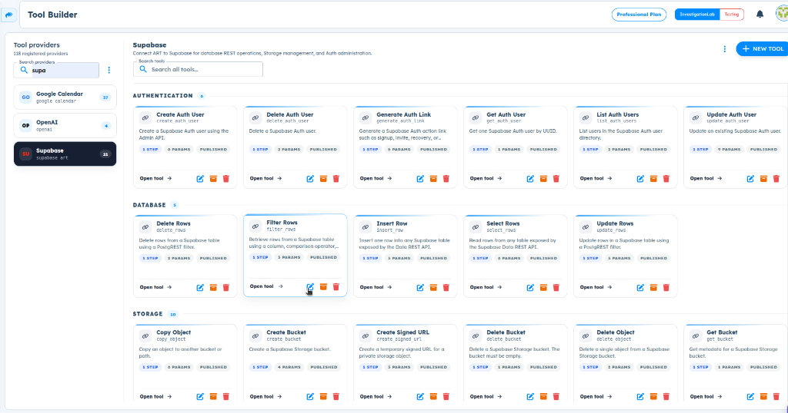
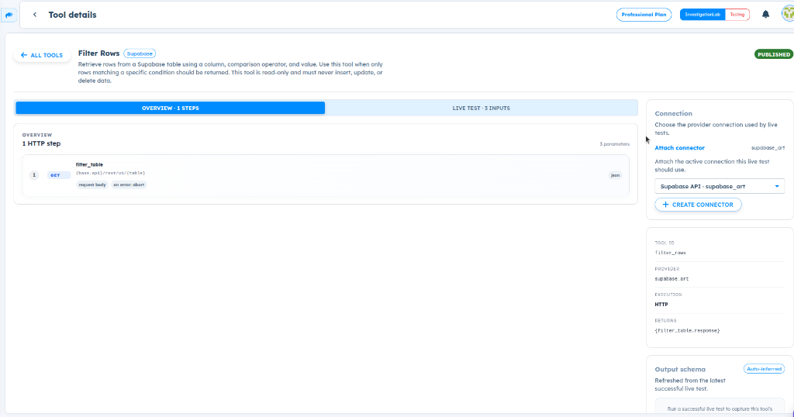

# ART-TOOL-003 — Tool Builder existing tools cannot be edited because Edit Definition is unavailable/inaccessible

## Metadata

- **Canonical Bug ID:** ART-TOOL-003
- **Title:** Tool Builder existing tools cannot be edited because Edit Definition is unavailable/inaccessible
- **Status:** OPEN
- **Feature:** Tool Builder
- **Module:** Tool Builder / Existing Tool Editing
- **Classification:** BUG
- **Severity:** HIGH
- **Priority:** P2
- **Assignee:** Anusha Ganesh Hedge
- **Environment:** Web (Tool Builder Dashboard & Tool Details)
- **Tags:** Tool-Builder, Existing-Tools, Tool-Editing, Edit-Definition, Dashboard, UI, P2
- **Date Reported:** 2026-10-06
- **Azure DevOps:** SYNCED

## 1. Problem

In Tool Builder, an existing published tool cannot currently be opened for definition editing. The Tool Builder dashboard displays an Edit icon on existing tool cards, but selecting that option fails to open the tool in an editable state. Furthermore, when navigating to the Tool details view for a published tool, there is no visible or accessible "Edit Definition" action. As a result, users can view the published tool and its parameters, connection, and metadata, but have no working pathway to modify or update the existing tool definition.

## 2. Observed Behavior

- The Tool Builder dashboard lists published tools (e.g., Supabase "Filter Rows") with an Edit icon on each tool card.
- Selecting the Edit option on the tool card does not successfully open the tool in an editable definition state.
- Navigating to the "Tool details" page displays the tool configuration, HTTP steps, connection, and metadata in read-only mode.
- The Tool details screen provides no visible or accessible "Edit Definition" action.
- The user is completely unable to modify an existing tool definition from either demonstrated entry point.

## 3. Reproduction

1. Open Tool Builder and navigate to an existing registered provider (e.g., Supabase).
2. Locate an existing published tool card on the dashboard (e.g., "Filter Rows").
3. Attempt to enter editing mode by clicking the Edit icon on the tool card; observe that the tool does not enter an editable state.
4. Click "Open tool ->" to open the "Tool details" view.
5. Inspect the Tool details view for an "Edit Definition" action; observe that no edit action is available.

## 4. Expected Behavior

Existing tools in Tool Builder should provide a clear and functional editing pathway. Selecting Edit from the dashboard tool card or clicking an "Edit Definition" button within Tool details should load the existing tool definition into the editor, allowing users to update configuration fields without having to recreate the tool from scratch.

## 5. Business Impact

Users and developers cannot maintain, update, or correct tools once they are created or published. Any necessary modifications to endpoints, parameters, descriptions, or configurations require manually recreating the entire tool, leading to duplicate definitions, operational overhead, and potential breaks in downstream pipelines and agent workflows that depend on existing tool IDs.

## 6. User Experience

The interface displays an Edit icon on tool cards, suggesting that existing tools are editable. However, clicking the icon fails to open the editor, and the Tool details page offers no edit options. Users are left with a read-only view and no apparent way to update their tools.

## 7. Investigation Guidance

Inspect the existing-tool editing workflow across both entry points in Tool Builder:

- Dashboard tool card Edit action: verify the click handler, route destination, and whether the tool ID or draft state is properly dispatched to the editor router/state store.
- Tool details page: check whether an "Edit Definition" button is conditionally rendered, hidden, or omitted for published tools.
- Editor component: verify how existing tool schemas and configurations are loaded by ID compared to the new tool creation flow, and whether publication status locks the editor route.

## 8. Fix Requirement

Tool Builder must provide a functional editing route for existing tools so that users can open, modify, and save updates to an existing tool configuration without creating a duplicate or recreating the tool.

## 9. Recommended Solution

Implement and expose a unified editing flow for existing tools:

- Wire the dashboard card Edit icon to navigate to the tool editor pre-populated with the selected tool's definition and configuration.
- Add an explicit "Edit Definition" action button in the Tool details header or action bar that routes to the same editor state.
- Ensure the editor distinguishes between creating a new tool and editing an existing tool so updates are saved against the existing tool record.

## 10. Minimum Working Fix

Enable the dashboard Edit icon to open the selected tool's definition in the editor, and expose an "Edit Definition" button on the Tool details screen for published tools.

## 11. Acceptance Criteria

- Clicking Edit on an existing Tool Builder card opens that tool in editable mode.
- The existing tool definition, HTTP steps, and parameters are preloaded into the editor.
- The Tool details screen displays an accessible "Edit Definition" action that routes to the editor.
- Changes made in the editor can be saved and published to update the existing tool.
- Saving updates to an existing tool modifies the existing record without creating an unintended duplicate.
- Viewing and live testing existing tools continue to function normally.

## 12. Environment

Web (Tool Builder Dashboard & Tool Details)

## 13. Severity

HIGH

## 14. Priority

P2

## 15. Tags

Tool-Builder, Existing-Tools, Tool-Editing, Edit-Definition, Dashboard, UI, P2

## 16. Assignee

Unassigned

## 17. Evidence

| Evidence File                                                                                  | Type       | Description                                                                                 | SHA-256                                                              | Size         |
| ---------------------------------------------------------------------------------------------- | ---------- | ------------------------------------------------------------------------------------------- | -------------------------------------------------------------------- | ------------ |
| [[ART-TOOL-003](ART-TOOL-003__dashboard-tool-card-edit-control__2026-10-06__01.png)]            | Screenshot | Tool Builder dashboard displaying tool cards with visible Edit controls.                    | `d4163127ffbb46d13ad72f329f277b4e20d8800781cbbb27f4d35f570bbb6520` | 205652 bytes |
| [[ART-TOOL-003](ART-TOOL-003__tool-details-missing-edit-definition-action__2026-10-06__02.png)] | Screenshot | Published Tool details screen for Filter Rows showing absence of an Edit Definition action. | `082f02056d502d05ff04e3a616015a101bdb2f436cf7e343e43185db101c4df5` | 102838 bytes |

## 18. Discussion

Visual evidence demonstrates that while existing tool cards feature an Edit icon on the dashboard, the editing flow cannot be accessed, and the Tool details view provides no Edit Definition action, leaving published tools effectively locked against updates.

## 19. Azure DevOps

- **Work Item ID:** 68991
- **URL:** [https://dev.azure.com/BixBytesSolutions/f3253417-808e-457f-a7f2-5699b2f38aa6/_workitems/edit/68991](https://dev.azure.com/BixBytesSolutions/f3253417-808e-457f-a7f2-5699b2f38aa6/_workitems/edit/68991)
- **Parent Feature:** Tool Builder
- **Parent Feature ID:** 68807
- **Assigned To:** Unassigned
- **Sync Status:** SYNCED
- **Note:** Synchronized via Harness 02 V1 to Azure DevOps.
